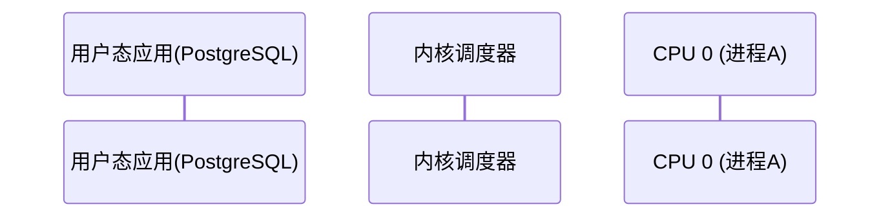
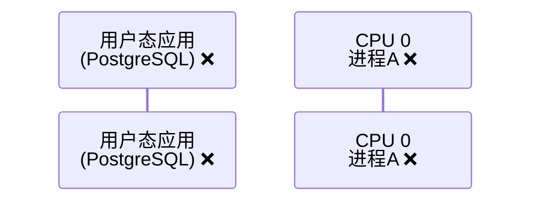
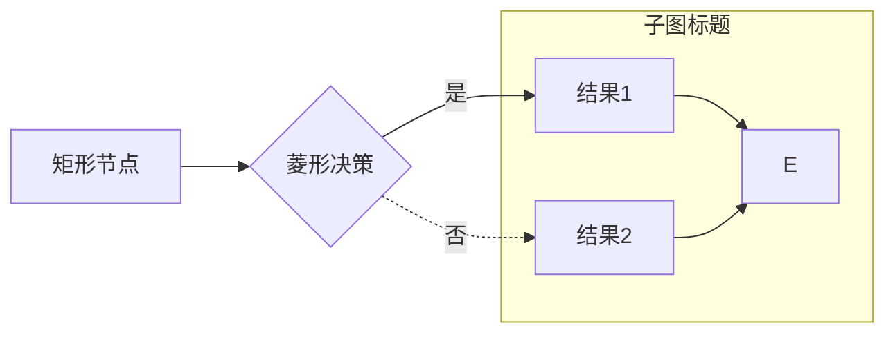
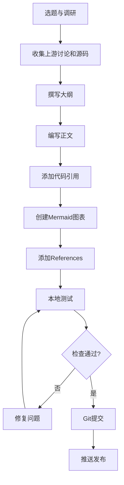

# Blog Post 写作指南

本指南总结了技术博客文章的写作规范和最佳实践，确保文章质量一致且易于维护。

---

## 一、文件结构与命名

### 1.1 文件命名规范

```
_posts/YYYY-MM-DD-主题关键词.md
```

**示例**:
- `2026-04-08-linux-kernel-7-preempt-lazy-postgresql-performance.md`
- `2026-03-30-x86-64-syscall-idt-linux-kernel-sdm.md`

**规则**:
- 使用小写字母和连字符
- 关键词要具体，避免过于宽泛
- 日期使用文章发布日期

### 1.2 Front Matter 格式

```yaml
---
title: "文章标题"
---


```

**注意事项**:
- ✅ 使用直引号 `"` 包裹标题
- ❌ 避免在标题中嵌套引号，使用书名号 `「」` 代替
- ✅ 如果文章包含Mermaid图表，必须添加 ``
- ❌ 不要添加其他frontmatter字段（如abstract），除非确实需要

**示例**:
```yaml
# ✅ 正确
title: "当Linux内核不再「迁就」PostgreSQL：一次抢占模型变更引发的性能风暴"

# ❌ 错误 - 嵌套引号会导致YAML解析错误
title: "当Linux内核不再"迁就"PostgreSQL：一次抢占模型变更引发的性能风暴"
```

---

## 二、内容组织

### 2.1 文章结构

```markdown
---
title: "标题"
---



> 副标题或引言性问题

## 引言：吸引读者

简短的场景描述或问题陈述...

## 一、第一个主要部分

### 子标题

内容...

## 二、第二个主要部分

...

## References

[^1]: 引用1
[^2]: 引用2
```

**要点**:
- 使用中文章节标题（一、二、三）或英文（## Section One）保持一致
- 引言要简洁有力，快速吸引读者
- 每个主要章节聚焦一个核心概念
- 使用子标题细分复杂内容
- References放在文末，使用脚注格式

### 2.2 引言写作技巧

**好的引言特点**:
1. **场景化开头**: 描述一个具体的问题场景
2. **提出核心问题**: 让读者知道文章要解决什么
3. **数据或事实**: 用具体数字增强说服力
4. **路线图**: 简要说明文章将如何解答问题

**示例**:
```markdown
## 引言：从"完美运行"到"性能腰斩"

想象一下这样的场景：你的数据库服务器刚刚升级了最新的Linux Kernel 7.0，
期待着更好的性能和安全性。然而，上线后监控图表却显示了一个触目惊心的画面
——PostgreSQL的吞吐量在毫无征兆的情况下**骤降了将近一半**。

这不是虚构的故障演练，而是在Kernel 7.0发布前测试中被多次报告的真实问题[^1]。
```

---

## 三、代码与引用规范

### 3.1 代码块格式

````markdown
```c
// C语言代码
int main() {
    return 0;
}
```

```
# 配置文件或无特定语言的代码块
config PREEMPT_VOLUNTARY
    bool "Voluntary Kernel Preemption"
```
````

**支持的语言标识符** (Rouge highlighter):
- `c`, `cpp`, `rust`, `python`, `javascript`, `bash`, `shell`
- `yaml`, `json`, `xml`, `html`, `css`
- `diff`, `patch`

**不支持的标识符**:
- ❌ `config` - Kconfig文件使用空标识符
- ❌ 自定义或不常见的语言

### 3.2 源代码引用

**必须使用GitHub链接，不要使用本地路径**:

```markdown
# ✅ 正确 - 使用GitHub链接
在[`kernel/sched/core.c`](https://github.com/torvalds/linux/blob/master/kernel/sched/core.c)中

PostgreSQL的源代码[`src/backend/storage/lmgr/s_lock.c`](https://github.com/postgres/postgres/blob/master/src/backend/storage/lmgr/s_lock.c)

# ❌ 错误 - 本地路径
在`/Users/weli/works/linux/kernel/sched/core.c`中
```

**引用commit时包含**:
1. Commit hash (简短形式，前7-8位)
2. Commit 标题
3. GitHub链接
4. LKML或邮件列表链接（如果有）

**示例**:
```markdown
在commit [`7dadeaa6e851`](https://github.com/torvalds/linux/commit/7dadeaa6e851)中，
Peter Zijlstra详细解释了引入这一机制的三个核心原因[^2]：

> The introduction of PREEMPT_LAZY was for multiple reasons:
> 
> - PREEMPT_RT suffered from over-scheduling...
> - the endless and uncontrolled sprinkling of cond_resched()...
```

### 3.3 代码块中引用源码行号

**从实际文件引用时可以包含行号信息**（仅在注释中说明）:

```markdown
内核在[`kernel/sched/core.c`](https://github.com/torvalds/linux/blob/master/kernel/sched/core.c)中实现了这一机制：

```c
// kernel/sched/core.c: 1172-1183
static __always_inline int get_lazy_tif_bit(void)
{
    if (dynamic_preempt_lazy())
        return TIF_NEED_RESCHED_LAZY;
    return TIF_NEED_RESCHED;
}
\```
```

---

## 四、Mermaid 图表规范

### 4.1 何时使用Mermaid图表

**建议使用场景**:
- ✅ 时序交互（sequenceDiagram）
- ✅ 流程演化（graph）
- ✅ 状态转换（stateDiagram）
- ✅ 架构关系（flowchart）

**每篇文章建议**:
- 技术深度文章: 3-5个图表
- 概念介绍文章: 1-3个图表
- 实践教程文章: 2-4个图表

### 4.2 Mermaid语法注意事项

#### 4.2.1 Sequence Diagram（时序图）

**✅ 正确的participant定义**:


**❌ 错误 - 不要使用HTML标签**:


**常用语法**:
```mermaid
sequenceDiagram
    A->>B: 同步调用
    A-->>B: 异步响应
    A-xB: 失败/错误
    activate A   # 激活生命线
    deactivate A # 结束生命线
    Note over A,B: 注释
    alt 条件1
        A->>B: 操作1
    else 条件2
        A->>B: 操作2
    end
```

#### 4.2.2 Graph（流程图/关系图）

**节点中可以使用HTML**:


**常用语法**:


#### 4.2.3 图表样式最佳实践

**颜色使用**:
- 🟢 绿色系 `#90EE90`: 高性能/吞吐量优化
- 🔵 蓝色系 `#87CEEB`: 新特性/中性
- 🟡 黄色系 `#FFD700`: 折中方案
- 🔴 红色系 `#FF6347`: 实时/低延迟/警告

**示例**:


### 4.3 图表说明文字

**在图表前后添加说明**:

```markdown
下图展示了两种模式的关键差异：

```mermaid
sequenceDiagram
    ...
\```

简单来说，**内核将抢占决策权从"代码中的分散检查点"收拢到了"调度器的时钟中断"中**。
```

---

## 五、引用与脚注规范

### 5.1 脚注编号

**使用递增数字**:
```markdown
这是第一个引用[^1]，这是第二个引用[^2]。

## References

[^1]: 第一个引用的详细信息
[^2]: 第二个引用的详细信息
```

### 5.2 引用格式

**Linux内核commit**:
```markdown
[^2]: Peter Zijlstra，Linux内核提交 [`7dadeaa6e851`](https://github.com/torvalds/linux/commit/7dadeaa6e851) — *sched: Further restrict the preemption modes*。详细说明了引入PREEMPT_LAZY的三个核心原因，以及为何限制PREEMPT_NONE和PREEMPT_VOLUNTARY。完整提交信息：<https://patch.msgid.link/20251219101502.GB1132199@noisy.programming.kicks-ass.net>
```

**PostgreSQL commit**:
```markdown
[^11]: Tomas Vondra，PostgreSQL提交 [`7fe2f67c7c9`](https://github.com/postgres/postgres/commit/7fe2f67c7c9) — *Limit the size of numa_move_pages requests*。PostgreSQL侧对内核bug的规避措施。讨论：<https://postgr.es/m/aEtDozLmtZddARdB@msg.df7cb.de>
```

**LKML讨论**:
```markdown
[^13]: LKML patch series：《[PATCH 00/14] Restartable Sequences: selftests, time-slice extension》，Thomas Gleixner提出RSEQ时间片扩展机制，共14个补丁。链接：<https://lkml.kernel.org/r/20251215155615.870031952@linutronix.de>
```

**内核文档**:
```markdown
[^3]: Linux内核文档，《preempt-locking.rst》，详细说明了内核抢占模型的演化和`cond_resched()`的使用。参见：[Documentation/locking/preempt-locking.rst](https://github.com/torvalds/linux/blob/master/Documentation/locking/preempt-locking.rst)
```

### 5.3 引用要包含的要素

每个技术引用应包含：
1. ✅ 作者/维护者名字
2. ✅ 仓库名（Linux kernel / PostgreSQL等）
3. ✅ Commit hash（带GitHub链接）
4. ✅ Commit标题（斜体）
5. ✅ 简短说明（为何重要/解决什么问题）
6. ✅ 上游讨论链接（LKML/邮件列表）

---

## 六、写作风格

### 6.1 技术准确性

**必须做到**:
- ✅ 引用官方源代码和文档
- ✅ 使用准确的技术术语
- ✅ 区分事实和推测（"实际测试显示" vs "理论上可能"）
- ✅ 引用commit message作为设计意图的证据
- ✅ **所有陈述和转述都必须有具体来源链接**（避免"有人提出"、"据报道"等没有明确出处的说法）

**示例**:
```markdown
# ✅ 好 - 有明确来源
在commit [`7c70cb94d29c`](https://github.com/torvalds/linux/commit/7c70cb94d29c)中，
Peter Zijlstra说明了工作机制[^6]：

> This LAZY bit will be promoted to the full NEED_RESCHED bit on tick.

# ❌ 差 - 无来源的断言
LAZY标志会在时钟中断时被升级。（读者会问：你怎么知道的？）

# ❌ 差 - 没有具体来源的转述
有人提出了一个方案：恢复PREEMPT_VOLUNTARY模式。
（谁提出的？在哪里提出的？什么时候？）

# ✅ 好 - 有具体人名、commit和链接
Peter Zijlstra在commit [`476e8583ca16`](https://github.com/torvalds/linux/commit/476e8583ca16)中
果断地在x86架构上启用了PREEMPT_LAZY[^12]。
```

### 6.2 叙事技巧

**使用场景化描述**:
```markdown
# ✅ 生动
让我们一步步推演这个灾难场景：

1. **CPU 0**上的进程A获得自旋锁L，开始执行临界区代码。
2. **此时**，调度器为CPU 0设置了`TIF_NEED_RESCHED_LAZY`标志。
3. 进程A继续执行，它并不知道自己被标记了。

# ❌ 枯燥
当一个进程持有自旋锁时，如果被抢占，会导致性能下降。
```

**使用对比和类比**:
```markdown
这就像在高速公路上设置的临时检查站——内核线程运行到这里时，
会主动"看一眼"是否有更高优先级的任务需要CPU。
```

### 6.3 层次递进

**从宏观到微观**:
```markdown
## 一、问题背景（宏观）
Linux抢占模型的演化...

## 二、技术细节（中观）
两个标志位的实现...

## 三、代码实现（微观）
```c
static __always_inline int get_lazy_tif_bit(void) {
    ...
}
\```
```

### 6.4 术语使用

**中英文混用规则**:
- ✅ 首次出现：**抢占（Preemption）**
- ✅ 后续：抢占 或 Preemption（保持一致）
- ✅ 代码相关：保持原文 `TIF_NEED_RESCHED_LAZY`
- ❌ 不要翻译函数名/变量名

---

## 七、Git提交规范

### 7.1 Commit Message 格式

```
<type>(<scope>): <subject>

<body>

Co-Authored-By: Claude Sonnet 4.5 <noreply@anthropic.com>
```

**Type类型**:
- `docs`: 文档/博客文章
- `feat`: 新功能特性
- `fix`: 修复问题
- `refactor`: 重构
- `style`: 格式调整

**Scope范围**:
- `post`: 博客文章
- `site`: 网站配置
- `diagram`: 图表相关

**示例**:
```
docs(post): add Linux Kernel 7.0 PREEMPT_LAZY and PostgreSQL performance analysis

Add comprehensive technical analysis of the performance regression issue between
Linux Kernel 7.0's PREEMPT_LAZY scheduler and PostgreSQL's spinlock implementation.

Key topics covered:
- Linux preemption model evolution and PREEMPT_LAZY introduction
- PostgreSQL's userspace spinlock design and implicit kernel assumptions
- Two-flag mechanism (TIF_NEED_RESCHED vs TIF_NEED_RESCHED_LAZY)
- RSEQ time slice extension as the official solution

Includes 16 authoritative references to kernel commits, LKML discussions,
and PostgreSQL source code with GitHub links.

Co-Authored-By: Claude Sonnet 4.5 <noreply@anthropic.com>
```

### 7.2 提交策略

**初稿提交**:
1. 完成基本内容 → 一次commit
2. 格式修复 → 单独commit
3. 添加图表 → 单独commit
4. 修复错误 → 单独commit

**避免**:
- ❌ 一个commit包含多个无关改动
- ❌ 提交信息过于简略（如"update"）
- ❌ 忘记添加Co-Authored-By

---

## 八、质量检查清单

### 8.1 发布前检查

**格式检查**:
- [ ] YAML frontmatter正确（无嵌套引号）
- [ ] 包含 ``（如有图表）
- [ ] 代码块语言标识符正确
- [ ] Mermaid图表语法正确（无HTML标签在participant中）
- [ ] 所有链接使用GitHub而非本地路径

**内容检查**:
- [ ] 每个技术断言都有引用来源
- [ ] Commit引用包含hash、标题、链接
- [ ] 引用了上游讨论（LKML/邮件列表）
- [ ] 代码示例准确且可验证
- [ ] 至少2-3个可视化图表

**可读性检查**:
- [ ] 引言简洁有力
- [ ] 章节结构清晰
- [ ] 有具体示例或场景
- [ ] 术语首次出现有解释
- [ ] 总结部分提炼核心观点

### 8.2 本地测试

```bash
# 1. 检查文件名格式
ls -la _posts/YYYY-MM-DD-*.md

# 2. 检查YAML frontmatter
head -10 _posts/YYYY-MM-DD-*.md

# 3. 检查Mermaid语法（无HTML标签）
grep -n "<br/>" _posts/YYYY-MM-DD-*.md | grep "participant"

# 4. 检查本地路径（应该没有）
grep -n "/Users/\|/home/" _posts/YYYY-MM-DD-*.md

# 5. 检查代码块语言标识符
grep -n '```[a-z]*' _posts/YYYY-MM-DD-*.md
```

---

## 九、常见问题与解决方案

### 9.1 YAML解析错误

**问题**: `title: "文章标题中有"引号""`

**解决**:
```yaml
# 方案1: 使用书名号
title: "文章标题中有「引号」"

# 方案2: 转义
title: "文章标题中有\"引号\""

# 方案3: 单引号包裹
title: '文章标题中有"引号"'
```

### 9.2 Mermaid渲染错误

**问题**: "Syntax error in text"

**检查**:
1. Participant中是否有`<br/>`标签？
2. 箭头语法是否正确（是否有空格）？
3. 缩进是否一致？
4. 引号配对是否正确？

**解决**:
```mermaid
# ❌ 错误 - participant中使用HTML标签
participant A as 用户<br/>应用

# ✅ 正确
participant A as 用户(应用)

# ❌ 错误 - 箭头和participant之间缺少空格
CPU0--xCPU0: 消息

# ✅ 正确 - 箭头前后都要有空格
CPU0 --x CPU0: 消息
A ->> B: 消息
A -->> B: 消息
```

**常用箭头类型**:
- `->>` : 实线同步调用
- `-->>` : 虚线异步响应
- `-x` : 实线带叉（失败/销毁）
- `--x` : 虚线带叉
- `->` : 简单箭头

### 9.3 代码高亮不工作

**问题**: 代码块没有语法高亮

**检查**:
1. 语言标识符是否正确？
2. 是否使用了不支持的语言？

**解决**:
````markdown
# ✅ C代码
```c
int main() {}
```

# ✅ Kconfig（使用空标识符）
```
config PREEMPT_LAZY
```

# ❌ 不存在的语言
```kconfig  # Rouge不支持
```
````

---

## 十、工作流程总结

### 完整写作流程



### 时间分配建议

- **调研与收集引用**: 30%
- **撰写正文**: 40%
- **创建图表**: 20%
- **审查与修订**: 10%

---

## 附录：参考资源

### 工具链

- **Jekyll**: 静态站点生成器
- **Rouge**: 代码语法高亮器（支持的语言列表）
- **Mermaid**: 图表渲染引擎（官方文档）
- **kramdown**: Markdown解析器

### 上游资源

- **Linux Kernel**: <https://github.com/torvalds/linux>
- **LKML Archive**: <https://lkml.kernel.org/>
- **PostgreSQL**: <https://github.com/postgres/postgres>
- **PostgreSQL Discussion**: <https://www.postgresql.org/list/>

### 示例文章

参考这些高质量文章：
- `2026-04-08-linux-kernel-7-preempt-lazy-postgresql-performance.md`
- `2026-03-30-x86-64-syscall-idt-linux-kernel-sdm.md`
- `2026-03-16-openshift-ccoctl-sts-credentials.md`

---

**最后更新**: 2026-04-08  
**版本**: 1.0  
**适用范围**: liweinan.github.io 技术博客
