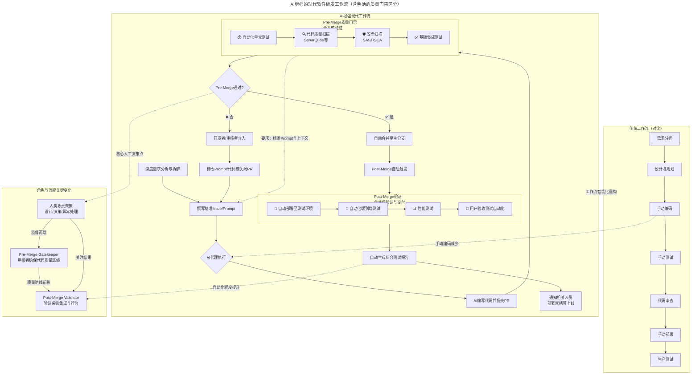



**Abstract:** AI coding assistants such as GitHub Copilot, Claude, and ChatGPT are evolving from mere auxiliary tools into core participants in our workflows. This report argues that the transformation is not simply about "efficiency gains," but a systemic restructuring of developer roles, work focus, and team collaboration models. The core value of developers is shifting upward from "writing code" to "architectural design, requirements analysis, and quality control," driving the entire R&D process toward greater automation and intelligence.

---

#### **1. Core Transformation: From "Code Writer" to "AI Conductor and Quality Commander"**

The deep integration of AI tools has led to a significant shift in how developers allocate their time, fundamentally changing their roles:

##### 1.1 Work Focus Shift

* **Decreased time on:**
  * Manually writing detailed implementation code
  * Creating basic boilerplate files
  * Looking up basic API documentation

* **Increased time on:**
  * **Deep analysis and decomposition:** Greater focus on understanding complex business logic and precisely breaking down macro requirements into fine-grained tasks (Issues/Prompts) that AI can understand and execute
  * **Learning and prompt engineering:** Learning how to collaborate effectively with AI, including writing clear prompts, providing effective context, and iteratively optimizing instructions
  * **Review and integration:** Core work becomes **reviewing AI-submitted code (PRs)**, judging its correctness, security, performance, and fit with the overall architecture
  * **System design and planning:** More energy invested in higher-level architectural design, technology selection, and long-term technical debt management

##### 1.2 Evolution of Required Capabilities

* **Extremely high demand for "holistic grasp capability":** Developers must have a clearer understanding of the system overview, inter-module relationships, and data flow to effectively guide AI and judge its output. **"Knowing what to build" is more important than "knowing how to write it."**
* **Critical thinking and discernment become key:** Must possess sharp judgment to quickly identify potential logical flaws, security risks, performance bottlenecks, or "eloquent nonsense" in AI-generated code
* **Communication and definition capabilities are amplified:** The ability to communicate with AI (and through AI with the team)—precisely defining problem boundaries and acceptance criteria—directly determines output quality

#### **2. Direct Impact: Leap in Efficiency, Density, and Automation Level**

##### 2.1 Significantly Faster Development Efficiency and Progress

* **Shortened coding cycles:** Repetitive, pattern-based coding work is greatly compressed, accelerating feature implementation
* **Accelerated learning curve:** AI serves as a real-time tutor, quickly answering technical questions and providing examples, helping developers rapidly master new languages and frameworks, thereby increasing learning intensity and effectiveness

##### 2.2 Increased Work Density and Output Expectations

Within the same time unit, as basic coding accelerates, individuals are expected to handle more complex logic, complete more functional modules, or be responsible for broader domains. This brings higher **cognitive work density**.

##### 2.3 Triggering Enhanced R&D Process Automation

AI introduction catalyzes the idealized "fully automated pipeline" vision closer to reality:

* **Starting point:** User or developer submits a structured Issue (serving as a natural language instruction)
* **AI execution:** AI agent understands the task, writes code, and automatically submits a PR
* **Automated quality gates:** Triggers automated testing (unit, integration), code quality scanning, security detection
* **Automated delivery:** After tests pass, code is automatically merged and deployed to the test environment, triggering more complex end-to-end automated tests
* **Automated feedback:** Test reports are automatically generated and submitted

**In this process, the core responsibility of developers is to design and maintain this automation pipeline and handle exceptions and critical decision points requiring human wisdom.**

#### **3. Potential Challenges and Future Outlook**

##### 3.1 Challenges and Risks

* **Over-reliance and skill degradation risk:** Need to guard against potential "use it or lose it" in basic coding ability, debugging depth, and understanding of underlying principles
* **Code quality and consistency governance:** AI-generated code may have inconsistent styles and hidden defects, requiring stronger code review culture and automated quality gates
* **New security and compliance topics:** AI may introduce code with security vulnerabilities or copyright-contaminated code, requiring new detection tools and audit processes
* **Team collaboration model adjustment:** Issue descriptions need extreme precision; code review standards and processes need redefinition to adapt to the new scenario of "humans reviewing AI code"

##### 3.2 Future Outlook

* **Increased developer stratification:** "Commander-type" developers who are good at leveraging AI, possess global vision, and strong critical thinking will become more valuable. Workflows may further stratify, with some focusing on business and architecture definition, and others on AI orchestration and result optimization
* **Birth of "AI-native" workflows:** Future development tools and project management platforms will integrate AI agents from the design phase, enabling more seamless and intelligent connections from requirements documentation to production deployment
* **Lowered innovation barriers, unleashed creativity:** Developers can be freed from heavy implementation details, investing more time and intellect in genuine innovation, user experience optimization, and solving complex business problems

#### **Conclusion**

The introduction of AI tools is not merely a simple tool upgrade, but a **deep restructuring of the software development workflow**. It is liberating developers from the traditional "code monkey" role, pushing them upstream in the value chain—to become **system designers, AI trainers and orchestrators, and ultimate quality owners**. Organizations and individuals who successfully adapt to this transformation will achieve a dual leap in productivity and innovation capability, building more powerful and automated intelligent R&D systems. The core of this process lies in: **humans focusing wisdom on defining "what to do" and "why," while increasingly delegating the specific execution of "how to do it" to AI for completion and optimization.**

#### **4. Beyond the Horizon: When AI Becomes Fully Autonomous**

The current workflow paradigm still maintains human leadership—humans define requirements, guide AI execution, and make final decisions. However, looking toward a more distant future, what if AI could autonomously generate requirements, organize and prioritize them, completely take over testing, and achieve self-iteration? In such a scenario, the entire development cycle might operate without human intervention.

This possibility raises profound questions that transcend technical considerations:

**4.1 Human-Centricity of AI-Generated Requirements**

If AI autonomously creates product requirements and feature roadmaps, can we ensure these requirements genuinely serve human needs and center around human values? Without human participation in the requirements generation phase, there is a risk that AI might optimize for metrics that appear rational but deviate from authentic human needs—pursuing efficiency, scalability, or algorithmic elegance while overlooking nuances of human experience, emotional needs, or cultural context.

**4.2 Alignment of AI's World Model with Human Understanding**

Does AI's understanding of the world align with human understanding and goals? Current AI systems learn from human-generated data and exhibit pattern-matching capabilities, but they lack genuine comprehension of meaning, context, and human intentionality. If AI systems were to operate with full autonomy, would their model of "what is valuable," "what is correct," and "what is desirable" converge with humanity's collective values and long-term interests?

**4.3 Current Reality: The Absence of AI Self-Awareness**

Importantly, we currently see no evidence of AI possessing self-awareness or autonomous consciousness. Today's AI systems, regardless of their sophistication, remain fundamentally tools—powerful pattern recognizers and generators that operate within the boundaries of their training and programming. They do not possess desires, intentions, or self-directed goals. This distinction is crucial: the scenarios described above remain speculative, contingent on breakthroughs in AI capabilities that may or may not occur, and that would raise entirely new categories of philosophical, ethical, and governance challenges.

**The Critical Imperative:**

As we advance along the path of AI-augmented development, maintaining human agency, judgment, and ethical oversight remains not merely advisable but essential. The "human-in-the-loop" is not a limitation to be overcome, but a safeguard ensuring that technology serves humanity's authentic interests and reflects our values, priorities, and collective wisdom.

---

#### **Modern Software Development Workflow Enhanced by AI**

```mermaid
---
title: AI-Enhanced Modern Software Development Workflow (with Clear Quality Gate Distinction)
---
flowchart TD
    subgraph A [Traditional Workflow (Comparison)]
        A1[Requirements Analysis] --> A2[Design & Planning]
        A2 --> A3[Manual Coding]
        A3 --> A4[Manual Testing]
        A4 --> A5[Code Review]
        A5 --> A6[Manual Deployment]
        A6 --> A7[Production Testing]
    end

    subgraph B [AI-Enhanced Modern Workflow]
        direction TB
        B1[Deep Requirements Analysis & Decomposition] --> B2[Write Precise Issue/Prompt]
        B2 --> B3{AI Agent Execution}

        B3 --> B4[AI Writes Code & Submits PR]

        subgraph B5 [Pre-Merge Quality Gates<br>Pre-Merge Validation]
            direction LR
            B5a[⏱️ Automated Unit Tests] --> B5b[🔍 Code Quality Scan<br>SonarQube etc]
            B5b --> B5c[🛡️ Security Scan<br>SAST/SCA]
            B5c --> B5d[✅ Basic Integration Tests]
        end

        B4 --> B5
        B5 --> B6{Pre-Merge Pass?}

        B6 -- ✅ Yes --> B7[Auto-Merge to Main Branch]
        B6 -- ❌ No --> B8[Developer/Reviewer Intervenes]
        B8 --> B9[Modify Prompt/Code or Close PR]
        B9 --> B2

        B7 --> B10[Post-Merge Auto-Trigger]

        subgraph B11 [Post-Merge Validation<br>Post-Merge Verification & Delivery]
            direction LR
            B11a[🚀 Auto-Deploy to Test Env] --> B11b[🧪 Automated E2E Tests]
            B11b --> B11c[📊 Performance Testing]
            B11c --> B11d[🎯 Automated UAT]
        end

        B10 --> B11
        B11 --> B12[Auto-Generate Test Report]
        B12 --> B13[Notify Stakeholders<br>Ready for Production]
    end

    subgraph C [Key Role & Process Changes]
        C1["Pre-Merge Gatekeeper"<br>Reviewers ensure code quality baseline]
        C2["Post-Merge Validator"<br>Verify system integration & behavior]
        C3["Human Responsibilities Focus"<br>Design/Decision/Exception Handling]

        C1 -- "Quality Defense Forward" --> C2
        C3 -- "Supervise Both Ends" --> C1
        C3 -- "Focus on Results" --> C2
    end

    A -- "Workflow Intelligence Restructuring" --> B
    A3 -. "Manual Coding Reduced" .-> B3
    B5 -. "Requires: Precise Prompts & Context" .-> B2
    B6 -. "Core Human Decision Point" .-> C3
    B12 -. "Increased Automation Level" .-> C2
```

---

### **分析报告：AI工具引入对软件研发工作流的重构与影响**

**报告摘要：** 以GitHub Copilot、Claude、ChatGPT等为代表的AI编码助手，正从辅助工具演变为工作流的核心参与者。本报告分析指出，其带来的并非简单的"效率提升"，而是一次对开发者角色、工作重心和团队协作模式的系统性重构。开发者的核心价值正从"编写代码"上移至"架构设计、需求分析与质量把控"，并推动研发全流程向更自动化、更智能化的方向演进。

---

#### **一、 核心转变：从"代码编写者"到"AI调度与质量指挥官"**

AI工具的深度集成，直接导致了开发者时间分配的显著转移，其角色发生了根本性变化：

##### 1.1 工作重心转移

* **减少：** 直接手写具体实现代码、编写基础样板文件、查阅基础API文档的时间
* **增加：**
  * **深度分析与拆解：** 更专注于理解复杂业务逻辑，并将宏观需求精准拆解为AI可理解、可执行的细颗粒度任务（Issue/Prompt）
  * **学习与提示工程：** 学习如何高效与AI协作，包括编写清晰的Prompt、提供有效的上下文、迭代优化指令
  * **审核与集成：** 核心工作变为**审核AI提交的代码（PR）**，判断其正确性、安全性、性能及与整体架构的契合度
  * **系统设计与规划：** 有更多精力投入到更高层次的架构设计、技术选型和长期技术债务管理

##### 1.2 能力要求演变

* **对"整体把握能力"要求极高：** 开发者必须对系统全貌、模块间关系、数据流有更清晰的认识，才能有效指导AI和判断其产出。**"知道要什么"比"知道怎么写"更重要。**
* **批判性思维与甄别能力成为关键：** 必须具备火眼金睛，能快速识别AI代码中潜在的逻辑漏洞、安全风险、性能瓶颈或"一本正经的胡说八道"
* **沟通与定义能力被放大：** 与AI（以及通过AI与团队）的沟通能力——即精准定义问题边界和验收标准的能力——直接决定产出质量

#### **二、 直接影响：效率、密度与自动化水平的跃升**

##### 2.1 开发效率与进度显著加快

* **缩短编码周期：** 重复性、模式化的编码工作被极大压缩，功能实现速度提升
* **加速学习曲线：** AI作为实时导师，能快速解答技术疑问、提供示例，帮助开发者快速掌握新语言、新框架，从而提升学习强度与效果

##### 2.2 工作密度与产出期望提升

在单位时间内，由于基础编码加速，个体被期望能处理更复杂的逻辑、完成更多的功能模块或负责更广的领域。这带来了更高的**认知工作密度**。

##### 2.3 触发研发全流程自动化增强

AI的引入成为催化剂，推动了理想化的"全自动流水线"愿景更接近现实：

* **起点：** 用户或开发者提交结构化的Issue（可视为自然语言指令）
* **AI执行：** AI代理（Agent）理解任务，编写代码，自动提交PR
* **自动化质量关卡：** 触发自动化测试（单元、集成）、代码质量扫描、安全检测
* **自动交付：** 测试通过后，自动合并代码，自动部署至测试环境，并触发更复杂的端到端自动化测试
* **自动反馈：** 测试报告自动生成并提交

**在这一流程中，开发者的核心职责是设计和维护这条自动化流水线，并处理其中需要人类智慧介入的异常与关键决策点。**

#### **三、 潜在挑战与未来展望**

##### 3.1 挑战与风险

* **过度依赖与技能退化风险：** 需警惕在基础编码能力、调试深度和底层原理理解上可能出现的"用进废退"
* **代码质量与一致性的治理：** AI生成的代码可能风格不一、存在隐藏缺陷，需要更强的代码审查文化和自动化质量门禁
* **安全与合规新课题：** AI可能引入存在安全漏洞的代码或受版权污染的代码，需要新的检测工具和审计流程
* **团队协作模式调整：** Issue的描述需要极度精确，代码审核的标准和流程需要重新定义，以适配"人审AI码"的新场景

##### 3.2 未来展望

* **开发者分层加剧：** 善于利用AI、具备全局视野和强大批判性思维的"指挥官型"开发者价值将更加凸显。工作流可能进一步分层，一部分人专注业务与架构定义，另一部分人专注AI调度与结果优化
* **"AI原生"工作流诞生：** 未来的开发工具和项目管理平台将从设计之初就融入AI智能体，实现从需求文档到上线部署的更无缝、更智能的衔接
* **创新门槛降低，创造力释放：** 开发者得以从繁重的实现细节中解脱，将更多时间和智力投入真正的创新、用户体验优化和解决复杂业务难题上

#### **结论**

AI工具的引入，绝非一次简单的工具升级，而是一次**对软件研发工作流的深度重构**。它正将开发者从传统的"码农"角色中解放出来，推向价值链条的更上游——成为**系统的设计者、AI的培训师与调度员、以及最终质量的责任人**。成功适应这一变革的组织与个人，将能实现生产效率与创新能力的双重跃迁，构建起更强大、更自动化的智能研发体系。这一进程的核心在于：**人类将智慧专注于定义"做什么"和"为什么"，而将"如何做"的具体执行，increasingly，委托给AI去完成和优化。**

#### **四、 更远的地平线：当AI走向完全自主**

目前的工作流范式仍然保持人类主导——人类定义需求、引导AI执行、做出最终决策。然而，展望更遥远的未来，如果AI能够自主创造需求、整理和排列优先级、完全接管测试、实现自我迭代，会怎样？在这样的场景下，整个开发周期可能无需人类介入即可运转。

这种可能性引发了超越技术层面的深刻问题：

**4.1 AI生成需求的人本中心性**

如果AI自主创建产品需求和功能路线图，我们能否确保这些需求真正服务于人类需要、以人类价值为中心？缺少人类参与需求生成阶段，存在这样的风险：AI可能会优化那些表面上看起来合理、但偏离真实人类需求的指标——追求效率、可扩展性或算法优雅性，却忽略人类体验的细微差别、情感需求或文化语境。

**4.2 AI世界模型与人类理解的对齐**

AI对世界的理解是否与人类的理解和目标一致？当前的AI系统从人类生成的数据中学习，展现出模式匹配能力，但它们缺乏对意义、语境和人类意图的真正理解。如果AI系统完全自主运作，它们关于"什么是有价值的"、"什么是正确的"、"什么是值得追求的"的模型，是否会与人类的集体价值观和长远利益趋同？

**4.3 当下现实：AI自主意识的缺失**

重要的是，我们目前没有看到任何AI拥有自我意识或自主意识的证据。今天的AI系统，无论多么复杂，本质上仍然是工具——在其训练和编程边界内运作的强大模式识别器和生成器。它们不具备欲望、意图或自主目标。这个区别至关重要：上述场景仍然是推测性的，依赖于AI能力的突破——这些突破可能发生也可能不发生，并且会引发全新类别的哲学、伦理和治理挑战。

**关键要务：**

随着我们沿着AI增强开发的道路前进，保持人类的主体性、判断力和伦理监督不仅仅是明智之举，而是至关重要的。"人在回路中"（human-in-the-loop）不是需要克服的限制，而是确保技术服务于人类真实利益、反映我们的价值观、优先事项和集体智慧的保障机制。

---

#### **AI增强的现代软件研发工作流**



---
