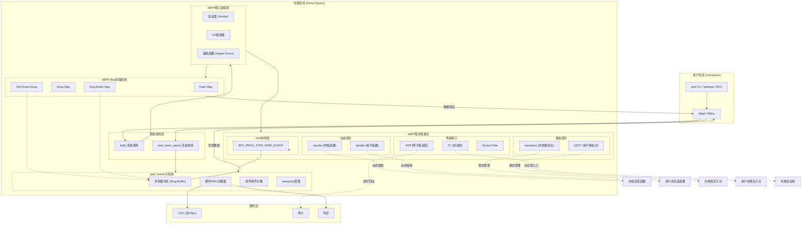



perf 子系统和 eBPF 并非两个孤立的子系统，而是**共享基础设施、互相协作**的伙伴。本文从两者在内核中的协作关系出发，再对比它们在「埋点」与数据处理思路上的本质区别，并对照主线内核代码做简要核对。

## 一、perf 与 eBPF 的紧密关系

### 1. 共享内核基础设施：perf_events 是基石

eBPF 的很多核心功能都建立在 `perf_events` 子系统提供的机制之上；`perf_events` 为 eBPF 的高效数据输出和硬件性能计数读取提供了通道。

#### 数据输出通道：BPF_MAP_TYPE_PERF_EVENT_ARRAY

当 eBPF 程序需要向用户空间发送大量数据时（例如追踪每次系统调用的参数），通常不直接操作文件或网络，而是通过一类特殊的 eBPF Map——`BPF_MAP_TYPE_PERF_EVENT_ARRAY`。

- **工作原理**：该 Map 的每个元素对应一个 `perf_event` 的文件描述符。eBPF 程序通过辅助函数 `bpf_perf_event_output()` 把数据写入该 Map，内核会将这些数据写入对应 perf 事件的**环形缓冲区（ring buffer）**。
- **优势**：复用 perf 子系统的内核-用户空间数据传输机制，实现无锁、高性能的数据通路，无需为 eBPF 再实现一套类似设施。

内核中该 Map 类型的实现位于 `kernel/bpf/arraymap.c`，例如 `perf_event_array_map_ops`（`perf_event_fd_array_get_ptr` 等）负责将 Map 中的 fd 解析为 `perf_event` 指针并与 ring buffer 关联；`kernel/bpf/verifier.c` 与 `kernel/bpf/syscall.c` 中对 `BPF_MAP_TYPE_PERF_EVENT_ARRAY` 的校验与更新逻辑也与之对应。

#### 读取性能计数器：bpf_perf_event_read 系列

eBPF 程序还可以通过 perf 子系统读取性能数据。辅助函数 `bpf_perf_event_read()` 和 `bpf_perf_event_read_value()` 用于读取由 `perf_events` 管理的硬件性能计数器（如 CPU 周期、缓存未命中等）的值，从而在 eBPF 中把自定义追踪逻辑与底层硬件性能数据结合。例如 `tools/perf/util/bpf_skel/bpf_prog_profiler.bpf.c`、`bperf_leader.bpf.c` 中就有对 `bpf_perf_event_read_value()` 的典型用法。

### 2. 程序类型协作：BPF_PROG_TYPE_PERF_EVENT

内核定义了专门的 eBPF 程序类型 `BPF_PROG_TYPE_PERF_EVENT`，允许将 eBPF 程序直接附加到某个 perf 事件上。

- **工作方式**：通过 `perf_event_open()` 创建 perf 事件时，可以指定一个 eBPF 程序作为该事件的**溢出处理函数（overflow handler）**。当事件触发（例如性能计数器达到采样周期，或 tracepoint 被命中）时，内核会调用该 eBPF 程序。相关逻辑见 `kernel/events/core.c` 中的 `bpf_overflow_handler` 以及 `perf_event_attach_bpf_prog()`；`kernel/trace/bpf_trace.c` 中则实现了 `perf_event_attach_bpf_prog()` 的具体附加流程。
- **应用场景**：可用于自定义、低开销的采样与分析，例如按 CPU 周期采样时在 eBPF 中记录调用栈或做过滤聚合，比传统 perf 采样更灵活。

### 3. 用户空间工具整合：从「BPF 事件」到「BPF 脚手架」

在用户空间工具 `perf` 中，与 eBPF 的集成方式也在演进。

- **过去**：`perf` 曾提供「BPF 事件」机制，允许将编译好的 eBPF 对象文件作为事件加载，但使用和维护成本较高。
- **现在**：`perf` 更多采用 **BPF skeleton**（libbpf 生成的脚手架）来加载和附加 eBPF 程序。例如 `perf trace` 使用 `tools/perf/util/bpf_skel/augmented_raw_syscalls.bpf.c` 等实现系统调用参数增强；`off_cpu.bpf.c`、`bpf_prog_profiler.bpf.c`、`bperf_leader.bpf.c` 等均使用 `BPF_MAP_TYPE_PERF_EVENT_ARRAY` 与 `bpf_perf_event_output()` / `bpf_perf_event_read_value()`，与内核实现一致。

### 4. 安全与权限统一：CAP_PERFMON

从权限模型看，perf 与 eBPF 的追踪能力由同一 capability 约束。内核在 `include/uapi/linux/capability.h` 中定义：

```c
/*
 * Allow system performance and observability privileged operations
 * using perf_events, i915_perf and other kernel subsystems
 */
#define CAP_PERFMON    38
```

同一文件中注释说明：**CAP_PERFMON** 与 **CAP_BPF** 共同用于放宽对追踪类 BPF 程序的限制（如指针转整数、部分 speculation 加固的绕过、`bpf_probe_read` / `bpf_trace_printk` 等），且「CAP_PERFMON and CAP_BPF are required to load tracing programs」。因此，拥有 `CAP_PERFMON` 的进程既可以做 perf 采样，也可以在具备 CAP_BPF 等条件下加载用于追踪的 eBPF 程序，两者在权限上统一。

### 小结：关系总览

| 关系层面 | 描述 |
|----------|------|
| **基础设施共享** | eBPF 依赖 perf 的**环形缓冲区**和**硬件计数器**，通过 `BPF_MAP_TYPE_PERF_EVENT_ARRAY` 和 `bpf_perf_event_read` 等实现高效数据交互。 |
| **程序类型协作** | `BPF_PROG_TYPE_PERF_EVENT` 允许将 eBPF 程序作为 perf 事件的溢出处理器，实现自定义采样逻辑。 |
| **工具整合** | `perf` 从早期的「BPF 事件」演进为使用 libbpf 的 **BPF skeleton** 加载 eBPF 程序。 |
| **安全模型** | `CAP_PERFMON` 与 `CAP_BPF` 共同控制对 perf_events 与 eBPF 追踪能力的访问。 |

下图概括 eBPF 与 perf 在内核中的架构关系、挂载点及数据通道（用户空间工具、系统调用、eBPF 核心与 Map、动态/静态探针、perf_events 子系统及与硬件的交互）：



（若站点支持 Mermaid 渲染，上图会显示为流程图；否则会显示为代码块。）

---

## 二、「埋点」思路的演进：预制传感器 vs 可编程探头

「埋点」是两者工作的基础，但**埋点方式与后续数据处理思路有本质区别**。

- **传统方式（含 perf 的多数功能）**：像在内核里预先装好一批**固定的、功能单一的传感器**，需要什么数据就去读对应传感器的读数。
- **eBPF 方式**：像提供一种可**安全、动态挂载并可编程的探头**，可以自己决定测什么、怎么测、以及在内核里做哪些初步处理。

### 1. 什么是「埋点」？

无论是 perf 还是 eBPF，核心都是在**内核（及用户态）关键路径上放置探测点**，在事件发生时（系统调用、网络包、函数调用等）采集信息。这些探测点是可观测性的数据源。

### 2. perf 的埋点思路：预制传感器

perf 主要利用**已有**的事件源与埋点：

- **硬件事件**：利用 CPU 的 **PMU（Performance Monitoring Unit）** 等硬件计数器，统计周期、缓存未命中、分支预测失败等；perf 负责配置与读取。
- **软件事件**：内核维护的统计（如上下文切换、缺页等），perf 直接读取。
- **Tracepoints（静态埋点）**：内核在关键路径上预先放置的静态探测点（系统调用入口/出口、调度、文件系统等），位置和格式在编译期确定；perf 通过启用这些 tracepoint 采集数据。

perf 的角色更接近「仪表盘操作员」：知道所有预制传感器在哪里、如何读，并以较低开销（尤其是采样）汇总成报告。

### 3. kprobe 与 uprobe：机制与内核支持

eBPF 的「动态埋点」能力建立在内核的 **kprobe** 与 **uprobe** 机制之上。二者允许在**不重新编译内核或目标程序**的前提下，在运行时把探测点挂在任意内核函数或用户态地址上，下面结合主线内核代码说明其含义与实现要点。

#### kprobe（Kernel Probe）

**kprobe** 用于在内核任意函数（或指定偏移）处插入探测。调用方只需提供**符号名**（如 `do_sys_open`）或「模块 + 偏移」；内核在**注册时**通过 `kallsyms_lookup_name()`（见 `kernel/kprobes.c`）解析出该符号的地址，无需在编译期固定探测位置。

- **为何是「动态」**：探测地址在 **register_kprobe()** 时才确定。内核维护符号表（kallsyms），可加载模块的符号在模块加载后也可解析；因此可以在不改源码、不重启的前提下，对当前运行内核的任意已导出或可见符号下 probe。
- **内核做了哪些支持**：
  - **插桩方式**：在探测地址处把**第一条指令**替换为架构相关的断点指令（如 x86 的 **INT3**，arm64 的 **BRK**）。`arch_arm_kprobe()` / `arch_disarm_kprobe()` 负责写入/恢复（见 `arch/x86/kernel/kprobes/core.c`：`text_poke(p->addr, &int3, 1)` 与恢复 `p->opcode`）。
  - **原始指令执行**：断点命中后，先执行注册的 handler（如 eBPF 程序），再**单步执行被替换掉的那条指令**。内核在可执行内存中为每条 kprobe 分配「指令槽」（`struct kprobe_insn_page`，见 `kernel/kprobes.c`），把原始指令拷贝到槽中执行，避免在运行时代码上直接执行可能受限于可执行页、相对寻址等约束。
  - **优化路径（CONFIG_OPTPROBES）**：部分架构还可将「断点 + 单步」优化为「跳转指令」，减少单步与 cache 失效的开销。

相关定义与流程集中在 `kernel/kprobes.c`（通用逻辑、哈希表 `kprobe_table`、注册/卸载）、`include/linux/kprobes.h`（`struct kprobe`：`addr`、`symbol_name`、`offset`、`opcode`、`ainsn` 等），以及各架构的 `arch/*/kernel/kprobes/`（如 `arch_arm_kprobe`、指令槽与单步）。

#### uprobe（User-space Probe）

**uprobe** 用于在用户态程序的指定**虚拟地址**处插入探测。通常用「可执行文件 inode + 文件内偏移」或「path + offset」描述位置；同一偏移可对应多个已映射该文件的进程，内核会按 **mmap** 在各自地址空间写入断点。

- **为何是「动态」**：探测的「文件 + 偏移」在**注册 uprobe 时**指定，无需重新编译或替换用户程序。只要目标进程已将该文件映射为可执行，内核会在其对应 VMA 的虚拟地址上安装断点；新 fork 的进程若映射同一文件，也会在首次访问时通过 **MMU notifier** 等路径被插入断点（见 `kernel/events/uprobes.c` 中的 `install_breakpoint`、`set_swbp`）。
- **内核做了哪些支持**：
  - **插桩方式**：在用户空间对应页上写入架构的**软断点**（如 x86 的 INT3）。`set_swbp()` 通过 `uprobe_write_opcode()` 把断点写进目标 VMA；卸载时 `set_orig_insn()` 恢复原指令（`kernel/events/uprobes.c`）。
  - **原始指令执行（XOL）**：用户态不能像内核那样随意在任意可执行页单步「一条指令」而不影响相邻指令，因此 uprobe 使用 **XOL（Execute Out of Line）**：为每个被探测的进程维护一块**专用可执行映射**（`struct xol_area`，名如 `[uprobes]`），把「被替换掉的那条指令」拷贝到 XOL 槽中执行，执行完再回到原流程。见 `kernel/events/uprobes.c` 中的 `xol_area`、`xol_fault`、`xol_add_vma` 以及 `arch_uprobe_analyze_insn()` 对指令的分析与 ixol 的生成。

uprobe 的消费者通过 `struct uprobe_consumer`（`handler`、`ret_handler`、`filter`）挂到 `struct uprobe` 上；eBPF 等会复用这套基础设施，把 BPF 程序作为 consumer 挂到同一 uprobe。

#### 小结：动态的含义与依赖

| 机制 | 探测对象 | 「动态」体现 | 内核关键支持 |
|------|----------|--------------|--------------|
| **kprobe** | 内核函数（符号或地址） | 地址在 **register_kprobe** 时由 kallsyms 等解析，无需编译期埋点 | 断点替换（arch_arm/disarm）、指令槽单步、可选跳转优化 |
| **uprobe** | 用户态（文件 + 偏移 → 各进程 VMA） | 在 **register_uprobe** 时指定 offset，按 mmap 在运行时插入断点 | 用户态页写断点（set_swbp/set_orig_insn）、XOL 执行原指令 |

eBPF 的 kprobe/uprobe 程序类型（如 `BPF_PROG_TYPE_KPROBE`）即是在上述机制之上，把「断点命中后的处理」换成经 verifier 校验的 BPF 字节码，从而在保持动态性的同时提供可编程、安全的内核/用户态探测能力[^5][^6][^7]。

### 4. eBPF 的埋点思路：可编程探头

eBPF 在「埋点」上的不同在于**动态与可编程**：

- **动态埋点（kprobe / uprobe）**：若内核或应用没有现成探测点，eBPF 可以在**任意内核函数（kprobe）或用户态函数（uprobe）** 入口/出口动态挂载探测逻辑，无需改内核源码或重新部署固定 tracepoint（其机制见上一小节）。
- **复用现有埋点**：eBPF 也可挂到现有 tracepoint 上；与 perf 不同的是，触发时不仅可以读预定义数据，还可以**执行自定义逻辑**做过滤、聚合、计算。
- **处理下放**：perf 通常把原始或轻度聚合数据经 ring buffer 传到用户空间再由 `perf` 分析；eBPF 则允许**把一部分处理逻辑放在内核**（例如只统计延迟 &gt; 100ms 的请求、或在内核里算好直方图），仅把结果或关键数据交给用户空间，减少数据拷贝与上下文切换。

### 对比总结

| 特性 | perf | eBPF |
|------|------|------|
| **埋点类型** | 主要依赖**预制**的硬件事件、软件事件和静态 tracepoint。 | 既可用预制 tracepoint，更核心的是**动态** kprobe/uprobe。 |
| **数据处理** | 主要在**用户空间**；内核负责采集和输出原始/轻度聚合数据。 | **内核与用户空间协同**；可在内核执行聚合、过滤、统计，只下发结果或关键数据。 |
| **灵活性** | 相对固定，只能获取预设格式的数据。 | 高；可访问函数上下文、参数、返回值，并按需编写处理逻辑。 |
| **编程模型** | 通过命令行参数与预定义事件配置。 | 用 C 等编写小程序，经内核验证后执行。 |

因此，两者都建立在「埋点」之上，但 **eBPF 的突破在于：在埋点之上增加了动态创建探测点、以及在内核中安全执行自定义处理逻辑的能力**，从「读仪表」演进到「可编程探头」。

## References

[^1]: [Linux Kernel - capability.h (CAP_PERFMON, CAP_BPF)](https://git.kernel.org/pub/scm/linux/kernel/git/torvalds/linux.git/tree/include/uapi/linux/capability.h) - 性能与可观测性相关 capability 定义及注释

[^2]: [kernel/bpf/arraymap.c - perf_event_array](https://git.kernel.org/pub/scm/linux/kernel/git/torvalds/linux.git/tree/kernel/bpf/arraymap.c) - BPF_MAP_TYPE_PERF_EVENT_ARRAY 的 map_ops 实现

[^3]: [kernel/events/core.c - bpf_overflow_handler, perf_event_attach_bpf_prog](https://git.kernel.org/pub/scm/linux/kernel/git/torvalds/linux.git/tree/kernel/events/core.c) - perf 事件与 BPF 溢出处理器的挂载

[^4]: [tools/perf/util/bpf_skel/](https://git.kernel.org/pub/scm/linux/kernel/git/torvalds/linux.git/tree/tools/perf/util/bpf_skel) - perf 工具内使用的 BPF skeleton 示例（如 augmented_raw_syscalls、off_cpu、bperf 等）

[^5]: [kernel/kprobes.c](https://git.kernel.org/pub/scm/linux/kernel/git/torvalds/linux.git/tree/kernel/kprobes.c) - kprobe 通用逻辑：注册/卸载、kallsyms 解析、指令槽与 arm/disarm

[^6]: [arch/x86/kernel/kprobes/core.c - arch_arm_kprobe / arch_disarm_kprobe](https://git.kernel.org/pub/scm/linux/kernel/git/torvalds/linux.git/tree/arch/x86/kernel/kprobes/core.c) - x86 上 kprobe 断点写入与恢复（INT3 / text_poke）

[^7]: [kernel/events/uprobes.c](https://git.kernel.org/pub/scm/linux/kernel/git/torvalds/linux.git/tree/kernel/events/uprobes.c) - uprobe 实现：set_swbp/set_orig_insn、XOL（xol_area）、install_breakpoint
