

`ccoctl` 是 OpenShift 的云凭据操作符 (CCO) 实用程序，其主要用途是在**手动模式**下，为各个集群组件在云提供商上**创建和管理精细化的短期权限凭证**，从而避免在集群中存储高权限的长期凭证，提升集群安全性。

简单来说，它允许您为 OpenShift 的每个组件（如镜像仓库、存储驱动、Ingress Controller 等）分别创建独立的、最小权限的云账号，而不是使用一个拥有全局权限的管理员账号。

## 一、为什么需要 ccoctl？与默认模式的对比

### 核心作用

`ccoctl` 主要用在需要**最高安全标准**的场景。它将云凭证的管理从集群内部转移到集群外部，实现了更严格的权限控制：

- **实现短期凭证**：为 AWS、GCP 等云平台配置基于 OIDC 的短期凭证（如 AWS STS、GCP Workload Identity）。集群组件使用这些临时令牌来访问云 API，凭证会自动轮换，风险更低。
- **避免存储管理员凭证**：在手动模式下，集群的 `kube-system` 命名空间中不会存储高权限的管理员级云凭证，大大降低了凭证泄露的风险。
- **管理长期凭证**：对于 IBM Cloud 或 Nutanix 等平台，`ccoctl` 也用于在安装过程中配置由外部管理的长期凭证。
- **清理资源**：在集群卸载后，可以使用 `ccoctl` 来删除它在安装时创建的云资源（如 IAM 角色、OIDC 提供商和 S3 存储桶）。

**简单来说**：不使用 `ccoctl` 的安装过程更简单快捷，但安全性较低；使用 `ccoctl` 的过程更复杂，但安全性最高，符合企业级安全最佳实践。

### 两种方式对比

| 对比维度 | 使用 `ccoctl` (手动模式 + 短期凭证) | 不使用 `ccoctl` (默认 Mint 模式) |
| :--- | :--- | :--- |
| **核心机制** | 基于 **STS** 的**短期、动态令牌**。集群组件通过 ServiceAccount 扮演 IAM 角色，自动获取定期刷新的临时凭证。 | 基于**长期 Access Key**。CCO 使用高权限的管理员凭证，为其他组件**动态创建**低权限的长期用户。 |
| **安全性** | **最高**。集群内部不存储任何长期有效的高风险凭证。 | **较高，但存在风险**。高权限的管理员凭证在安装后默认会存储在 `kube-system` 命名空间中。 |
| **安装流程** | **复杂**。安装前需要手动执行 `ccoctl`，预先创建 OIDC、IAM 角色等，并将生成的清单提供给安装程序。 | **简单、自动化**。只需在 `install-config.yaml` 中配置云凭证即可。 |
| **运维负担** | 升级时若权限要求未变通常无需额外操作；权限有更新时需用 `ccoctl` 更新角色。 | 升级前需检查新版本 CredentialsRequest，确保管理员凭证权限充足。 |
| **集群销毁** | 需使用 `ccoctl aws delete` 等**手动清理**预先创建的 IAM 和 OIDC 资源。 | `openshift-install destroy cluster` 即可**自动清理**。 |

**建议**：有严格安全合规要求或希望采用最小权限原则时选用 `ccoctl`；开发测试、POC 或优先便利性时，默认 Mint 模式即可。

---

## 二、如何使用 ccoctl

### 获取 ccoctl 二进制

```bash
RELEASE_IMAGE=$(./openshift-install version | awk '/release image/ {print $3}')
CCO_IMAGE=$(oc adm release info --image-for='cloud-credential-operator' $RELEASE_IMAGE -a ~/.pull-secret)
oc image extract $CCO_IMAGE --file="/usr/bin/ccoctl.rhel8" -a ~/.pull-secret
chmod 775 ccoctl.rhel8
./ccoctl --help
```

### 主要场景：为 AWS STS 集群创建资源

1. **创建密钥对**：`./ccoctl aws create-key-pair`
2. **创建 OIDC 身份提供商和 S3 存储桶**：`./ccoctl aws create-identity-provider --name=<cluster-name> --region=<aws-region> --public-key-file=<path-to-public-key>`
3. **提取 CredentialsRequests**：`oc adm release extract --credentials-requests --cloud=aws --to=./credrequests <your-release-image>`
4. **为每个组件创建 IAM 角色**：`./ccoctl aws create-iam-roles --name=<cluster-name> --region=<aws-region> --credentials-requests-dir=./credrequests --identity-provider-arn=<arn-of-oidc-provider>`

完成后将生成的 manifest 复制到安装目录的 `manifests` 和 `tls` 目录。集群卸载后清理：`./ccoctl aws delete --name=<cluster-name> --region=<aws-region>`。

---

## 三、STS 工作流程：从准备到运行时

这是云原生安全的最佳实践之一，结合 **OIDC 身份联邦**、**Kubernetes ServiceAccount** 和 **云 IAM 角色**，以 **AWS STS** 为例说明。

### 核心架构概览（双向信任链）

1. **OpenShift 集群信任 AWS**：集群通过 OIDC 提供商对外宣称「我是谁」。
2. **AWS 信任 OpenShift**：IAM 角色配置为只信任特定的 OpenShift ServiceAccount。
3. **组件自动换证**：组件通过扮演角色获取临时令牌，无需人工干预。

### 前期准备（ccoctl 搭建）

1. **创建 OIDC 提供商**：`ccoctl` 在 AWS 上创建公钥端点（通常放在 S3），AWS 用其验证集群签发的 ServiceAccount 令牌。
2. **创建 IAM 角色与信任策略**：为每个需要云权限的组件创建一个 IAM 角色，信任策略只允许特定的 OpenShift ServiceAccount 扮演该角色。示例：

```json
{
  "Effect": "Allow",
  "Principal": { "Federated": "arn:aws:iam::123456789:oidc-provider/<s3-bucket-name>" },
  "Action": "sts:AssumeRoleWithWebIdentity",
  "Condition": {
    "StringEquals": { "<s3-bucket-name>:sub": "system:serviceaccount:openshift-ingress:router" }
  }
}
```

### 集群运行时（自动获取凭证）

以 Ingress Controller Pod 为例：

1. **Pod 挂载带注解的 ServiceAccount**：例如 `sts.amazonaws.com/role-arn: "arn:aws:iam::123456789:role/openshift-ingress-role"`，无 AWS Secret。
2. **API Server 签发 JWT**：Kubelet 向 API Server 请求为该 ServiceAccount 签发 JWT，签名私钥即 `ccoctl` 生成的那对密钥中的私钥。
3. **Pod 向 AWS STS 发起 AssumeRoleWithWebIdentity**：SDK 自动携带 JWT 与 Role ARN。
4. **STS 验证并颁发临时凭证**：验证 JWT 签名（用 OIDC 公钥）、校验 `sub` 与信任策略，通过后返回 `AccessKeyId`、`SecretAccessKey`、`SessionToken`（通常 1 小时有效）。
5. **Pod 使用临时凭证调用 AWS API**，过期前 SDK 自动用同一 JWT 换新凭证，对应用透明。

### 为什么这个模式更安全？

- **无长期凭证**：集群内没有永久有效的 AccessKey/SecretKey。
- **权限最小化**：每个组件只能拿到自己 Role 的权限。
- **凭证自动轮换**：泄露的临时凭证在 1 小时内失效。
- **身份绑定**：凭证与特定 Pod/ServiceAccount 绑定，无法被集群外冒用。

---

## 四、技术细节：公钥、IAM Role 数量与 SA/Role 关系

### 公钥端点：签名验证，不是数据加密

使用的是**私钥签名、公钥验签**的数字签名过程：

- **ccoctl**：生成密钥对；**私钥**由集群 API Server 保管并用于**签发** JWT；**公钥**上传到 S3（OIDC 公钥端点）。
- **流程**：API Server 用私钥对 JWT 签名 → AWS STS 从 OIDC 端点取公钥验签，确认令牌来自可信集群且未被篡改。核心是**身份真实性验证**，不是传输保密。

### IAM Role 数量：约 10–15 个

`ccoctl` 为每个需要调用云 API 的组件创建一个独立 IAM Role，**不使用** IAM User。典型组件包括：Cluster API Provider、Image Registry、Ingress Controller、Storage (CSI)、Machine Config Operator、Cloud Network Config 等。

### ServiceAccount 与 IAM Role：扮演与被扮演

- **ServiceAccount**：集群内「谁」在请求。
- **IAM Role**：云上「可以做什么」的权限集合。
- **信任策略**：规定只允许特定 OIDC 端点、特定 ServiceAccount（如 `openshift-ingress:router`）来扮演该 Role。SA 拿 JWT 来「敲门」，Role 验证通过后才允许暂时扮演。

### 整体关系与流程图

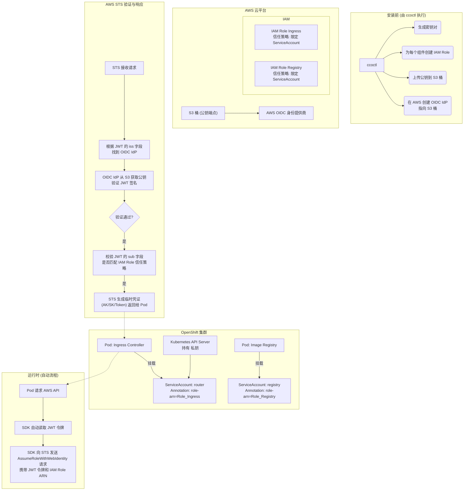

要点：私钥在集群内签名，公钥在 S3 供 AWS 验签；每个组件一个 Role；SA 通过 Annotation 与 Role 信任策略建立绑定；运行时 Pod 用 JWT 向 STS 申请扮演 Role 并获得临时凭证。

---

## 五、JWT 令牌 vs STS 临时凭证

**关系概括**：JWT 是「身份证」，STS 临时凭证是「通行证」。Pod 先亮出身份证证明「我是谁」，再换取能真正调用云 API 的通行证。

### 对比表

| 维度 | JWT 令牌 | STS 临时凭证 |
|:---|:---|:---|
| **颁发者** | Kubernetes API Server | AWS STS |
| **用途** | 向 AWS 证明身份（某某 ServiceAccount） | 向 AWS 服务证明权限（有权调用哪些 API） |
| **包含内容** | 集群身份、Namespace、SA 名称、过期时间 | 临时 AccessKey、SecretKey、SessionToken、过期时间 |
| **有效期** | 通常 1 小时（可配置） | 通常 1 小时 |
| **是否直接调用 AWS API** | ❌ 不能 | ✅ 能 |

### 类比：机场安检

| 现实场景 | OpenShift + AWS |
|:---|:---|
| 身份证 | **JWT 令牌** |
| 公安局 | Kubernetes API Server |
| 登机牌 | **STS 临时凭证** |
| 用登机牌登机 | 用临时凭证调用 AWS API |

### JWT 与 STS 关系（Mermaid）

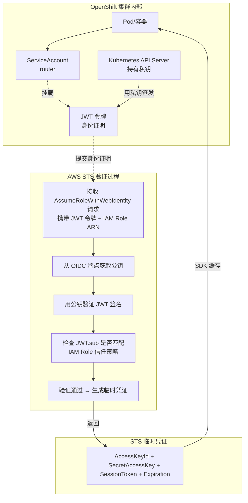

### 时序流程

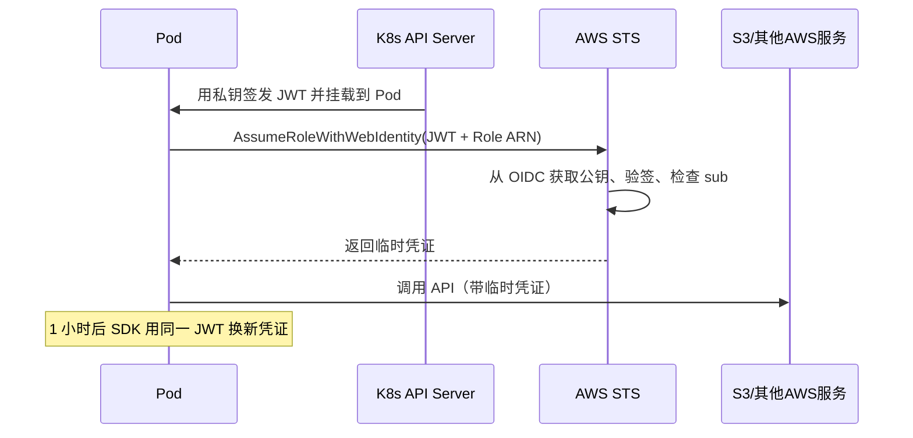

### 三者的层级关系

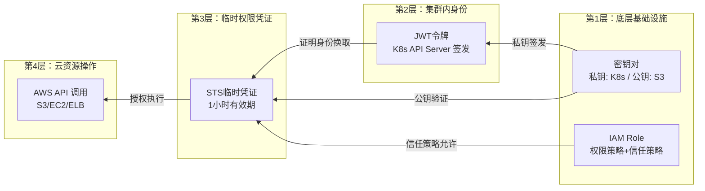

### 核心关系总结（图示）

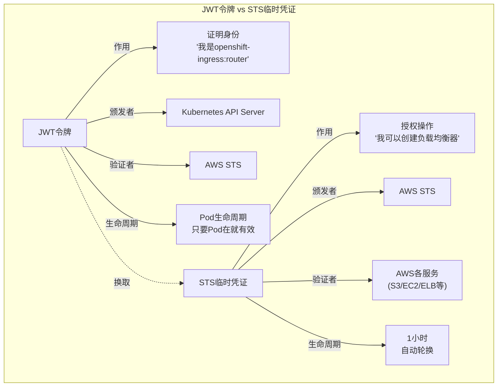

**一句话**：JWT 管「你是谁」，临时凭证管「你能做什么」；两者职责分明，流程自动化。

---

## 六、IAM Role 的两种核心策略与权限来源

**重要**：这些 IAM Role 的权限**与 IAM User 无关**，来自**角色自身附加的权限策略**。

### 双重策略结构

每个 IAM Role 包含两个独立策略：

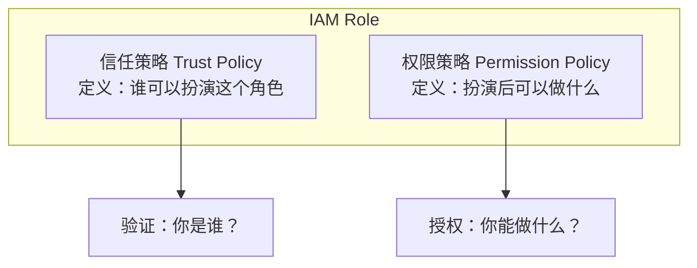

- **信任策略**：只允许来自特定 OIDC 提供商、且 JWT 的 `sub` 为特定 ServiceAccount 的请求者扮演该角色。
- **权限策略**：定义扮演后能执行哪些 AWS 操作（如 Image Registry 的 S3 操作）。

在 ccoctl 模式下**完全不使用 IAM User**：ccoctl 为每个组件创建 IAM Role，直接附加权限策略与信任策略；Pod 通过 JWT 扮演角色，获得的是**角色自身的权限**。

### 信任策略的完整工作机制

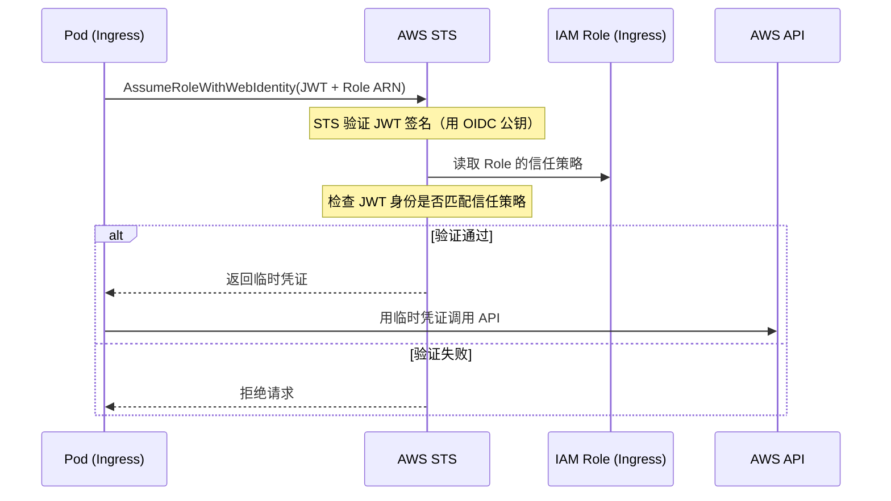

信任策略在扮演阶段由 STS 验证；权限策略在实际调用各 AWS 服务时验证；两者独立且缺一不可。

### ccoctl 的权力从哪来？

`ccoctl` 的权力是**被赋予**的：运行 `ccoctl` 的人（或系统）必须提供一个具有足够 AWS 权限的 IAM 用户或角色（例如能调用 `iam:CreateRole`、`iam:CreateOpenIDConnectProvider`、`s3:PutObject` 等）。有了该凭证后，`ccoctl` 按 OpenShift 的 CredentialsRequest 为每个组件创建 IAM Role，并附加权限策略与信任策略。

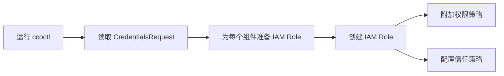

---

## 七、运行态集群的权限闭环与安全实践

用于运行 `ccoctl` 的高权限用户，在集群安装完成后**可以彻底退出**：集群运行时**不需要、也不会用到**该用户的凭证。

### 运行态权限闭环

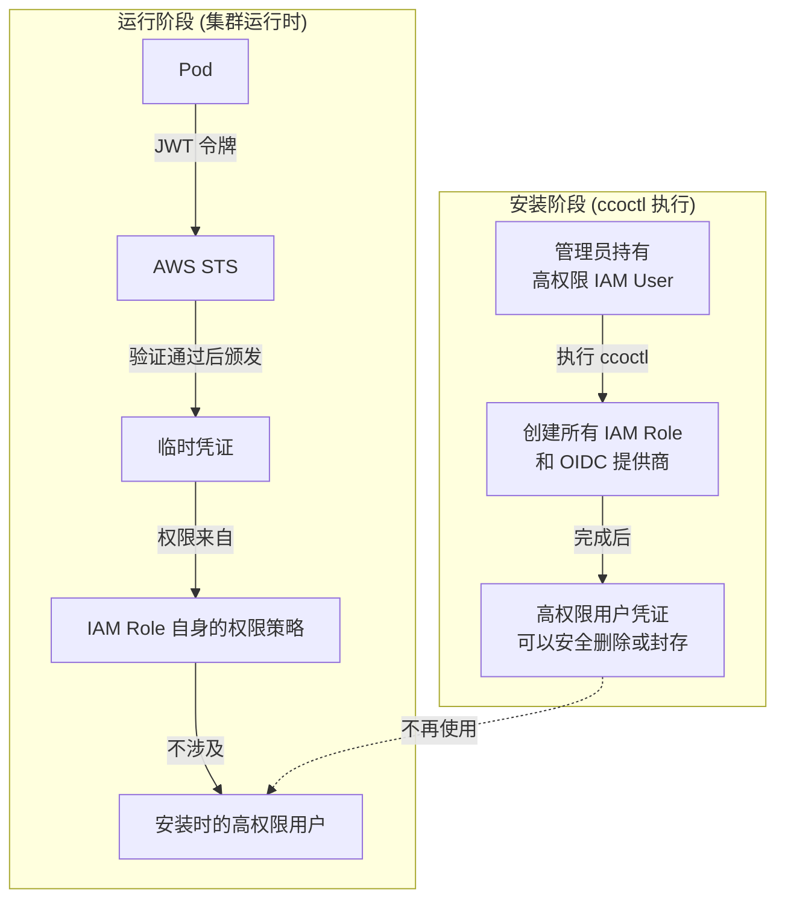

原因简要说明：权限已固化在各 IAM Role 的权限策略与信任策略中；集群组件通过 JWT → STS → 扮演 Role → 获得临时凭证 → 调用 API，整条链无需安装时的高权限用户；临时凭证的权限来自被扮演的 Role，而非创建 Role 的用户。

### 安全最佳实践：安装后清理

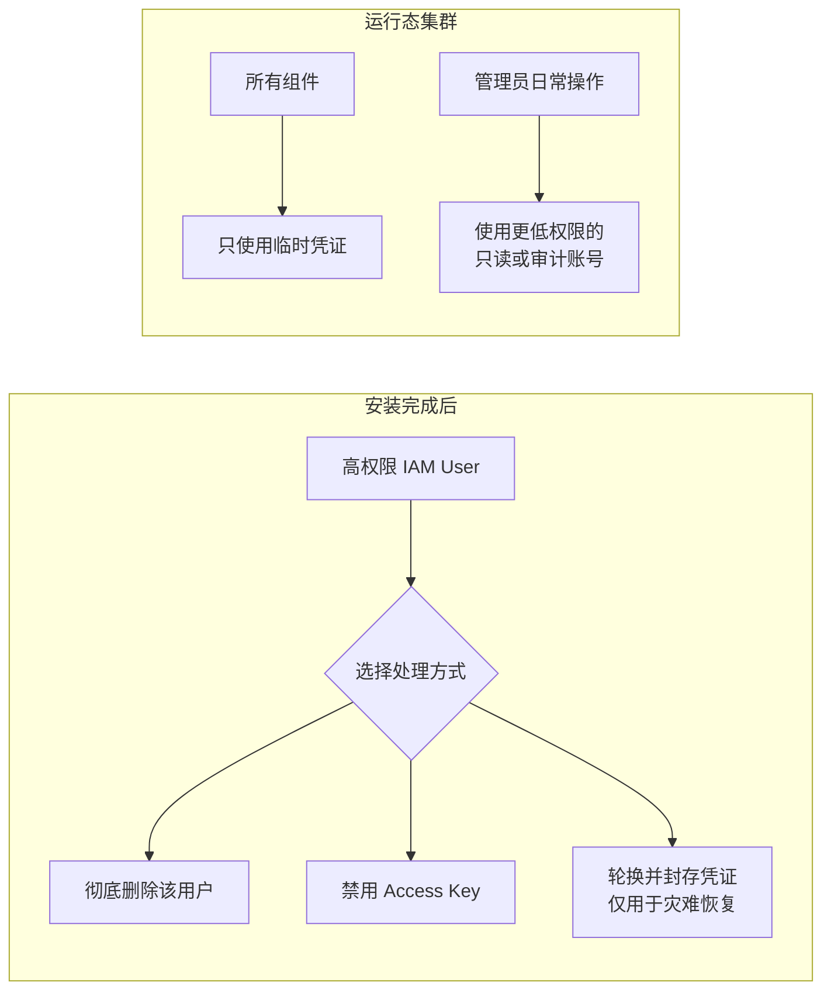

建议：安装成功后立即删除或禁用该高权限用户的 Access Key；日常管理使用只读或审计账号；必要时可用 STS 临时凭证来运行 `ccoctl`，避免长期高权限用户。

### 与 Mint 模式对比

| 对比项 | Mint 模式 | ccoctl + STS 模式 |
|:---|:---|:---|
| 安装时高权限用户 | 安装后默认**保留**在 `kube-system` Secret 中 | 安装后**可安全删除** |
| 凭证类型 | 长期 AccessKey/SecretKey | 1 小时自动轮换的临时凭证 |
| 泄露风险 | 攻击者可提取长期凭证 | 仅能获得短期凭证，且无法提取长期凭证 |
| 权限范围 | 常为全局管理员权限 | 每组件最小必要权限 |

---

## 八、kube-apiserver 与 OIDC

JWT 的签发与公钥提供由 **kube-apiserver** 完成：

1. **持有私钥**：加载 `ccoctl` 生成并交给集群的私钥（如 `/etc/kubernetes/pki/sa.key`）。
2. **签发 JWT**：当 Pod 挂载 ServiceAccount 并请求令牌时，使用 TokenRequest API 签发**绑定服务账户令牌**（Bound Service Account Token）。
3. **提供公钥端点**：通过 `/.well-known/openid-configuration`、`/openid/v1/jwks` 等对外提供公钥，供 AWS STS 验签。

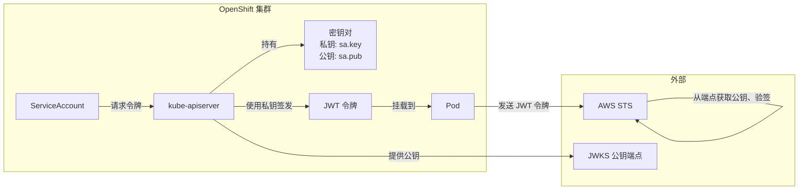

kubelet 会监控挂载的短期令牌有效期，在过期前通过 TokenRequest API 向 apiserver 请求新令牌，实现无缝轮换。

---

## 九、AWS 对 OIDC 的支持与标准化

AWS **主动实现了 OIDC 开放标准**，才能与 Kubernetes/OpenShift 无缝集成。

### AWS 对 OIDC 的支持

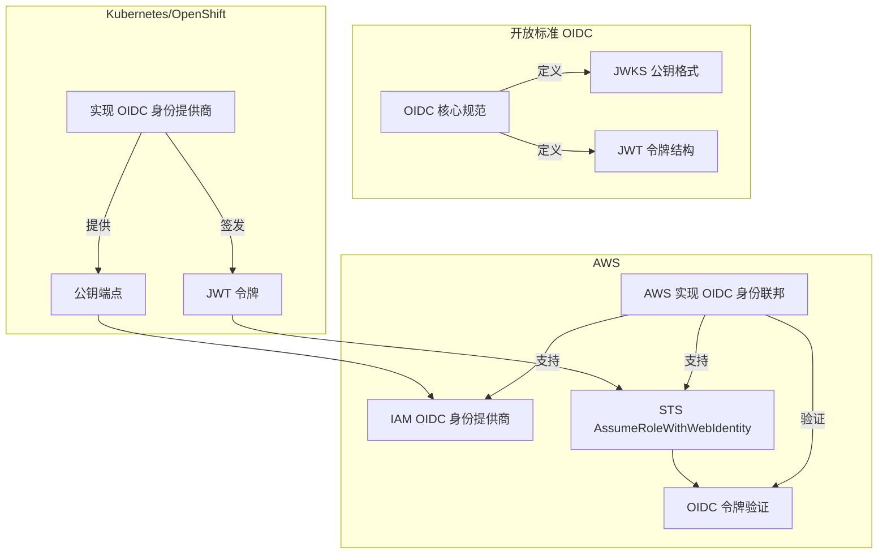

AWS 的三件关键实现：① IAM OIDC 身份提供商（ccoctl 在 AWS 上创建）；② STS `AssumeRoleWithWebIdentity` API；③ IAM Role 信任策略中的 OIDC 条件键（如 `sub`、`aud`、`iss`）。GCP、Azure、阿里云等也支持类似 OIDC 联邦，逻辑一致：集群提供 OIDC 端点 → 云厂商创建 OIDC IdP → 角色配置信任策略 → Pod 用 JWT 换临时凭证。

### 标准化的价值

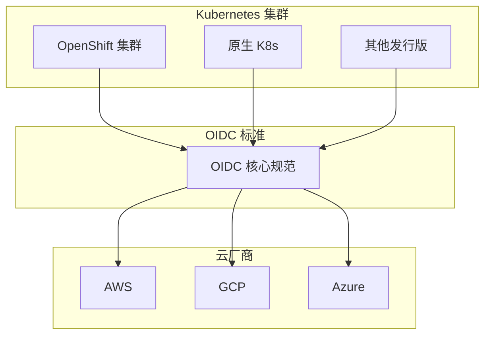

---

## 十、短期 vs 长期凭证与数据格式

### 短期与长期凭证对比

| 维度 | 普通版本 (Mint/手动) | STS 版本 (ccoctl) |
| :--- | :--- | :--- |
| **凭证类型** | **长期** AccessKey/SecretKey | **短期** STS 临时凭证 |
| **凭证来源** | CCO 用管理员凭证创建 IAM **User** | Pod 用 JWT **扮演** IAM **Role** |
| **有效期** | **永久有效**（除非手动轮转） | **1 小时**，自动轮换 |
| **集群内凭证** | 存在于 `kube-system` Secret | **零**长期凭证 |
| **凭证数量** | 11+ 个（1 个高权限 + 约 10 个组件用户） | 0 个用户，约 10 个可扮演的 Role |
| **泄露影响** | 严重且持久 | 有限且短暂（1 小时内失效） |

安装阶段 STS 版本需要更多权限（创建 OIDC、IAM Role 等）是一次性「建设成本」；运行阶段普通版本长期存在的多凭证才是安全命门。STS 用安装时短暂的「多」，换运行时永久的「少」和「短」。

### 数据格式对比

- **长期凭证**：2 个字段 — `AccessKeyId`（以 `AKIA` 开头）、`SecretAccessKey`；无过期时间。
- **临时凭证**：3 个字段 — `AccessKeyId`（以 `ASIA` 开头）、`SecretAccessKey`、**`SessionToken`**，以及 `Expiration`。调用 AWS API 时**必须同时携带**三者；缺少 `SessionToken` 会被拒绝。

`SessionToken` 是 STS 临时凭证的关键：证明凭证由 STS 合法颁发、在有效期内且未超出权限范围。

### SessionToken 的验证

验证是「接力」的：**签发**由 STS 在 AssumeRoleWithWebIdentity 时完成；**每次 API 调用**时，目标服务（如 S3、EC2）将凭证转交 AWS 统一认证系统，检查 SessionToken 是否合法、未过期、未吊销，并评估权限与条件。这样既能及时吊销，又保证审计与动态条件评估有效。

每次 API 调用时，AWS 内部的验证流程可概括为：

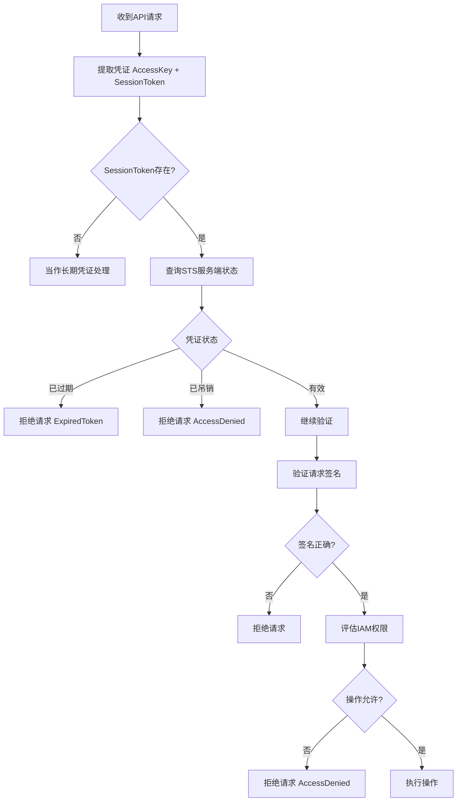

### SessionToken 验证时序

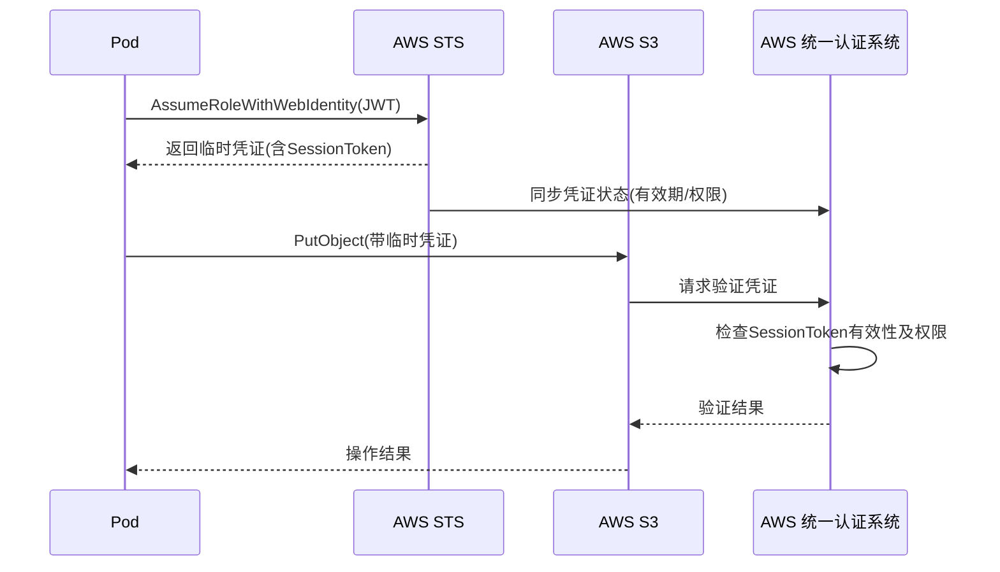

---

## 十一、缓存与验证：不会每次调用 AssumeRole

集群**不会每次访问都调用 AssumeRole**。凭证使用是**一次 AssumeRole，多次使用**，并有过期前自动刷新。

### 缓存机制

```mermaid
graph TD
    subgraph "第1层：Pod 内 SDK 缓存"
        A[Pod 首次调用 AWS API] --> B[SDK 检查内存缓存]
        B -->|无有效凭证| C[调用 AssumeRoleWithWebIdentity]
        C --> D[STS 返回临时凭证，有效期 1 小时]
        D --> E[SDK 将凭证缓存到内存]
        E --> F[使用凭证调用目标 API]
    end
    subgraph "第2层：后续 API 调用"
        G[后续 API 请求] --> H[SDK 检查内存缓存]
        H -->|有有效凭证| I[直接使用缓存凭证]
        I --> J[调用目标 API]
    end
    subgraph "第3层：过期前自动刷新"
        K[凭证剩余约 5 分钟] --> L[SDK 异步刷新]
        L --> M[后台 AssumeRoleWithWebIdentity]
        M --> N[更新内存缓存]
        N --> O[对应用完全透明]
    end
```

因此：**是否每次访问都 AssumeRole？** 否，只有首次（或过期后）才调用。**凭证用多久？** 1 小时，SDK 在过期前约 5 分钟自动刷新。**性能影响？** 与长期凭证无异，绝大多数请求命中缓存。

### 何时会重新 AssumeRole？

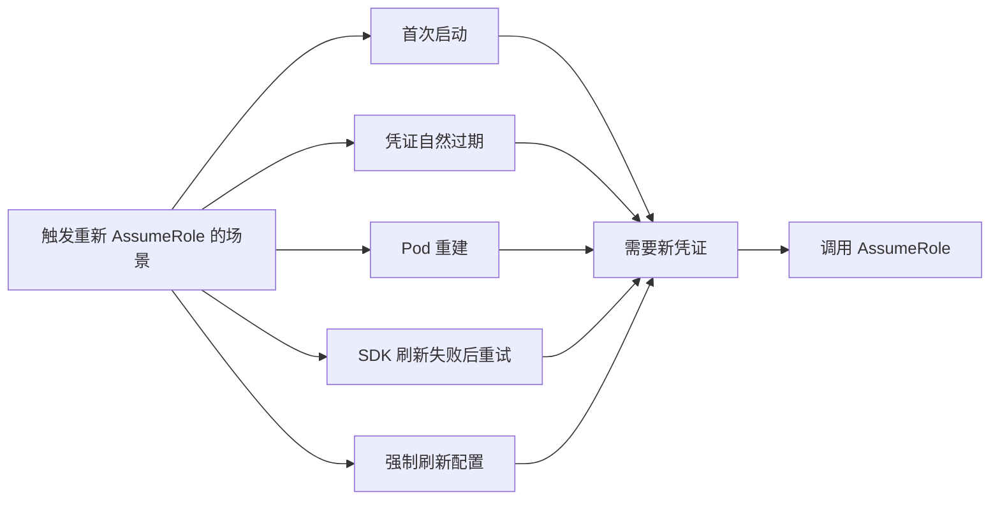

即：首次启动、凭证自然过期、Pod 重建、SDK 刷新失败后重试、或显式配置强制刷新时。

### 获取 vs 验证

**凭证获取**有缓存（约 1 小时一次，由 SDK 管理）；**凭证验证**每次 API 调用都会进行（目标服务向 AWS 认证系统验证 SessionToken、签名与权限）。这样既能及时吊销、满足动态策略与审计，又通过服务端缓存和边缘节点将单次验证延迟控制在很低水平。

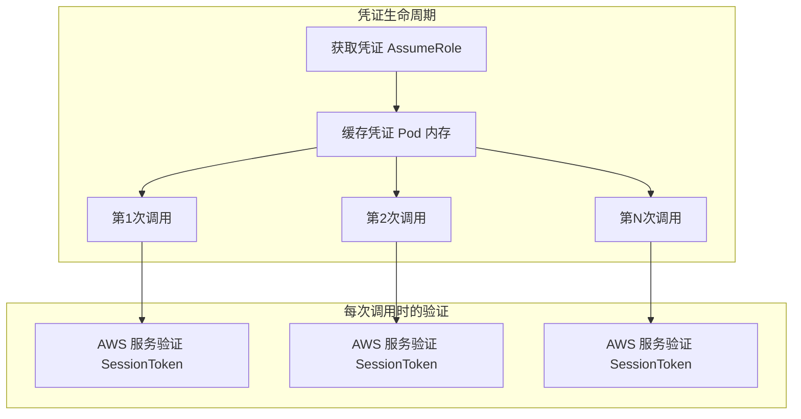

---

## 十二、完整链条总览：数据与端点

### 阶段概览

- **阶段 1（ccoctl）**：提取 CredentialsRequest、生成密钥对、向 S3 上传 OIDC 配置与公钥、创建 OIDC 提供商、为每个组件创建 IAM Role（含信任策略与权限策略）、输出 Secret YAML。
- **阶段 2（运行时）**：Pod 挂载 SA → apiserver 签发 JWT → Pod 首次调用时 SDK 向 STS 发送 AssumeRoleWithWebIdentity(JWT + Role ARN) → STS 从 OIDC 取公钥验签、检查 sub → 返回临时凭证 → Pod 用临时凭证调用各 AWS 服务。
- **阶段 3（每次调用）**：目标服务将凭证交 AWS 统一认证验证 SessionToken、权限与条件。

### 完整时序图

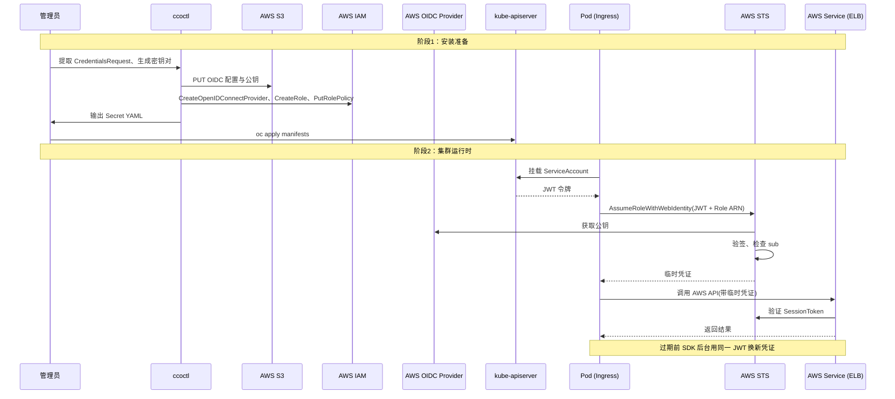

### 关键端点

| 阶段 | 端点类型 | 用途 |
|:---|:---|:---|
| 安装 | S3 | `/.well-known/openid-configuration`、公钥（如 keys.json） |
| 安装 | IAM | 创建 OIDC 提供商、IAM Role |
| 运行时 | kube-apiserver | 签发 JWT（TokenRequest API） |
| 运行时 | STS | `AssumeRoleWithWebIdentity` |
| 运行时 | S3/EC2/ELB 等 | 业务 API，每次请求验证 SessionToken |

---

## 总结

- **ccoctl** 在手动模式下为各组件在云上创建并管理精细化、短期权限凭证，避免在集群内存储高权限长期凭证。
- **STS 流程**：OIDC + ServiceAccount + IAM Role 形成双向信任；Pod 用 JWT 向 STS 证明身份，换取 1 小时有效的临时凭证；公钥用于验签，不涉及数据加密。
- **IAM Role** 的权限来自角色自身的**权限策略**与**信任策略**，与 IAM User 无关；ccoctl 的执行权限来自运行它的管理员所持凭证。
- **运行时**不需要安装时的高权限用户，建议安装后删除或禁用该用户，日常使用低权限账号。
- **JWT** 管身份，**STS 临时凭证**管权限；临时凭证含 **SessionToken**，调用 API 必须携带；**获取**有 SDK 缓存（约 1 小时一次），**验证**每次请求都会进行。
- **kube-apiserver** 签发 JWT 并暴露公钥；**AWS** 通过 OIDC 标准与 Kubernetes 对接，实现跨系统信任传递。

整体可概括为：**一次创建（ccoctl），多次使用（SDK 缓存），每次验证（SessionToken）**，是 OpenShift 在公有云上实现最小权限与无长期凭证的典型生产级方式。
