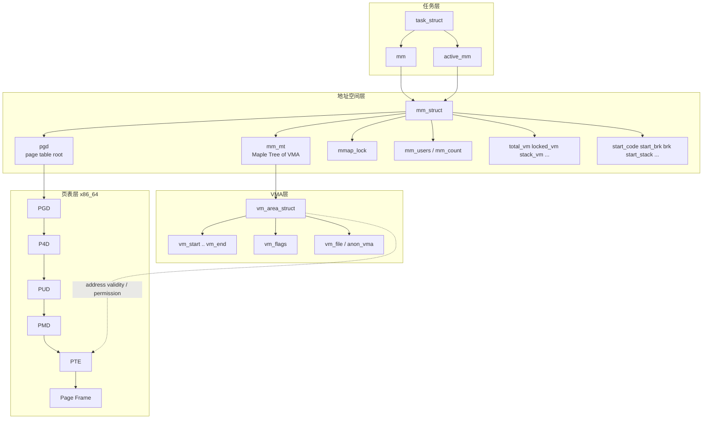



用户态栈空间有限（如 `ulimit -s` 的 8MB），访问栈底之外的地址会触发缺页；内核在缺页处理中决定是**扩展栈**（分配新页）还是**拒绝访问**（发 SIGSEGV）。本文从内核视角说明：用户栈在 Linux 里如何表示、缺页时栈如何向下扩展、为何会触顶溢出，以及缺页次数、页缓存与架构（如 ARM64 页大小）对现象的影响。文内引用内核源码路径与片段均对应本地树 `linux/`（如 `/Users/weli/works/linux`），便于对照阅读。

## 一、现象与问题

一个常见现象：用 `perf stat -e page-faults` 跑一个「不断向栈下增长直到崩溃」的程序，可能只看到**几百次缺页**就发生 SIGSEGV，而栈已使用数 MB。会自然产生两个问题：

1. 为什么「这么少」的缺页就会栈溢出？
2. 缺页次数在不同运行、不同架构下为何差异很大（例如 x86-64 第二次运行明显减少，ARM64 首次就很少）？

下面用内核机制统一解释，并用 [stack-vs-heap-benchmark](https://github.com/liweinan/stack-vs-heap-benchmark) 中的 `stack_overflow_test crash` 作为可复现的样例（非论述主体）。

## 二、用户栈在内核中的表示

用户栈对应一个**向下增长**的 VMA（`struct vm_area_struct`），由 `VM_GROWSDOWN` 标记。

- **栈顶**：高地址，由用户态 SP 指向；初始栈顶由 loader/内核在 exec 时设定，并受 `arch_pick_mmap_layout()` 等影响，会为栈预留空间并留出 **stack guard gap**。
- **栈底（当前）**：即该 VMA 的 `vm_start`（低地址）；栈「向下长」即 `vm_start` 变小，VMA 向低地址扩展。
- **栈大小限制**：由 `RLIMIT_STACK`（`ulimit -s`）提供，内核在**扩展栈**时用该限制做检查，超过则拒绝扩展并导致本次缺页处理失败，进而向用户态发 SIGSEGV。

栈与其它映射之间保留的间隔由全局变量 `stack_guard_gap` 控制（默认 256 页，即 4KB 页下 1MB）：

```c
// mm/mmap.c
/* enforced gap between the expanding stack and other mappings. */
unsigned long stack_guard_gap = 256UL<<PAGE_SHIFT;
```

因此：**栈溢出**在内核侧的语义是——缺页发生在当前栈 VMA 的 `vm_start` 之下，且要么扩展会超过 `RLIMIT_STACK`，要么会侵入 `stack_guard_gap` 或其它映射，从而不允许扩展，只能返回错误并让上层发 SIGSEGV。

## 三、补充：`mm_struct` / `task_struct` / `vm_area_struct` 的关系（校对到当前内核）

为避免把旧资料中的字段名带入本文，这里先给出与当前内核（`/Users/weli/works/linux`）一致的结构关系。你在阅读后续缺页与栈扩展路径时，可以把这张图当作“对象关系索引”。



### 本图对应的关键校对点

- `mm_struct` 当前主组织结构是 **`mm_mt`（Maple Tree）**，不是旧口径里的 `mmap + mm_rb`。
- `mm_struct` 的 VMA 锁字段是 **`mmap_lock`**，不是 `mmap_sem`。
- `task_struct` 里 `mm` / `active_mm` 的关系与经典描述一致。
- 缺页建立映射时，VMA 负责“地址区间与权限语义”，页表负责“虚拟地址到物理页”的具体映射。

## 四、缺页时栈如何扩展：从查 VMA 到 expand_downwards

用户访问栈上尚未映射的地址时，CPU 触发缺页异常，进入架构相关的 fault 处理（如 x86-64 的 `do_user_addr_fault`），再通过通用层查找 VMA 并决定是否扩展栈。

### 4.1 查找 VMA 与「无 VMA 则尝试扩展栈」

在支持 `CONFIG_LOCK_MM_AND_FIND_VMA` 的路径上（如 x86-64），会调用 `lock_mm_and_find_vma()`（`mm/mmap_lock.c`）：

```c
// mm/mmap_lock.c (约 251–286 行)
vma = find_vma(mm, addr);
if (likely(vma && (vma->vm_start <= addr)))
    return vma;

/* 地址落在某 VMA 起始之下，仅当该 VMA 是向下扩展的栈时才允许扩展 */
if (!vma || !(vma->vm_flags & VM_GROWSDOWN)) {
    mmap_read_unlock(mm);
    return NULL;   /* 上层会进入 bad_area，发 SIGSEGV */
}
// ...
if (expand_stack_locked(vma, addr))
    goto fail;
```

含义：若 `addr` 不在任何已有 VMA 内（或正好在栈 VMA 的 `vm_start` 之下），则只有当前「紧邻其上的」VMA 是 `VM_GROWSDOWN`（用户栈）时才尝试扩展；否则返回 NULL，缺页无法解析，最终发 SIGSEGV。

### 4.2 expand_stack_locked → expand_downwards

`expand_stack_locked()` 在向下扩展的配置下（常见配置）直接调用 `expand_downwards()`（`mm/mmap.c` 与 `mm/vma.c`）：

```c
// mm/mmap.c
int expand_stack_locked(struct vm_area_struct *vma, unsigned long address)
{
    return expand_downwards(vma, address);
}
```

`expand_downwards()`（`mm/vma.c` 约 3024–3102 行）主要做三件事：

1. **检查 VM_GROWSDOWN**，并做地址与 `mmap_min_addr` 等校验。
2. **强制 stack_guard_gap**：若在 `addr` 下方存在其它可访问的 VMA，且与当前栈的间距小于 `stack_guard_gap`，则拒绝扩展，返回 `-ENOMEM`。
3. **在允许扩展的前提下**，调用 `acct_stack_growth()` 做栈限制检查；通过则更新 VMA 的 `vm_start`（及相关结构），完成栈的向下延伸。

### 4.3 栈限制检查：acct_stack_growth

栈能扩展的「总大小」由 `rlimit(RLIMIT_STACK)` 限制（对应 `ulimit -s`）。扩展前在 `acct_stack_growth()` 中统一检查（`mm/vma.c` 约 2898–2930 行）：

```c
// mm/vma.c
static int acct_stack_growth(struct vm_area_struct *vma,
                             unsigned long size, unsigned long grow)
{
    struct mm_struct *mm = vma->vm_mm;
    // ...
    /* Stack limit test */
    if (size > rlimit(RLIMIT_STACK))
        return -ENOMEM;
    // ...
    return 0;
}
```

这里 `size` 是扩展后的栈 VMA 总大小。一旦「当前栈已用 + 本次要扩展」超过 `RLIMIT_STACK`，就返回 `-ENOMEM`，`expand_downwards()` 失败，缺页路径无法解析该地址，上层会进入 bad_area 并给进程发 SIGSEGV。也就是说：**触顶 = 扩展被 rlimit 拒绝**，而不是「多缺了一次页」本身；缺页只是触发这次检查的契机。

### 4.4 扩展成功后：匿名页分配

扩展栈 VMA 只调整了虚拟区间（`vm_start` 下移），并未立刻分配物理页。物理页在**第一次访问**该新区间内的地址时，由通用缺页逻辑分配：此时 VMA 已包含该地址，`find_vma` 会命中栈 VMA，进入 `handle_mm_fault()` → `__handle_mm_fault()` → `handle_pte_fault()`，对匿名、未映射的 PTE 走 `do_anonymous_page()`（`mm/memory.c` 约 5022 行），分配匿名页并建立映射。因此：**每第一次接触一个新页，产生一次缺页**；栈用量由 SP 下移多少决定，缺页次数则等于「新被触及的页数」，二者相关但不等价。

## 五、缺页与「触顶」的完整路径小结

1. **用户访问**栈下未映射地址 → CPU #PF。
2. **arch**（如 `arch/x86/mm/fault.c`）→ `do_user_addr_fault()` → `lock_mm_and_find_vma(mm, address, regs)`。
3. **mm/mmap_lock.c**：`find_vma(mm, addr)`；若 `addr` 在栈 VMA 之下且该 VMA 为 `VM_GROWSDOWN`，则 `expand_stack_locked(vma, addr)`。
4. **mm/mmap.c**：`expand_stack_locked()` → **mm/vma.c**：`expand_downwards()` → 检查 `stack_guard_gap`，再 `acct_stack_growth()` 检查 `size > rlimit(RLIMIT_STACK)`；若通过则扩展 `vma->vm_start`。
5. 若扩展失败（rlimit 或 guard gap），`lock_mm_and_find_vma` 返回 NULL，arch 层进入 bad_area → 向用户态发 **SIGSEGV**。
6. 若扩展成功，返回用户态重试指令，再次访问同一地址时已落在栈 VMA 内，走正常缺页：**mm/memory.c** `handle_mm_fault()` → `__handle_mm_fault()` → `handle_pte_fault()` → `do_anonymous_page()`，分配物理页并建立 PTE。

因此：**「224 次缺页就崩溃」** 表示整次进程运行共发生 224 次缺页（包括栈、代码段、库、guard 等）；**最后一次（或临界一次）** 是访问到了**不允许扩展的区域**（超过 RLIMIT_STACK 或进入 guard gap），内核拒绝扩展并发 SIGSEGV，而不是「第 224 次缺页时多分配了一页栈」。

## 六、页缓存、物理页与缺页次数

- **物理页**：进程退出后，部分物理页可能仍留在系统（匿名页回收策略、文件页的 page cache）。新进程再次运行同一程序时，可能复用这些物理页，但**页表是 per-process 的**，进程退出后页表销毁，新进程必须重新建立虚拟地址到物理页的映射，因此仍会触发缺页。
- **栈是匿名映射**：栈不对应文件，不能像文件映射那样用 (inode, offset) 做 page cache 的键。第二次运行缺页减少，主要来自**代码段、共享库等文件映射**的缓存命中，以及系统中仍有可复用的物理页被新进程映射；栈区本身每个进程独立，只是若系统未立刻回收，新进程可能复用刚释放的物理页，缺页数会少一些。
- 内核的页缓存与物理页复用是**全局的**，不按进程或程序名区分；多进程可共享同一物理页（如代码段、共享库），体现的是「尽量共享」的设计。

## 七、ARM64 与页大小、THP

在 **ARM64** 上，许多配置使用 **16KB** 甚至 **64KB** 的页，且可能启用透明大页（THP），同样大小的栈所需**页数**远少于 x86-64 的 4KB 页，因此**同一次运行**的缺页次数会少很多（例如首次运行就只看到约 226 次）。这与「第二次运行因缓存而减少」是不同原因：前者是**架构与页大小**，后者是**物理页/页表复用**。

## 八、如何复现与对照内核

- 查看栈限制与页大小：`ulimit -s`、`getconf PAGESIZE`。
- 用 [stack-vs-heap-benchmark](https://github.com/liweinan/stack-vs-heap-benchmark) 复现：`make stack_overflow_test`，`perf stat -e page-faults ./stack_overflow_test crash`。该程序先递归消耗约 6–7MB 栈，再在剩余空间内用汇编每次 push 8KB 直到触顶，便于观察「总栈接近 8MB 时的一次失败扩展」与缺页计数的关系。
- 对照阅读内核（以你本机路径为准，例如 `/Users/weli/works/linux`）：
  - **mm/mmap_lock.c**：`lock_mm_and_find_vma()` 中 `find_vma` 与 `expand_stack_locked()` 的调用；
  - **mm/mmap.c**：`stack_guard_gap`、`expand_stack_locked()`、`expand_stack()`；
  - **mm/vma.c**：`expand_downwards()`、`acct_stack_growth()` 及 `rlimit(RLIMIT_STACK)` 检查；
  - **mm/memory.c**：`handle_mm_fault()`、`__handle_mm_fault()`、`do_anonymous_page()`；
  - **arch/x86/mm/fault.c**：`do_user_addr_fault()` 及对 `lock_mm_and_find_vma()` 的调用。

## 九、结论

- 用户栈在内核中是一个 **VM_GROWSDOWN** 的 VMA；扩展时受 **rlimit(RLIMIT_STACK)** 和 **stack_guard_gap** 约束。
- 缺页时，若地址落在栈 VMA 之下，内核通过 **expand_stack_locked → expand_downwards → acct_stack_growth** 决定是否扩展；超过 rlimit 或违反 guard gap 则拒绝扩展，本次缺页无法解析，进程收到 **SIGSEGV**。
- 缺页次数 = 本次运行中「首次触及」的页数（栈、代码、库、guard 等合计），与「栈总用量」相关但不等同；触顶由**扩展被内核拒绝**决定，而非缺页计数达到某个值。
- 第二次运行缺页减少主要来自物理页/文件映射的复用；ARM64 下首次运行缺页就较少则主要来自更大页与 THP。

若你希望把栈溢出、缺页与 rlimit 的结论落实到具体可跑的程序上，可用上述 benchmark 项目配合本机内核源码一起对照。
