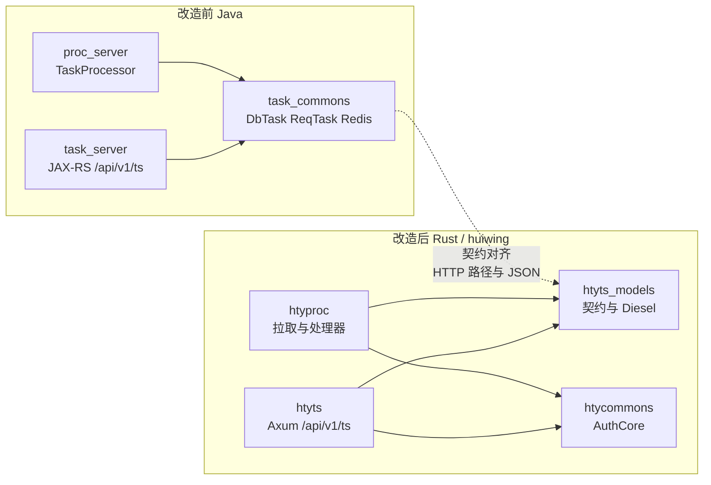
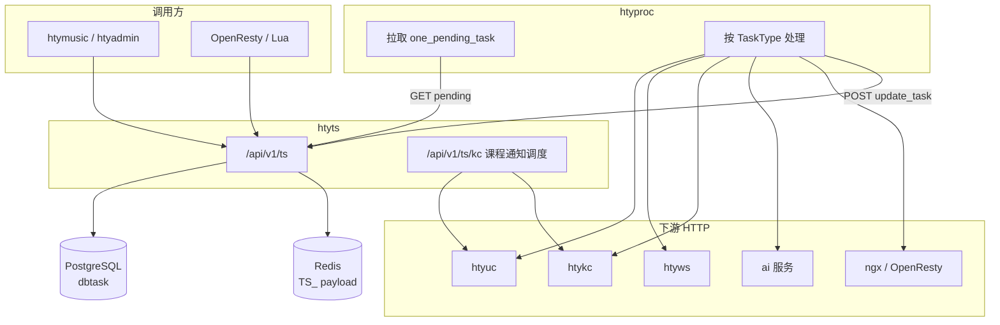
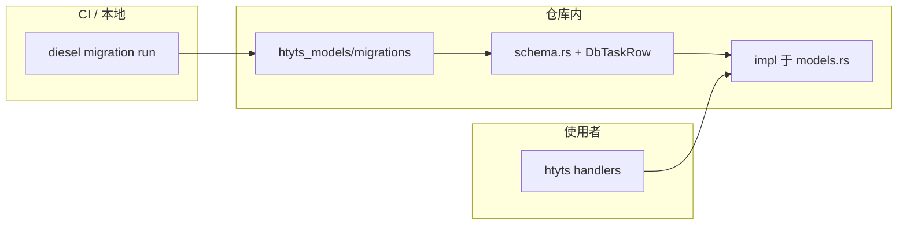
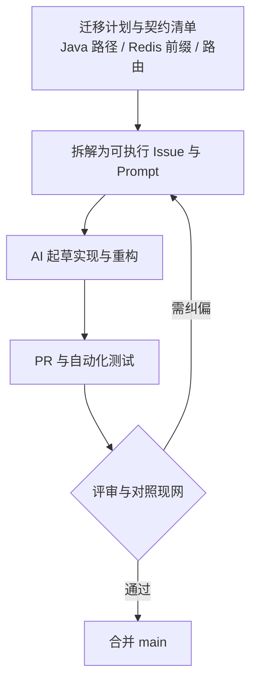
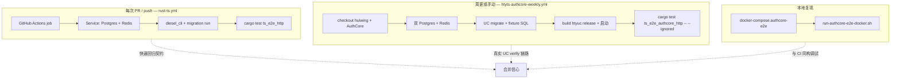
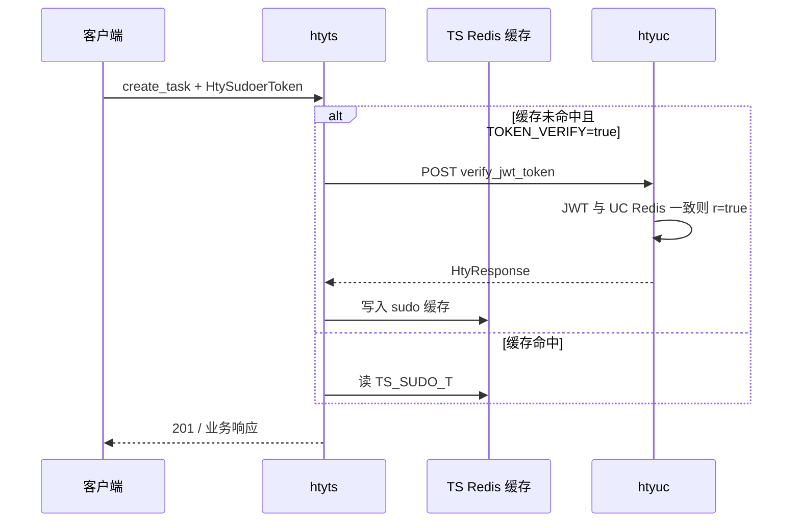



{{ page.abstract }}

## 背景：计划里写什么，代码里落什么

迁移前在 Cursor 里整理了一份结构化计划（`rust_迁移_task_ts_proc`），核心不是「逐文件翻译 Java」，而是先把**契约**钉死：

- **task_server** → 对外仍是 `**/api/v1/ts/**`：任务 CRUD、`one_pending_task` / `one_zombie_task`、分页列表，以及原 Quartz 承载的**课程通知**（改为 Rust 侧调度 + HTTP 调 htyuc/htykc）。
- **proc_server** → `htyproc`：拉取 pending、按 `TaskType` 分发、与 Ts/Ai/Ngx/Uc/Ws 等下游 HTTP 对齐。
- **共享数据** → `htyts_models`：与现网 JSON 兼容的 `ReqTask`、payload、`DbTask` 行结构；PostgreSQL + Redis（`TS_` 前缀等与 Java 一致），并优先复用 **AuthCore `htycommons`** 的 `HtyResponse`、Axum 提取器、JWT 等，而不是在私有仓库里再造一套「长得像」的协议。

计划里同时写清了**仓库边界**：任务域专有逻辑默认闭环在 huiwing；对 AuthCore 的改动要满足开源仓库的兼容、通用与安全预期——这一条直接影响了「哪些代码进 `htyts_models`、哪些只借鉴模式」。

### 改造前后：进程与 crate 边界

### 迁移后的运行时结构（与现网调用关系）

## 实际落到仓库里的变更（2026-03-22 前后）

主线已合入 `huiwing` 的 `main`（含 [PR #1631](https://github.com/alchemy-studio/huiwing/pull/1631) 的合并），与本次主题相关的提交大致可以读成三层：

1. **`feat(rust): task_server / proc_server 迁移`**  
   在工作区引入 `htyts_models`、`htyts`、`htyproc`，把 Java 侧任务 API 与处理器迁到 Rust，并与现有 workspace（Axum、`htycommons`、依赖版本）对齐。

2. **`feat(htyts_models): Diesel migrations + schema/DbTaskRow` + `refactor(htyts): move DB ops into htyts_models`**  
   用 **Diesel** 管理 `dbtask` 表结构（`migrations/`、`diesel.toml`、`schema.rs`），把数据库访问集中到 `htyts_models`（风格上对齐 `htyuc_models`），`htyts` 通过重导出与 handler 调用；E2E 侧改为 **`diesel migration run`**，去掉维护一份独立 `init.sql` 的漂移风险。实现细节上顺带处理了与 workspace 里 **reqwest 版本**相关的 URL 拼装（例如用 `url::form_urlencoded` 等与现有服务一致）。

3. **`ci: HTYTS + AuthCore 周更联调与本地 docker-compose`**  
   - **GitHub Actions**：轻量的 `rust-ts.yml` 仍在 **PR/push** 上跑：Postgres + Redis + `diesel_cli` + 迁移 + `cargo test -p htyts --test ts_e2e_http`。  
   - **重任务**：单独 workflow **仅 `schedule`（例如每周）+ `workflow_dispatch`**，clone **AuthCore**、双库迁移、构建并启动 **htyuc**、再跑依赖真实 UC 的集成测试；避免把「起一整条 AuthCore 链」绑在每一次 PR 上。  
   - **本地**：`docker-compose.authcore-e2e.yml` + `scripts/run-authcore-e2e-docker.sh`，用固定宿主机端口起双 Postgres + Redis，脚本里处理 **`LOGGER_LEVEL`**、**`env -u CARGO_TARGET_DIR` 构建 htyuc**（避免 IDE 注入的 target 目录导致找不到二进制）等踩坑点。

合并顺序上，`#1631` 把 Diesel/DB 重构与 CI 演进合进主线后，又与已存在的 AuthCore 联调提交并存于历史里；若只看「最终能力」，可以理解为：**主线同时具备 Diesel 管理的任务表、轻量 HTTP E2E、以及与 AuthCore UC 的可选联调路径**。

### 数据层：Diesel 迁移与 crate 分工

## 我们怎样用 AI 完成「重写」而不是「胡写」

结合上面那份计划，实际协作方式更接近下面几条，而不是「一句话生成整个仓库」：

1. **计划即边界**  
   把 Java 包路径、现网路由、Redis 前缀、与 htykc/htyuc 的调用关系写进计划后，后续无论是拆 crate 还是写 handler，都有一个**可对照的清单**，减少模型自由发挥。

2. **契约优先于行数**  
   先固定 `ReqTask` / `HtyResponse` / 错误码与 Java 行为一致，再补实现；AI 适合批量生成样板与对称的 handler，但**字段名、状态机、与 UC 的 JWT 语义**需要人眼对照现网或集成测试。

3. **迭代式纠偏**  
   例如联调 UC 时发现：`verify_jwt` 在 UC 侧会查 **Redis 里是否存有与 `token_id` 对应的完整 JWT**——本地随手 `jwt_encode_token` 出来的串并不会过校验；最终 E2E 改为走 **`login_with_password`（fixture 用户）** 拿「已在 UC Redis 里登记」的 token，这是对**真实协议**的修正，而不是计划里一开始就能写全的细节。

4. **Review 仍然是闸门**  
   AI 加速的是起草与重构 diff；合并进 `main` 仍走 PR、CI 绿灯与人工扫一眼安全面（密钥、日志、对外 HTTP）。

### 人机协作工作流（计划驱动）

## GitHub CI 与基础设施：E2E 分两层做

- **默认 CI（每次 PR）**  
  Docker services 起 Postgres + Redis，迁移到最新 schema，跑 **`ts_e2e_http`**。成本可控、反馈快，适合防止「改 handler 把契约改断」。

- **AuthCore 联调（周更 / 手动）**  
  需要第二套 PG（UC 库）、UC 的 `diesel` + fixture SQL、以及 release 级 **htyuc** 进程；测试用例标成 **`#[ignore]`**，只在专门 workflow 或本地脚本里加 `--ignored` 跑。这样**不把重依赖强加给每个贡献者**，又能在主干上周期性验证「HTYTS + HTYUC + 同一 `JWT_KEY`」这条真实链路。

- **本地 Docker Compose**  
  与 CI 同源的思路：compose 只负责**基础设施**，业务进程（htyuc、Rust 测试）仍在宿主机用 cargo 跑，便于调试日志与 attach；脚本把环境变量、端口、以及 UC 启动条件写死成可重复的一步。

### CI 与 E2E：轻量 PR 与重联调分流

### 联调链：sudo 校验走 HTYUC（概念）

## 小结

这一轮迁移的本质是：**用一份明确的迁移计划约束 AI 与人工的分工**，用 **Diesel + CI 迁移步骤**约束 schema 与运行时一致，再用 **分层 E2E（轻量每次跑、重联调周期跑 + 本地 compose）** 把「像 Java 一样能跑」变成可重复验证的事实。若你也在做「Java 服务 → Rust + 现网契约不变」，最值得提前投资的往往是**契约文档与 CI 里的数据库/迁移**，其次才是具体某一层的代码行数。

---

*仓库：`alchemy-studio/huiwing`；开源基础设施：`alchemy-studio/AuthCore`。文中涉及的 PR、workflow 与脚本以仓库当前 `main` 为准。*
