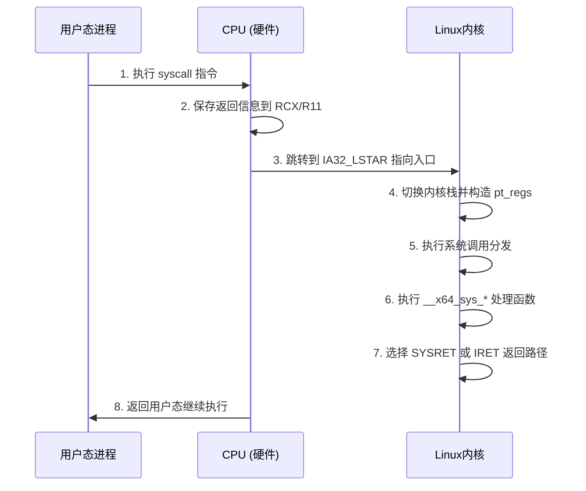
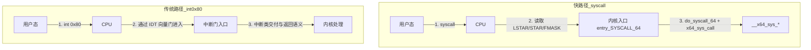
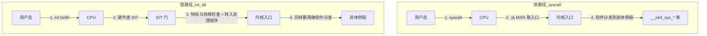

本文按三个问题组织：

1. **IDT 与 `SYSCALL` 的区别**（含 x86 上系统调用入口的大致演化，并给出手册与内核文档链接）。
2. **在 x86-64 Linux 上，`syscall` 从 CPU 到内核代码的完整执行机制**（SDM 中的处理器行为与 `arch/x86` 里的实现对应起来读）。
3. **经 IDT 的入核路径与 `SYSCALL` 入核路径的性能与开销比较**（机制层面为主，兼及测量上的数量级）。

正文中的技术细节与 Intel 官方 *Software Developer’s Manual*（尤其 **Volume 3A/3** 中 IDT、中断与异常交付、`SYSCALL`/`SYSRET` 章节）及当前 Linux `arch/x86` 源码相互对照。

---

## 主题一：IDT 与 `SYSCALL` 的区别与演化

### 1.1 谁在决定内核入口

- **异常、硬件中断、`INT n`**：CPU 用 **IDT（Interrupt Descriptor Table）** 按 **向量号** 取门描述符，再按架构规则完成特权级与栈等处理；OS 负责 **填表** 并用 **`LIDT`** 之类加载 **IDTR**，不能改成“凡进内核都只靠 MSR 里的一个 RIP”[^1][^2]。
- **`SYSCALL`（64 位长模式下的系统调用主路径之一）**：CPU 根据 **`IA32_STAR`、`IA32_LSTAR`、`IA32_FMASK`** 等 **MSR** 切到 ring 0 并跳转到 **`IA32_LSTAR` 指向的 RIP**，**不查 IDT**[^3][^4]。

二者都是架构规定的入口协议，但针对的事件类别不同：前者服务 **异步/异常类事件** 的统一交付，后者服务 **用户态主动发起的系统调用** 的专用快速通道。

### 1.2 64 位模式下的 IDT 索引

在 **64-bit / IA-32e** 下，门描述符为 **16 字节**；向量 *k* 对应表项在 IDT 中的字节偏移为 **k × 16**（与 legacy 模式下 8 字节项不同）[^1]。

手册在 64-bit mode IDT gate 处写道[^11]：

> In 64-bit mode, the IDT index is formed by scaling the interrupt vector by 16. The first eight bytes (bytes 7:0) of a 64-bit mode interrupt gate are similar but not identical to legacy 32-bit interrupt gates. The type field (bits 11:8 in bytes 7:4) is described in Table 3-2. The Interrupt Stack Table (IST) field (bits 4:0 in bytes 7:4) is used by the stack switching mechanisms described in Section 6.14.5, “Interrupt Stack Table.” Bytes 11:8 hold the upper 32 bits of the target RIP (interrupt segment offset) in canonical form.

### 1.3 对照表

| 特性 | 经 IDT 的路径 | `SYSCALL` 路径 |
| :--- | :--- | :--- |
| 典型触发 | 硬件中断、CPU 异常、`INT n`（含历史上的 `int 0x80`） | 用户态执行 **`syscall`** |
| 入口定位 | CPU 按向量查 **IDT 门** | CPU 读 **`IA32_LSTAR` 等 MSR** |
| 门/MSR 语义 | 类型、DPL、IST、段选择子等 **由 CPU 解释** | **`STAR`/`LSTAR`/`FMASK` 组合**，由 OS 预编程 |
| 是否使用 IDT | 是 | **否**（本条目不讨论 FRED 等后续扩展）

### 1.4 与“系统调用号 → 内核函数”的关系

抽象上都可说成 **编号映射到处理逻辑**：IDT 用 **中断向量**，系统调用用 **`RAX` 中的调用号**。  
**差别在于**：IDT 的查表与跳转是 **CPU 事件交付的一部分**；而 **`RAX → __x64_sys_*`** 属于 **内核在进入 `do_syscall_64` 之后的纯软件分发**，处理器并不解析“系统调用号”的语义。

### 1.5 一条简化的演化脉络（x86 / Linux 相关）

1. **80386 及保护模式**：**IDT** 与 **`INT n`** 成为统一的异常/中断/软中断交付入口；内核通过设置向量 *n* 的门，把控制流交给对应处理例程。
2. **32 位 Linux**：用户态系统调用长期使用 **`int 0x80`**，即 **CPU 查 IDT 向量 0x80** 进入内核（仍属 IDT 路径）[^5]。
3. **约 Pentium II / Pro 一代**：Intel 引入 **`SYSENTER`/`SYSEXIT`**，配合 **MSR** 提供另一条 **不经 IDT 门描述符的** 快速进核通道（Linux 在 **32 位兼容路径**等场景仍会碰到与 **`SYSENTER`/`SYSCALL`** 相关的入口约定）[^6]。
4. **x86-64（AMD64 / Intel 64）**：架构在 **长模式**下提供 **`SYSCALL`/`SYSRET`**（由 **`IA32_EFER.SCE`** 等控制使能，细节以 SDM 为准）。**64 位 Linux 用户态**通常通过 **glibc 等内联 `syscall`**，内核入口落在 **`entry_SYSCALL_64`**[^3][^7]。
5. **并存**：今日 64 位内核仍可能为 **32 位进程** 保留 **`int 0x80` / `SYSENTER` / 兼容入口**（向量与实现见内核头文件与 `entry_64_compat` 等）；**本文明细以 64 位 `syscall` 主线为主**。

### 1.6 参考入口

本节的手册与文档链接统一放在文末 **References**，正文按 `[^n]` 标号引用。

---

## 主题二：x86-64 Linux 上 `syscall` 从 CPU 到内核的完整机制

### 2.1 三层结构（总览）

1. **CPU（SDM）**：用户态约定 **`RAX`=调用号**、参数寄存器后执行 **`syscall`**。硬件将 **`RIP → RCX`、`RFLAGS → R11`**，按 **MSR** 加载 **`CS`/`SS`/`RIP`**，并令 **`RFLAGS <- RFLAGS & ~IA32_FMASK`**；**不保存 `RSP`**、不向栈压帧。  
2. **内核入口 `entry_SYSCALL_64`**（`arch/x86/entry/entry_64.S`）：**`swapgs`**、切换到 **per-CPU 内核栈**，在栈上构造 **`struct pt_regs`**，再 **`call do_syscall_64`**。  
3. **分发与返回**：**`do_syscall_64`** → **`x64_sys_call`** 的 **`switch (nr)`** → 各 **`__x64_sys_*`**。返回时若满足契约则 **`SYSRET`**，否则 **`IRET`**。

对比 **IDT 路径**：**IDT** 处理「向量 → 硬件按门交付」；**`syscall`** 处理「寄存器约定 + **MSR** 指定 **`RIP`** → **软件**补全栈帧再交付」。

### 2.2 端到端序列（示意）



### 2.3 CPU 侧（与 Vol.3A §5.8.8 等一致）

1. **`RIP`（下一条指令）→ `RCX`**；**`RFLAGS` → `R11`**[^3]。  
2. **`RIP`** 来自 **`IA32_LSTAR`**；**`CS`/`SS`** 的选择子与 **`IA32_STAR`** 的位域布局按 SDM Figure 5-14[^3]。  
3. **`RFLAGS <- RFLAGS & ~IA32_FMASK`**。Linux 在 **`arch/x86/kernel/cpu/common.c`** 的 **`idt_syscall_init()`** 中向 **`MSR_SYSCALL_MASK`** 写入含 **`X86_EFLAGS_IF`** 等位，使进入内核后 **`IF` 通常被清除**[^3][^8]。  
4. **`SYSCALL` 不改变 `RSP`**；**`SYSRET` 也不恢复 `RSP`**，栈由内核显式管理[^3][^4]。

同一节（§5.8.8）对 `SYSCALL`/`SYSRET` 的英文原文可对照如下[^11]：

> For SYSCALL, the processor saves RFLAGS into R11 and the RIP of the next instruction into RCX; it then gets the privilege-level 0 target code segment, instruction pointer, stack segment, and flags as follows:
>
> Target instruction pointer — Reads a 64-bit address from IA32_LSTAR. (The WRMSR instruction ensures that the value of the IA32_LSTAR MSR is canonical.)  
> Flags — The processor sets RFLAGS to the logical-AND of its current value with the complement of the value in the IA32_FMASK MSR.

> The SYSCALL instruction does not save the stack pointer, and the SYSRET instruction does not restore it. It is likely that the OS system-call handler will change the stack pointer from the user stack to the OS stack. If so, it is the responsibility of software first to save the user stack pointer.

（手册在「gets the … as follows」之后对 **Target code segment**、**Stack segment** 等另有逐条说明，此处摘入与 **`LSTAR`/`FMASK`** 及 **RSP** 最直接相关的句子；完整列举见 [^1] 中 **§5.8.8** 与 **Figure 5-14**。）

### 2.4 Linux 侧（源码锚点）

| 内容 | 文件与要点 |
|------|------------|
| **`STAR`/`LSTAR`/`SYSCALL_MASK` 初始化** | `arch/x86/kernel/cpu/common.c`：`syscall_init()`、`idt_syscall_init()` |
| **入口汇编** | `arch/x86/entry/entry_64.S`：`entry_SYSCALL_64`（`swapgs`、`pt_regs`、`do_syscall_64`、若可则 `sysretq`） |
| **C 分发与 `SYSRET`/`IRET` 判定** | `arch/x86/entry/syscall_64.c`：`do_syscall_64`、`x64_sys_call`；**`sys_call_table[]`** 仍存在于镜像中，**主路径分发**为 **`switch`** |

### 2.5 内核源码摘录（与上表对应）

下列片段与主线 Linux 树一致，便于和 SDM 对照阅读[^8][^9][^10]。

`arch/x86/kernel/cpu/common.c` — `idt_syscall_init()` 中写入 **`MSR_LSTAR`** 与 **`MSR_SYSCALL_MASK`**：

```c
static inline void idt_syscall_init(void)
{
	wrmsrq(MSR_LSTAR, (unsigned long)entry_SYSCALL_64);
	/* ... IA32_SYSENTER_* and ia32_enabled() branches omitted ... */
	/*
	 * Flags to clear on syscall; clear as much as possible
	 * to minimize user space-kernel interference.
	 */
	wrmsrq(MSR_SYSCALL_MASK,
	       X86_EFLAGS_CF|X86_EFLAGS_PF|X86_EFLAGS_AF|
	       X86_EFLAGS_ZF|X86_EFLAGS_SF|X86_EFLAGS_TF|
	       X86_EFLAGS_IF|X86_EFLAGS_DF|X86_EFLAGS_OF|
	       X86_EFLAGS_IOPL|X86_EFLAGS_NT|X86_EFLAGS_RF|
	       X86_EFLAGS_AC|X86_EFLAGS_ID);
}
```

`arch/x86/entry/entry_64.S` — `entry_SYSCALL_64` 入口（硬件不压栈后，由这里构造 **`pt_regs`** 并调用 **`do_syscall_64`**）：

```asm
SYM_CODE_START(entry_SYSCALL_64)
	swapgs
	movq	%rsp, PER_CPU_VAR(cpu_tss_rw + TSS_sp2)
	SWITCH_TO_KERNEL_CR3 scratch_reg=%rsp
	movq	PER_CPU_VAR(cpu_current_top_of_stack), %rsp
	/* Construct struct pt_regs on stack */
	pushq	$__USER_DS				/* pt_regs->ss */
	pushq	PER_CPU_VAR(cpu_tss_rw + TSS_sp2)	/* pt_regs->sp */
	pushq	%r11					/* pt_regs->flags */
	pushq	$__USER_CS				/* pt_regs->cs */
	pushq	%rcx					/* pt_regs->ip */
	pushq	%rax					/* pt_regs->orig_ax */
	PUSH_AND_CLEAR_REGS rax=$-ENOSYS
	movq	%rsp, %rdi
	movslq	%eax, %esi
	call	do_syscall_64		/* returns with IRQs disabled */
```

`arch/x86/entry/syscall_64.c` — **`sys_call_table[]` 注释**与 **`x64_sys_call()`** 的 **`switch`** 分发：

```c
/*
 * The sys_call_table[] is no longer used for system calls, but
 * kernel/trace/trace_syscalls.c still wants to know the system
 * call address.
 */
#define __SYSCALL(nr, sym) case nr: return __x64_##sym(regs);
long x64_sys_call(const struct pt_regs *regs, unsigned int nr)
{
	switch (nr) {
	#include <asm/syscalls_64.h>
	default: return __x64_sys_ni_syscall(regs);
	}
}
```

同文件 **`do_syscall_64()`** — 前半dispatch、末尾返回值决定 **`SYSRET`** 与 **`IRET`**（以下与中版内核树连续片段一致，仅删去空白行以便排版）：

```c
/* Returns true to return using SYSRET, or false to use IRET */
__visible noinstr bool do_syscall_64(struct pt_regs *regs, int nr)
{
	add_random_kstack_offset();
	nr = syscall_enter_from_user_mode(regs, nr);
	instrumentation_begin();
	if (!do_syscall_x64(regs, nr) && !do_syscall_x32(regs, nr) && nr != -1) {
		regs->ax = __x64_sys_ni_syscall(regs);
	}
	instrumentation_end();
	syscall_exit_to_user_mode(regs);
	if (cpu_feature_enabled(X86_FEATURE_XENPV))
		return false;
	if (unlikely(regs->cx != regs->ip || regs->r11 != regs->flags))
		return false;
	if (unlikely(regs->cs != __USER_CS || regs->ss != __USER_DS))
		return false;
	if (unlikely(regs->ip >= TASK_SIZE_MAX))
		return false;
	if (unlikely(regs->flags & (X86_EFLAGS_RF | X86_EFLAGS_TF)))
		return false;
	return true;
}
```

---

## 主题三：经 IDT 的路径与 `SYSCALL` 路径的性能与开销

**`syscall` 相对 `int` + IDT 更快，主要不是因为“少查一次内存里的表”**，而是因为 **`int` 走 IDT 门与异常/中断类交付**，含 **门与特权相关检查、中断帧布局**，返回侧又常配合 **`IRET`**；**`SYSCALL`/`SYSRET`** 针对系统调用做了裁剪。内核里的 **调用号分发**发生在两条路径**入核之后**，不是整体差距的主因。

### 3.1 路径对比（示意）





### 3.2 机制层对比

| 特性 | **`int 0x80` + IDT** | **`syscall` + MSR** |
| :--- | :--- | :--- |
| 核心机制 | 软件中断，走 **异常/中断类交付** | **系统调用专用指令** |
| 入口 | CPU **按向量查 IDT 门** | CPU **从 MSR 取目标 `RIP` 等** |
| 特权与门 | **DPL、门类型** 等 | **不经同一套 IDT 门** |
| 硬件保存的现场 | **中断/异常帧**（含段与标志等，因事件与模式而异） | **主要为 `RCX`/`R11` 的返回契约** |
| 返回 | 常见 **`IRET`** | 条件满足时 **`SYSRET`**，否则 **`IRET`** |

### 3.3 单次查表与整条路径

**硬件对 IDT 的一次访问**与 **内核对 `switch (nr)` 的几条指令**各自都很快；差别主要来自 **整条入核/出核**：多保存了哪些状态、是否经过 **IDT 门语义**、返回是 **`IRET` 全功能**还是 **`SYSRET` 窄契约**、以及 Linux 在出口是否 **回退到 `IRET`**。

### 3.4 宏观相同、微观不同

| 动作 | **`int`（经 IDT）** | **`syscall`** |
| :--- | :--- | :--- |
| 特权级切换 | 需要 | 需要 |
| 栈切换 | 硬件常介入 **TSS/IST** 等语义 | **`swapgs` + 软件切换 `RSP`** |
| 硬件自动保存 | **异常/中断帧** | **`RCX`/`R11`** |
| 门/DPL | 有 | 无同一套 **IDT 门**检查 |

**结论**：两者都要 **ring 3 ↔ ring 0**，但 **`SYSCALL`/`SYSRET` 把可由专用指令承担的部分压到更小**；通用 **`int`/IDT/`IRET`** 需兼顾更广的事件类型，默认更重。

### 3.5 数量级举例

在常见 x86-64 桌面平台上，对 **`getpid` 类极短系统调用**做周期计数，**`int 0x80`** 有时可达约 **二百周期**量级，**`syscall`** 多在约 **数十至百余周期**量级，可差数倍。结果强依赖 **CPU、微架构、是否实际走 `SYSRET` 与测量方法**；定量的结论应在目标机上用 **`perf` 等**重复测量。

### 3.6 小结

- **IDT**：通用 **事件交付** 机制，优先保证覆盖面与一致性，**不以最短系统调用为唯一目标**。  
- **`SYSCALL`/`SYSRET`**：系统调用 **专用**入出核路径，节省的是 **协议与返回路径**，不是单次“函数指针查找”。  
- **Linux**：即便从 **`syscall`** 入核，仍可能在出口选用 **`IRET`**，与 **`SYSRET` 契约**及历史、安全问题有关。

---

## 建议的自修顺序

1. SDM：**中断/异常与 IDT**、**`SYSCALL`/`SYSRET`**。  
2. Linux：**`common.c`（MSR）→ `entry_64.S` → `syscall_64.c`**。  
3. 对照阅读：`entry_64.S` 与 `syscall_64.c`，结合文末 References。

## References

[^1]: [Intel® 64 and IA-32 Architectures SDM — Combined Volumes](https://www.intel.com/content/www/us/en/developer/articles/technical/intel-sdm.html) - 官方总入口（含 Volume 3 系统编程）；文中 IDT 64-bit 描述与中断/异常机制以此为准  
[^2]: [OSDev Wiki — Interrupt Descriptor Table](https://wiki.osdev.org/Interrupt_Descriptor_Table) - IDT 结构与模式差异的教学索引  
[^3]: [x86 Instruction Reference — SYSCALL](https://www.felixcloutier.com/x86/syscall) - 指令级语义（`RCX`/`R11`、`LSTAR`、`FMASK`、`RSP` 不保存）  
[^4]: [x86 Instruction Reference — SYSRET](https://www.felixcloutier.com/x86/sysret) - `SYSRET` 返回语义与 `RSP` 处理约束  
[^5]: [Linux Kernel Documentation — entry_64](https://www.kernel.org/doc/html/latest/arch/x86/entry_64.html) - x86 多入口说明（含 `entry_INT80_compat`、`system_call` 等）  
[^6]: [Intel x86 Instruction Set Reference — SYSENTER](https://www.felixcloutier.com/x86/sysenter) - `SYSENTER/SYSEXIT` 的历史快速调用路径  
[^7]: [man7 — syscall(2)](https://man7.org/linux/man-pages/man2/syscall.2.html) - Linux 用户态系统调用 ABI 与调用约定说明  
[^8]: [Linux Source — arch/x86/kernel/cpu/common.c](https://git.kernel.org/pub/scm/linux/kernel/git/torvalds/linux.git/tree/arch/x86/kernel/cpu/common.c) - `syscall_init()` / `idt_syscall_init()` 与 `MSR_SYSCALL_MASK` 初始化  
[^9]: [Linux Source — arch/x86/entry/entry_64.S](https://git.kernel.org/pub/scm/linux/kernel/git/torvalds/linux.git/tree/arch/x86/entry/entry_64.S) - `entry_SYSCALL_64` 路径（`swapgs`、`pt_regs`、`sysretq`）  
[^10]: [Linux Source — arch/x86/entry/syscall_64.c](https://git.kernel.org/pub/scm/linux/kernel/git/torvalds/linux.git/tree/arch/x86/entry/syscall_64.c) - `do_syscall_64`、`x64_sys_call` 与 `SYSRET/IRET` 判定  
[^11]: 正文所引 **Intel SDM 英文原文**出自 *Intel® 64 and IA-32 Architectures Software Developer’s Manual, Volume 3A: System Programming Guide, Part 1*（约 **§6.14** 64-bit IDT gate、**§5.8.8** `SYSCALL`/`SYSRET`）；完整手册见 [^1] 的官方下载入口  
