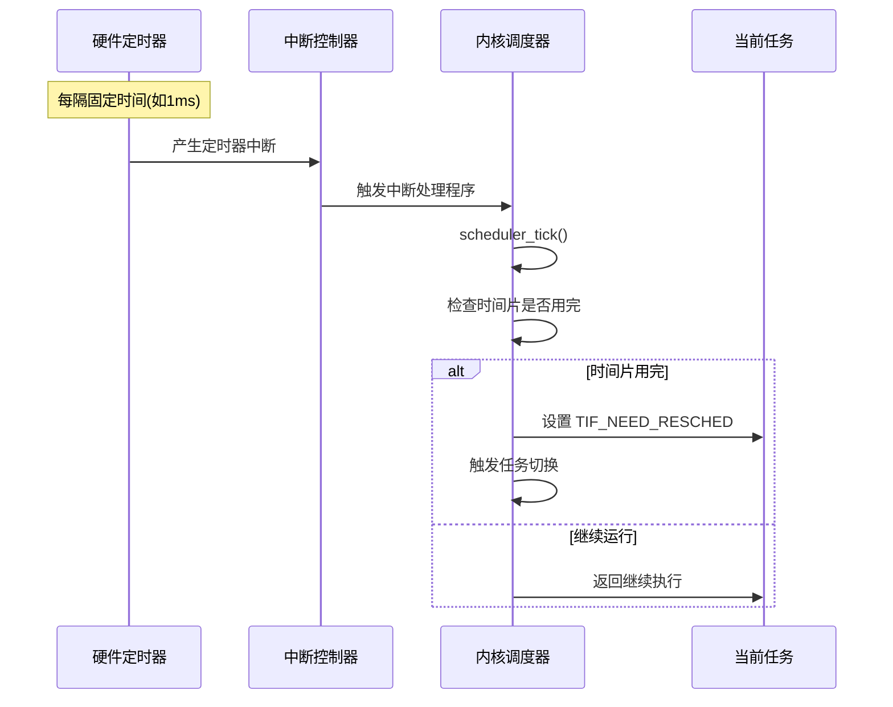
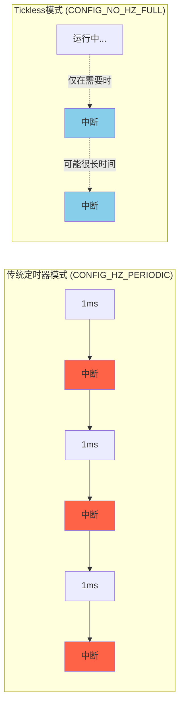
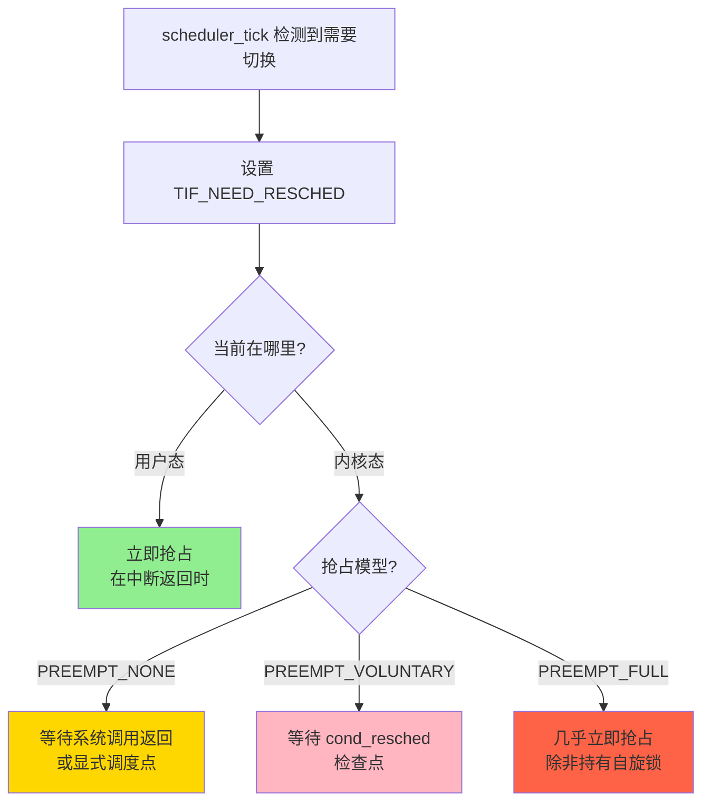
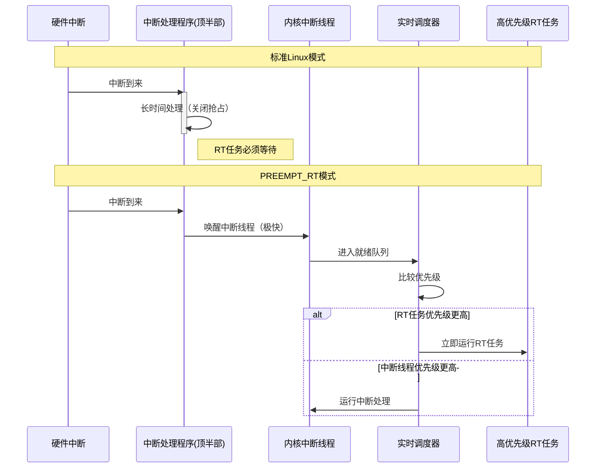



> 内核如何决定"现在该换谁运行了"？

## 引言：操作系统的"心跳"

当你的Linux系统同时运行着数百个进程，内核是如何决定在什么时刻暂停一个任务、让另一个任务运行的？这个看似简单的问题，背后隐藏着操作系统设计中最核心的权衡：**公平性 vs. 实时性**，**吞吐量 vs. 响应延迟**。

答案的关键在于一个持续跳动的"心跳"——**定时器中断（Timer Interrupt）**。它就像一个永不停歇的闹钟，每隔几毫秒就提醒内核："该检查一下，是不是要换个任务运行了？"

但这只是故事的一部分。本文将深入Linux内核的调度子系统，揭示定时器中断在任务调度中的真实角色，以及它与抢占机制、实时操作系统的微妙关系。

## 一、定时器中断：调度的驱动力还是可选项？

### 1.1 传统观点：定时器中断是调度的核心

在经典的操作系统教科书中，任务调度的基本模型是这样的：



这个模型在Linux早期版本（以及许多教学用的简化内核）中是准确的：

1. **硬件定时器**（如x86的PIT或APIC timer）每隔固定时间（称为一个"tick"，通常是1ms或10ms）产生中断
2. 内核的**时钟中断处理程序**被调用
3. 调度器检查当前任务的**时间片（time slice）**是否用完
4. 如果用完，设置"需要重新调度"标志，在中断返回时触发任务切换

### 1.2 现代Linux：Tickless与动态时钟

然而，现代Linux内核（特别是启用了**CONFIG_NO_HZ_FULL**的系统）引入了"tickless"模式[^1]，彻底改变了这个模型：

**传统模式（HZ=1000）**：即使CPU完全空闲，每秒也会产生1000次定时器中断。

**Tickless模式**：当CPU只运行一个任务且没有定时器到期时，内核会**完全停止周期性的时钟中断**，只在以下情况下设置定时器：
- 有定时器事件需要处理
- 调度器需要检查任务状态
- RCU需要进行grace period处理

这意味着：**定时器中断不是调度的必要条件，而是一种优化手段**。



### 1.3 那么，调度到底在哪里发生？

Linux内核中，任务切换（调用`schedule()`函数）可以在以下几个**调度点（scheduling point）**发生：

| 调度点 | 触发条件 | 是否依赖定时器中断 |
| :--- | :--- | :--- |
| **中断返回** | 从任何中断（包括时钟中断）返回用户态时，检查`TIF_NEED_RESCHED`标志 | 部分依赖 |
| **系统调用返回** | 系统调用结束返回用户态前 | 不依赖 |
| **主动调用** | 任务调用`schedule()`、`yield()`或阻塞在I/O上 | 不依赖 |
| **抢占点** | 内核代码中的`preempt_enable()`或`cond_resched()` | 不依赖 |

**结论**：定时器中断**不是唯一的调度驱动力**，但它是保证**公平性和防止任务饿死**的关键机制。


## 二、深入内核代码：定时器中断如何触发调度

### 2.1 时钟中断的处理路径

在Linux内核中，时钟中断的处理流程如下（以x86-64为例）：

**硬件中断 → 中断处理程序 → 调度器检查**

关键函数调用链（基于Linux 6.x/7.x）：

```c
// arch/x86/kernel/time.c - 时钟中断入口
void __irq_entry smp_apic_timer_interrupt(struct pt_regs *regs)
{
    entering_irq();
    trace_local_timer_entry(LOCAL_TIMER_VECTOR);
    local_apic_timer_interrupt();  // 处理本地APIC定时器
    trace_local_timer_exit(LOCAL_TIMER_VECTOR);
    exiting_irq();
}
```

调用链继续：

```
local_apic_timer_interrupt()
  └─> tick_handle_periodic() 或 hrtimer_interrupt()  // 取决于是否启用高精度定时器
      └─> update_process_times()
          └─> scheduler_tick()  // 调度器的时钟处理函数
```

### 2.2 调度器的时钟心跳：`scheduler_tick()`

这是调度器在每个时钟中断中被调用的核心函数，定义在[`kernel/sched/core.c`](https://github.com/torvalds/linux/blob/master/kernel/sched/core.c)中[^2]：

```c
/*
 * This function gets called by the timer code, with HZ frequency.
 * We call it with interrupts disabled.
 */
void scheduler_tick(void)
{
    int cpu = smp_processor_id();
    struct rq *rq = cpu_rq(cpu);
    struct task_struct *curr = rq->curr;
    
    // 更新运行队列时钟
    update_rq_clock(rq);
    
    // 调用当前调度类的 task_tick 方法
    curr->sched_class->task_tick(rq, curr, 0);
    
    // 检查是否需要触发负载均衡
    trigger_load_balance(rq);
    
    // ... 其他统计和处理
}
```

关键点：
1. **每个CPU独立处理**：`scheduler_tick()`在每个CPU上独立运行
2. **调度类多态**：通过`task_tick`回调，不同调度策略（CFS、RT、DEADLINE）有不同的处理逻辑
3. **不直接切换任务**：这个函数只**标记**是否需要重新调度，真正的切换在中断返回时发生

### 2.3 CFS调度类的时钟处理

对于普通任务（`SCHED_OTHER`），调度器使用**完全公平调度器（CFS）**。在[`kernel/sched/fair.c`](https://github.com/torvalds/linux/blob/master/kernel/sched/fair.c)中[^3]：

```c
static void task_tick_fair(struct rq *rq, struct task_struct *curr, int queued)
{
    struct cfs_rq *cfs_rq;
    struct sched_entity *se = &curr->se;
    
    for_each_sched_entity(se) {
        cfs_rq = cfs_rq_of(se);
        entity_tick(cfs_rq, se, queued);
    }
    // ... NUMA平衡等
}

static void entity_tick(struct cfs_rq *cfs_rq, struct sched_entity *curr, int queued)
{
    // 更新当前任务的虚拟运行时间
    update_curr(cfs_rq);
    
    // 检查是否需要抢占
    if (cfs_rq->nr_running > 1)
        check_preempt_tick(cfs_rq, curr);
}
```

**虚拟运行时间（vruntime）** 是CFS的核心概念：
- 每个任务都有一个`vruntime`，表示它已经"使用"了多少CPU时间（按优先级加权）
- 调度器总是选择`vruntime`最小的任务运行
- `check_preempt_tick()`检查当前任务的`vruntime`是否明显大于队列中其他任务，如果是，则设置`TIF_NEED_RESCHED`


## 三、抢占机制：何时真正切换任务？

### 3.1 抢占标志位：`TIF_NEED_RESCHED`

设置这个标志只是"建议"内核应该切换任务，但何时真正切换取决于**抢占模型**：



### 3.2 中断返回路径：实际的切换点

在x86-64架构上，中断返回时的处理（[`arch/x86/entry/entry_64.S`](https://github.com/torvalds/linux/blob/master/arch/x86/entry/entry_64.S)）[^4]：

```
ENTRY(interrupt_return)
    // ... 保存寄存器等
    
    testl $_TIF_NEED_RESCHED, %edi  // 检查是否需要重新调度
    jz restore_regs_and_return       // 如果不需要,直接返回
    
    // 需要调度
    call schedule                     // 调用调度器
    
restore_regs_and_return:
    // ... 恢复寄存器并返回用户态
    iretq
```

**关键点**：
- 如果返回**用户态**，总是会检查并响应`TIF_NEED_RESCHED`
- 如果返回**内核态**，取决于配置的抢占模型


## 四、RTOS vs. 通用Linux：调度哲学的根本差异

### 4.1 实时操作系统的调度特点

你的草稿中提到了一个关键区别：**RTOS的核心不是时间片轮转，而是基于优先级的抢占**[^5]。

| 特征 | Linux (CFS) | RTOS (如FreeRTOS) |
| :--- | :--- | :--- |
| **调度目标** | 公平性：确保所有任务都能获得CPU时间 | 确定性：最高优先级任务必须最快响应 |
| **时间片** | 动态计算的虚拟运行时间 | 相同优先级才使用时间片轮转 |
| **抢占延迟** | 毫秒级（取决于抢占模型） | 微秒级（优先级抢占几乎立即发生） |
| **Tickless** | 支持（省电） | 部分RTOS支持，但优先保证实时性 |

### 4.2 PREEMPT_RT：将Linux变成RTOS

Linux的**PREEMPT_RT补丁**[^6]通过以下改造，将通用内核变成硬实时系统：

**关键技术1：中断线程化**



**关键技术2：自旋锁变互斥锁**

标准Linux中的`spinlock`在PREEMPT_RT下被替换为`rt_mutex`（支持优先级继承），避免了高优先级任务在自旋锁上空转的问题。


## 五、Lazy抢占：Kernel 7.0的新权衡

你的另一篇文章分析的`PREEMPT_LAZY`[^7]正是这个权衡的最新演化：

**传统`PREEMPT_VOLUNTARY`**：
```c
// 内核代码中散布的检查点
if (need_resched())  // 检查 TIF_NEED_RESCHED
    schedule();       // 立即让出CPU
```

**新的`PREEMPT_LAZY`**：
```c
// 设置惰性标志
set_tsk_need_resched_lazy(current);

// cond_resched() 不再检查惰性标志
// 只在时钟中断时升级为紧急标志
if (tick_happened && test_lazy_flag())
    set_tsk_need_resched(current);  // 升级为紧急抢占
```

**设计哲学转变**：
- **旧模式**：通过代码中的启发式检查点实现"礼貌让出"
- **新模式**：将抢占决策集中到调度器的时钟中断中，简化内核但增加了抢占延迟

这个改变导致PostgreSQL性能下降的原因，正是因为它破坏了数据库自旋锁对"临界区内不会被抢占"的隐含假设。


## 六、总结：调度是一门平衡的艺术

回到最初的问题：**Linux内核是否核心依赖定时器中断来进行任务调度？**

**答案是分层的**：

1. **理论上**：不依赖。系统调用返回、主动让出、I/O阻塞等都可以触发调度。
2. **实践上**：依赖。定时器中断是保证公平性、防止任务饿死、更新调度统计的关键机制。
3. **现代内核**：可选。Tickless模式下，单任务运行时可以完全没有周期性中断。
4. **实时系统**：弱依赖。RTOS更依赖事件驱动的抢占，时钟中断仅用于时间片轮转。

**关键技术实现**：
- **`scheduler_tick()`**：每个时钟中断调用，更新vruntime，检查是否需要抢占
- **`TIF_NEED_RESCHED`标志**：建议切换的信号，但何时响应取决于抢占模型
- **中断返回路径**：实际任务切换的执行点
- **抢占模型**：决定了内核态代码的可中断性

**设计权衡**：
- 频繁的时钟中断 → 更好的公平性和响应，但更高的开销
- Tickless → 省电和减少干扰，但需要更复杂的调度逻辑
- 全抢占 → 低延迟，但吞吐量可能下降
- 惰性抢占 → 简化内核，但需要应用层适配（如使用RSEQ）

这些权衡没有"完美答案"，只有针对不同场景的"合适选择"。这也是为什么从通用服务器到硬实时系统，Linux提供了如此丰富的调度配置选项。

---

## References

[^1]: Linux内核文档，《Reducing OS jitter due to per-cpu kthreads》，详细说明了NO_HZ_FULL模式的设计和使用。参见：[Documentation/timers/no_hz.rst](https://github.com/torvalds/linux/blob/master/Documentation/timers/no_hz.rst)

[^2]: Linux内核源码 [`kernel/sched/core.c`](https://github.com/torvalds/linux/blob/master/kernel/sched/core.c) — `scheduler_tick()`函数是时钟中断调用调度器的入口点，更新运行队列时钟并调用调度类的task_tick回调。

[^3]: Linux内核源码 [`kernel/sched/fair.c`](https://github.com/torvalds/linux/blob/master/kernel/sched/fair.c) — CFS调度器的实现，包括`task_tick_fair()`和虚拟运行时间的更新逻辑。

[^4]: Linux内核源码 [`arch/x86/entry/entry_64.S`](https://github.com/torvalds/linux/blob/master/arch/x86/entry/entry_64.S) — x86-64架构的中断返回路径，包括`TIF_NEED_RESCHED`标志检查和调度调用。

[^5]: FreeRTOS文档，《The FreeRTOS Kernel》，说明了基于优先级的抢占式调度机制。参见：<https://www.freertos.org/implementation/a00008.html>

[^6]: Linux PREEMPT_RT项目，《Real-Time Linux Wiki》，详细介绍了实时补丁的实现原理，包括中断线程化和优先级继承互斥锁。参见：<https://wiki.linuxfoundation.org/realtime/start>

[^7]: Peter Zijlstra，Linux内核提交 [`7c70cb94d29c`](https://github.com/torvalds/linux/commit/7c70cb94d29c) — *sched: Add Lazy preemption model*。引入了惰性抢占标志`TIF_NEED_RESCHED_LAZY`，改变了传统的抢占检查机制。链接：<https://lkml.kernel.org/r/20241007075055.331243614@infradead.org>
