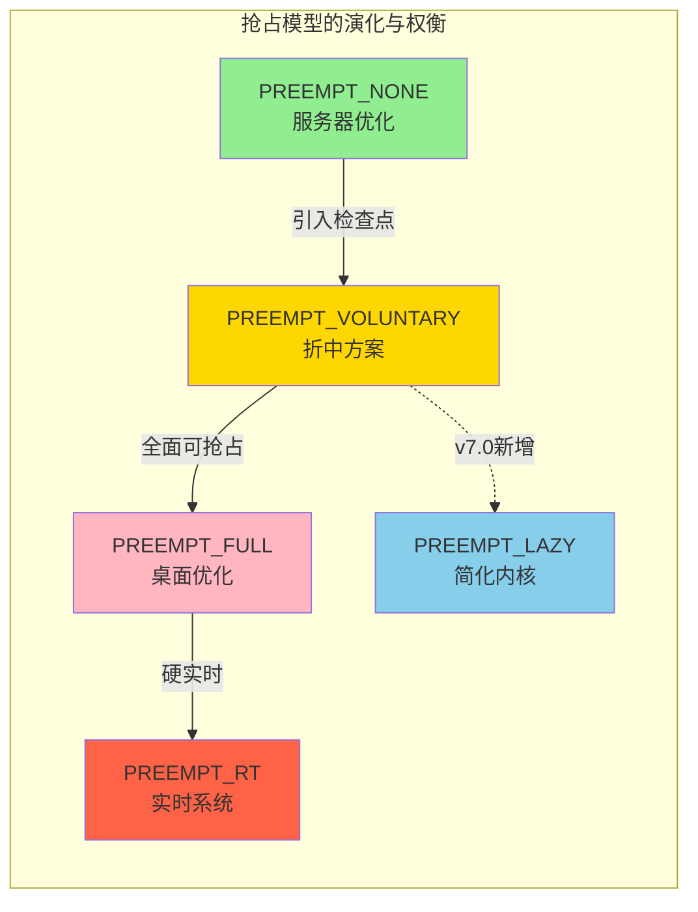
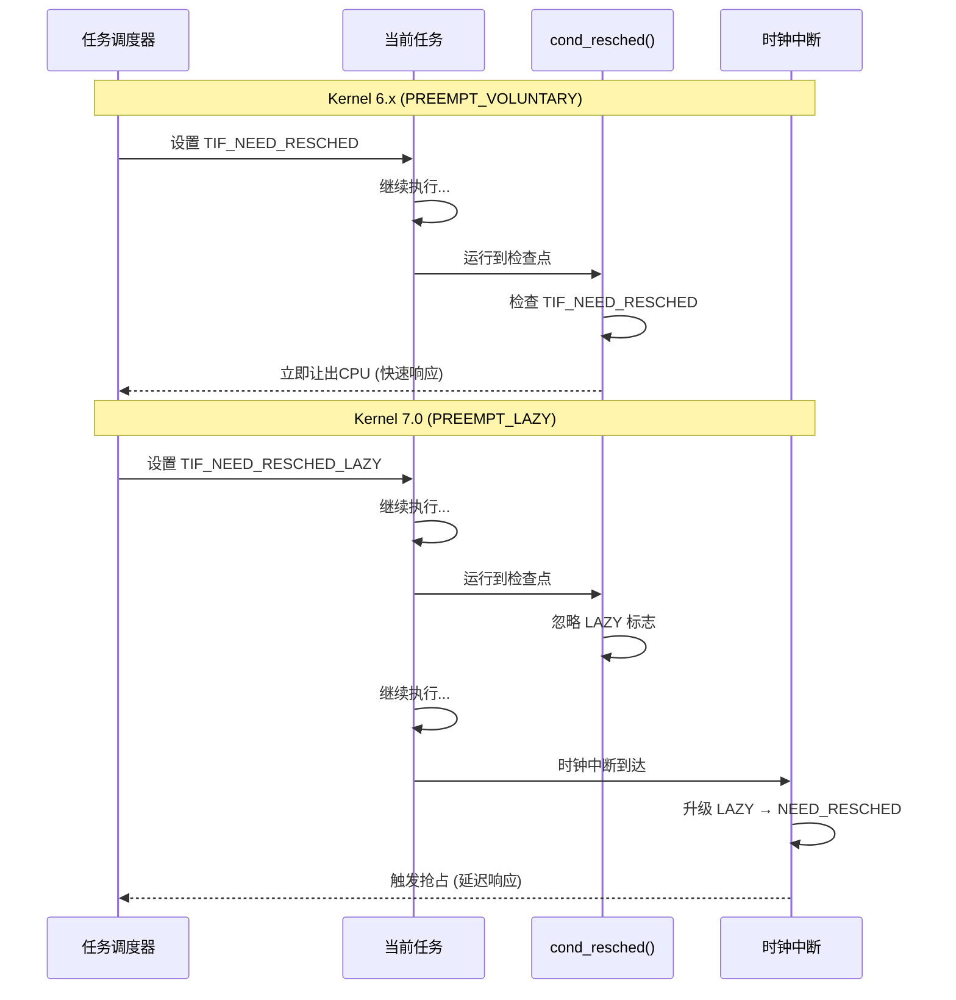
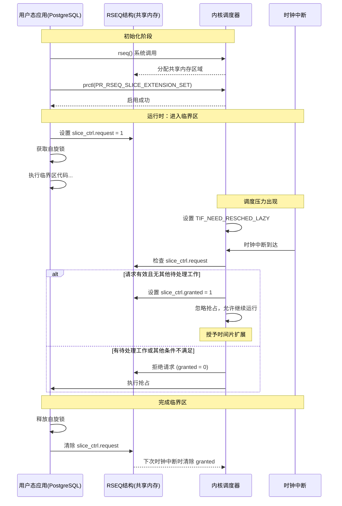



> 一个调度标志位的改变，如何让数据库吞吐量瞬间腰斩？

## 引言：从"完美运行"到"性能腰斩"

想象一下这样的场景：你的数据库服务器刚刚升级了最新的Linux Kernel 7.0，期待着更好的性能和安全性。然而，上线后监控图表却显示了一个触目惊心的画面——PostgreSQL的吞吐量在毫无征兆的情况下**骤降了将近一半**。

这不是虚构的故障演练，而是在Kernel 7.0发布前测试中被多次报告的真实问题[^1]。在标准的工作负载测试下，PostgreSQL等数据库的性能出现了显著的衰退，问题根源直指Linux内核调度器的一次看似"优化"的改动——**惰性抢占（PREEMPT_LAZY）** 的引入[^2]。本文将深入技术底层，剖析这次性能衰退的来龙去脉，并探讨其背后的设计哲学冲突。


## 一、Linux抢占模型速览：吞吐量 vs. 响应时间的权衡

要理解这个问题，我们首先需要明白Linux内核是如何决定"何时暂停一个任务，让另一个任务运行"的。这个决策过程被称为**抢占（Preemption）**。多年来，Linux内核提供了几种抢占模式，在**系统吞吐量**和**交互响应时间**之间做出权衡。

| 抢占模式 | 核心机制 | 特点 | 典型场景 |
| :--- | :--- | :--- | :--- |
| **PREEMPT_NONE** | 任务仅在时间片用完或主动让出时被抢占。 | **吞吐量最高**，但响应延迟可能较大。 | 服务器、批处理系统 |
| **PREEMPT_VOLUNTARY** | 在内核代码的"检查点"（如`cond_resched()`）主动让出CPU。 | 吞吐量与响应时间的**折中方案**。 | 通用发行版内核默认选项 |
| **PREEMPT_FULL** | 除了极少数临界区（如持有自旋锁），几乎任何地方都可抢占。 | **响应延迟极低**，适合桌面和多媒体应用。 | 桌面系统、需要低延迟的场景 |
| **PREEMPT_RT** (实时补丁) | 进一步将自旋锁变为可抢占，提供硬实时能力。 | **确定性响应**，但吞吐量有损耗。 | 工业控制、音视频处理 |

对于绝大多数Linux发行版内核，默认采用的是`PREEMPT_VOLUNTARY`模式。而像PostgreSQL这样的数据库，则极度依赖于`PREEMPT_NONE`或`PREEMPT_VOLUNTARY`带来的高吞吐量特性。

下图展示了不同抢占模型在性能特性上的定位：



**关键特性对比：**

- 🟢 **PREEMPT_NONE/VOLUNTARY**：高吞吐，PostgreSQL的最佳拍档
- 🔵 **PREEMPT_LAZY**：试图保持高吞吐，同时简化内核
- 🔴 **PREEMPT_FULL/RT**：低延迟优先，牺牲部分吞吐

### `cond_resched()`：一个权宜之计

在`PREEMPT_NONE`模式下，如果一个内核线程执行了过长的循环，可能会导致其他任务"饿死"。为了解决这个问题，内核开发者在代码中插入了数百个`cond_resched()`调用[^3]。这就像在高速公路上设置的临时检查站——内核线程运行到这里时，会主动"看一眼"是否有更高优先级的任务需要CPU，如果有，就主动让出。

但这终究是一个**启发式（heuristic）的权宜之计**：它依赖于开发者"猜"对哪里需要插入检查点，而且这些额外的检查点本身也会带来性能开销。


## 二、Kernel 7.0 的改变：惰性抢占的登场

Kernel 7.0 的调度器迎来了一次重大重构。维护者Peter Zijlstra引入了一个新的抢占模式——**PREEMPT_LAZY（惰性抢占）**。在commit [`7dadeaa6e851`](https://github.com/torvalds/linux/commit/7dadeaa6e851)中，他详细解释了引入这一机制的三个核心原因[^2]：

> The introduction of PREEMPT_LAZY was for multiple reasons:
> 
> - PREEMPT_RT suffered from over-scheduling, hurting performance compared to !PREEMPT_RT.
> - the introduction of (more) features that rely on preemption; like folio_zero_user() which can do large memset() without preemption checks.
> - the endless and uncontrolled sprinkling of cond_resched() -- mostly cargo cult or in response to poor to replicate workloads.

简单来说，核心目标是**简化内核代码，并为最终移除所有的`cond_resched()`铺平道路**。

在支持`PREEMPT_LAZY`的架构（包括x86和ARM64）上，传统的`PREEMPT_VOLUNTARY`选项已从配置菜单中移除[^4]。在[`kernel/Kconfig.preempt`](https://github.com/torvalds/linux/blob/master/kernel/Kconfig.preempt)中可以看到：

```
config PREEMPT_VOLUNTARY
	bool "Voluntary Kernel Preemption (Desktop)"
	depends on !ARCH_HAS_PREEMPT_LAZY
	depends on !ARCH_NO_PREEMPT
```

### 技术核心：两个标志位的故事

`PREEMPT_LAZY`的实现非常巧妙，它引入了两个关键的线程标志位。在commit [`26baa1f1c4bd`](https://github.com/torvalds/linux/commit/26baa1f1c4bd)中，Peter Zijlstra描述了这一基础设施[^5]：

> Add the basic infrastructure to split the TIF_NEED_RESCHED bit in two.
> Either bit will cause a resched on return-to-user, but only
> TIF_NEED_RESCHED will drive IRQ preemption.

具体来说：

1. **`TIF_NEED_RESCHED`（紧急标志）**：设置此标志意味着**必须立即抢占**当前任务。这通常用于高优先级实时任务被唤醒的场景。
2. **`TIF_NEED_RESCHED_LAZY`（惰性标志）**：设置此标志意味着"最好"抢占当前任务，但**不是现在**。这用于普通的调度公平性考虑。

在commit [`7c70cb94d29c`](https://github.com/torvalds/linux/commit/7c70cb94d29c)中，Peter Zijlstra进一步说明了工作机制[^6]：

> This LAZY bit will be promoted to the full NEED_RESCHED bit on tick.
> As such, the average delay between setting LAZY and actually
> rescheduling will be TICK_NSEC/2.
> 
> In short, Lazy preemption will delay preemption for fair class but
> will function as Full preemption for all the other classes, most
> notably the realtime (RR/FIFO/DEADLINE) classes.

**工作机制：**

- **大多数情况**：当一个普通的高优先级任务被唤醒时，调度器只会设置`TIF_NEED_RESCHED_LAZY`标志，而不是传统的`TIF_NEED_RESCHED`。
- **检查点行为改变**：在`PREEMPT_VOLUNTARY`模式下，`cond_resched()`会检查`TIF_NEED_RESCHED`标志并立即让出CPU。但在新的惰性模式下，**`cond_resched()`不再检查惰性标志**。
- **最终抢占**：当前任务会继续运行，直到下一个**时钟中断（timer tick）** 到来。此时，内核会检查惰性标志，如果被设置，则将其"升级"为紧急标志，并触发抢占。

内核在[`kernel/sched/core.c`](https://github.com/torvalds/linux/blob/master/kernel/sched/core.c)中实现了这一机制：

```c
static __always_inline int get_lazy_tif_bit(void)
{
	if (dynamic_preempt_lazy())
		return TIF_NEED_RESCHED_LAZY;

	return TIF_NEED_RESCHED;
}

void resched_curr_lazy(struct rq *rq)
{
	__resched_curr(rq, get_lazy_tif_bit());
}
```

在时钟中断处理中，惰性标志会被升级为常规的重调度标志：

```c
	if (dynamic_preempt_lazy() && tif_test_bit(TIF_NEED_RESCHED_LAZY))
		resched_curr(rq);
```

### 改变前后的对比

**Kernel 6.x (PREEMPT_VOLUNTARY)**：高优先级任务醒来 → 设置 `TIF_NEED_RESCHED` → 当前任务运行到下一个`cond_resched()` → **立即让出CPU**。

**Kernel 7.0 (PREEMPT_LAZY)**：高优先级任务醒来 → 设置 `TIF_NEED_RESCHED_LAZY` → 当前任务**忽略所有`cond_resched()`检查点** → 继续运行直到**时钟中断**（例如几毫秒后）→ 升级标志，让出CPU。

下面的时序图展示了这两种模式的关键差异：



简单来说，**内核将抢占决策权从"代码中的分散检查点"收拢到了"调度器的时钟中断"中**。这简化了内核，但也意味着一个任务在被抢占前，可能会运行更长时间。


## 三、PostgreSQL 的自旋锁机制：一场对低延迟的极致追求

那么，为什么内核的这个改动会让PostgreSQL"崩溃"呢？答案藏在PostgreSQL为了极致性能而设计的**自旋锁（Spinlock）** 机制中。

### 自旋，而不是睡眠

在PostgreSQL的源代码[`src/backend/storage/lmgr/s_lock.c`](https://github.com/postgres/postgres/blob/master/src/backend/storage/lmgr/s_lock.c)中，我们可以看到其自旋锁的实现逻辑[^7]。当一个进程尝试获取一个已被其他进程持有的自旋锁时，它不会立即进入睡眠状态（这会导致上下文切换，开销巨大），而是会执行一个**紧凑的循环，反复检查锁是否已被释放**。这个过程被称为**自旋（spinning）**。

PostgreSQL的代码注释清楚地说明了这一点：

```c
/*
 * When waiting for a contended spinlock we loop tightly for awhile, then
 * delay using pg_usleep() and try again.  Preferably, "awhile" should be a
 * small multiple of the maximum time we expect a spinlock to be held.  100
 * iterations seems about right as an initial guess.  However, on a
 * uniprocessor the loop is a waste of cycles, while in a multi-CPU scenario
 * it's usually better to spin a bit longer than to call the kernel, so we try
 * to adapt the spin loop count depending on whether we seem to be in a
 * uniprocessor or multiprocessor.
 */
```

实际的自旋锁实现：

```c
int
s_lock(volatile slock_t *lock, const char *file, int line, const char *func)
{
	SpinDelayStatus delayStatus;

	init_spin_delay(&delayStatus, file, line, func);

	while (TAS_SPIN(lock))
	{
		perform_spin_delay(&delayStatus);
	}

	finish_spin_delay(&delayStatus);

	return delayStatus.delays;
}
```

PostgreSQL的设计哲学是：**自旋锁保护的临界区代码**应该**极其短小**，通常只是修改几个指针或标志位。因此，持有锁的时间预期只有几十个CPU指令周期。在这种情况下，**"自旋等待"几乎总是比"睡眠唤醒"更快**。

### 当"被误解"的自旋锁遭遇"更懒"的内核

问题在于，PostgreSQL的自旋锁机制对内核的抢占行为有一个**强烈的隐含假设**：

> **"我已经把临界区做得非常短了。因此，当我持有自旋锁时，请千万不要抢占我。让我赶紧执行完，释放锁，比让其他CPU上的几十个线程一起自旋空转要好得多。"**

在旧的`PREEMPT_VOLUNTARY`模式下，内核"尊重"了这个假设。虽然理论上任何地方都可能被抢占，但实际情况是，由于临界区极短，在它内部触发抢占的概率微乎其微。

但在Kernel 7.0的`PREEMPT_LAZY`模式下，情况发生了根本性的变化。虽然临界区很短，但**现在，持锁进程在释放锁之前，更有可能"撞上"时钟中断**。

让我们一步步推演这个灾难场景：

1. **CPU 0**上的进程A获得自旋锁L，开始执行临界区代码。
2. **此时**，由于某些原因（例如时间片即将用完，或有其他任务被唤醒），调度器为CPU 0设置了`TIF_NEED_RESCHED_LAZY`标志。
3. 进程A继续执行，它并不知道自己被标记了。它快速执行着临界区代码，眼看就要完成了。
4. **然而**，时钟中断发生了。Kernel 7.0的中断处理程序检查到惰性标志，并将其**升级为紧急抢占标志**。
5. **内核执行抢占**：进程A的上下文被保存，它被"踢出"CPU。而它**手上还死死握着那把锁L**。
6. 现在，其他CPU（如CPU 1, CPU 2, ...）上的进程B、C、D想要获取锁L。它们执行`TAS`操作，发现锁被占用，于是**开始自旋**。
7. 这些进程在用户态疯狂地自旋、自旋、自旋……**消耗着宝贵的CPU周期，却什么有用的工作都没做**。
8. 进程A虽然被抢占了，但由于它持有锁，且可能优先级不高，调度器迟迟没有让它重新运行。
9. 最终，经过漫长的等待（对CPU而言），进程A被重新调度，释放了锁。但此时，整个系统的CPU时间已经被无意义的自旋消耗殆尽。

下图展示了这个灾难性的时序：

```mermaid
sequenceDiagram
    participant CPU0 as CPU 0 (进程A)
    participant Lock as 自旋锁L
    participant Sched as 调度器
    participant CPU1 as CPU 1 (进程B)
    participant CPU2 as CPU 2 (进程C)
    
    CPU0->>Lock: 获取锁L
    activate Lock
    CPU0->>CPU0: 执行临界区代码
    
    Note over Sched: 设置 TIF_NEED_RESCHED_LAZY
    Sched-->>CPU0: (标记，但不立即抢占)
    
    CPU0->>CPU0: 继续执行临界区...
    
    Note over CPU0: 时钟中断到达！
    Sched->>CPU0: 升级标志，强制抢占
    CPU0--xCPU0: 被换出 (仍持有锁L!)
    deactivate CPU0
    
    Note over CPU1,CPU2: 其他CPU上的进程尝试获取锁
    
    CPU1->>Lock: TAS_SPIN(lock)
    Lock-->>CPU1: 失败 (锁被占用)
    CPU1->>CPU1: 自旋等待...
    CPU1->>CPU1: 自旋等待...
    
    CPU2->>Lock: TAS_SPIN(lock)
    Lock-->>CPU2: 失败 (锁被占用)
    CPU2->>CPU2: 自旋等待...
    CPU2->>CPU2: 自旋等待...
    
    Note over CPU1,CPU2: CPU空转，浪费算力！
    
    CPU1->>CPU1: 继续自旋...
    CPU2->>CPU2: 继续自旋...
    
    Note over Sched,CPU0: 经过漫长等待...
    Sched->>CPU0: 重新调度进程A
    activate CPU0
    CPU0->>CPU0: 完成临界区
    CPU0->>Lock: 释放锁L
    deactivate Lock
    
    CPU1->>Lock: TAS_SPIN(lock)
    Lock-->>CPU1: 成功！
    activate Lock
    Note over CPU1,CPU2: 终于可以继续工作了
```


## 四、修复方案：从"内核妥协"到"用户态适配"

面对这个棘手的性能衰退问题，社区出现了两种截然不同的声音。

### 方案A：内核妥协（被否决）

最初，有人提出了一个看似最简单的方案：**将Kernel 7.0的默认抢占模式恢复为`PREEMPT_VOLUNTARY`**。毕竟，这是所有软件都已经验证过的"安全"配置。

然而，这个提议被调度器维护者**Peter Zijlstra明确否决了**。他在commit [`476e8583ca16`](https://github.com/torvalds/linux/commit/476e8583ca16)中果断地在x86架构上启用了PREEMPT_LAZY[^12]，提交信息非常简洁：

> sched, x86: Enable Lazy preemption
> 
> Add the TIF bit and select the Kconfig symbol to make it go.

他的理由代表了内核社区的长期愿景：

1. **设计目标**：引入`PREEMPT_LAZY`就是为了**干掉所有`cond_resched()`**，简化内核。这是一个正确的技术方向，不能因为一个应用的回退而放弃。
2. **责任归属**：内核不应该为了迁就用户空间程序的行为而保留过时的机制。如果PostgreSQL依赖"不被抢占"来实现高性能，那么**应该修复的是PostgreSQL，而不是冻结内核的发展**。

### 方案B：让PostgreSQL使用"RSEQ时间片扩展"（官方推荐）

Peter Zijlstra和Thomas Gleixner给出的解决方案是：**让PostgreSQL使用Kernel 7.0中新增的RSEQ（Restartable Sequences）时间片扩展功能**[^13]。

**什么是RSEQ？** RSEQ是一种允许用户空间程序与内核安全地协作，执行一系列原子操作的机制。

**时间片扩展是什么？** 这是Thomas Gleixner在2025年12月提交的一系列补丁引入的新特性。在commit [`d7a5da7a0f7f`](https://github.com/torvalds/linux/commit/d7a5da7a0f7f)的用户空间API文档中，明确说明了其目的[^14]：

> This allows a thread to request a time slice extension when it enters a
> critical section to avoid contention on a resource when the thread is
> scheduled out inside of the critical section.

这正是为了解决像PostgreSQL这样的应用在持锁期间被抢占导致的性能问题而设计的！

Linux内核在[`include/uapi/linux/rseq.h`](https://github.com/torvalds/linux/blob/master/include/uapi/linux/rseq.h)中定义了相关接口[^15]：

```c
/**
 * rseq_slice_ctrl - Time slice extension control structure
 * ...
 */
struct rseq_slice_ctrl {
	union {
		__u32		all;
		struct {
			__u8	request;
			__u8	granted;
			__u16	__reserved;
		};
	};
};

struct rseq {
	// ...
	struct rseq_slice_ctrl slice_ctrl;
	// ...
};
```

其效果是：**当该线程持有关键锁（即处于RSEQ临界区）时，内核调度器将暂时"无视"针对它的惰性抢占标志，不会在时钟中断时强行抢占它**。这相当于PostgreSQL向内核宣告："给我几十微秒，我马上就完事，别打断我。"

这完美地解决了我们之前分析的"持锁被抢"的困境。PostgreSQL可以获得它梦寐以求的"短时不可抢占"保证，同时内核也可以继续朝着更简洁、更统一的调度架构演进。

- **短期方案**：在Kernel 7.0发布初期，可以通过内核启动参数强制将抢占模式恢复为传统模式，作为权宜之计。
- **长期方案**：PostgreSQL社区**需要在其代码中集成RSEQ时间片扩展的支持**。这是一个需要修改PostgreSQL锁管理器（`s_lock.c`）的工程，但这是从根本上解决问题的唯一途径。

### 如何使用RSEQ时间片扩展

根据内核文档[^14]，应用程序需要按以下步骤启用这个功能：

1. **注册RSEQ**：通过`rseq()`系统调用注册一个用户空间内存区域
2. **启用时间片扩展**：通过`prctl()`启用该功能：

```c
prctl(PR_RSEQ_SLICE_EXTENSION, PR_RSEQ_SLICE_EXTENSION_SET,
      PR_RSEQ_SLICE_EXT_ENABLE, 0, 0);
```

3. **请求扩展**：在进入临界区前，在`rseq->slice_ctrl.request`字段设置请求位
4. **检查授权**：内核会在`rseq->slice_ctrl.granted`字段返回是否授权

下图展示了RSEQ时间片扩展的完整工作流程：



这个机制的核心实现在commit [`dfb630f548a7`](https://github.com/torvalds/linux/commit/dfb630f548a7)中，由Thomas Gleixner详细说明了授权决策过程[^16]：只有在从中断返回用户态、且没有其他待处理工作（如信号）时，才会授予时间片扩展。


## 五、PostgreSQL与Linux内核的协作历史：NUMA案例

有趣的是，PostgreSQL和Linux内核之间的互动并非总是冲突。一个很好的协作案例发生在2025年，当时PostgreSQL 18引入了新的NUMA内省功能。

在开发过程中，PostgreSQL开发者发现了Linux内核中`do_pages_stat()`函数的一个长期存在的bug（自2010年起）[^10]。这个bug影响所有在64位内核上运行32位用户空间的系统。PostgreSQL开发者Christoph Berg提交了内核修复[`10d04c26ab2b`](https://github.com/torvalds/linux/commit/10d04c26ab2b)：

> Discovered while working on PostgreSQL 18's new NUMA introspection code.
> 
> For arrays with more than 16 entries, the old code would incorrectly
> advance the pages pointer by 16 words instead of 16 compat_uptr_t.

同时，PostgreSQL也在自己的代码中实现了规避措施，在commit [`7fe2f67c7c9`](https://github.com/postgres/postgres/commit/7fe2f67c7c9)中限制了`numa_move_pages`请求的大小[^11]：

> This is a long-standing kernel bug (since 2010), affecting pretty much
> all kernels, so it'll take time until all systems get a fixed kernel.
> Luckily, we can work around the issue by chunking the requests the same
> way do_pages_stat() does, at least on affected systems.

这个案例展示了**开源项目之间健康的协作模式**：发现问题后，同时修复内核bug并在应用层实现兼容性处理，确保在旧内核上也能正常工作。

## 六、总结与展望：一次痛苦的蜕变

Kernel 7.0与PostgreSQL的这次"冲突"，并非谁的错，而是计算机系统设计中的一个经典矛盾：**通用操作系统的演进 vs. 特定领域应用的极致优化**。

- **对Linux而言**：`PREEMPT_LAZY`是一次勇敢的"自我简化"手术。它摒弃了历史包袱，为未来几十年的调度器发展奠定了基础[^9]。尽管短期内带来了阵痛，但方向是正确的。
- **对PostgreSQL而言**：这次事件是一次警醒。它揭示了自己过去一直依赖的"在`PREEMPT_VOLUNTARY`下不会被抢占"的假设，其实只是一个美丽而脆弱的巧合。拥抱RSEQ等新内核机制，将使其性能模型更加健壮和可移植。

这次性能腰斩事件，本质上是**两个高度复杂的系统在"无锁化"和"抢占"的边缘地带，发生的一次深刻的碰撞**。它再次证明了一个朴素的真理：在系统软件的世界里，没有银弹。每一个看似微小的"优化"，都可能在其他地方掀起惊涛骇浪。而解决之道，不在于互相指责和回退，而在于更深层次的**协作与适配**。

最终，一个更简洁、更强大的Linux内核，和一个更健壮、更高效的PostgreSQL，都将从这个痛苦的蜕变中诞生。

---

## References

[^1]: LKML讨论：《Re: [PATCH v3 00/20] sched: EEVDF and latency-nice and/or slice-attr》，讨论了抢占模型变化对数据库工作负载的影响。参见：<https://lkml.kernel.org/r/20241007075055.555778919@infradead.org>

[^2]: Peter Zijlstra，Linux内核提交 [`7dadeaa6e851`](https://github.com/torvalds/linux/commit/7dadeaa6e851) — *sched: Further restrict the preemption modes*。详细说明了引入PREEMPT_LAZY的三个核心原因，以及为何限制PREEMPT_NONE和PREEMPT_VOLUNTARY。完整提交信息：<https://patch.msgid.link/20251219101502.GB1132199@noisy.programming.kicks-ass.net>

[^3]: Linux内核文档，《preempt-locking.rst》，详细说明了内核抢占模型的演化和`cond_resched()`的使用。参见：[Documentation/locking/preempt-locking.rst](https://github.com/torvalds/linux/blob/master/Documentation/locking/preempt-locking.rst)

[^4]: Paul E. McKenney，Linux内核提交 [`78c2ce0fd6dd`](https://github.com/torvalds/linux/commit/78c2ce0fd6dd) — *scftorture: Update due to x86 not supporting none/voluntary preemption*。明确说明"As of v7.0-rc1, architectures that support preemption, including x86 and arm64, no longer support CONFIG_PREEMPT_NONE or CONFIG_PREEMPT_VOLUNTARY." 链接：<https://patch.msgid.link/20260303235903.1967409-4-paulmck@kernel.org>

[^5]: Peter Zijlstra，Linux内核提交 [`26baa1f1c4bd`](https://github.com/torvalds/linux/commit/26baa1f1c4bd) — *sched: Add TIF_NEED_RESCHED_LAZY infrastructure*。说明："Add the basic infrastructure to split the TIF_NEED_RESCHED bit in two." 链接：<https://lkml.kernel.org/r/20241007075055.219540785@infradead.org>

[^6]: Peter Zijlstra，Linux内核提交 [`7c70cb94d29c`](https://github.com/torvalds/linux/commit/7c70cb94d29c) — *sched: Add Lazy preemption model*。说明："This LAZY bit will be promoted to the full NEED_RESCHED bit on tick. As such, the average delay between setting LAZY and actually rescheduling will be TICK_NSEC/2." 链接：<https://lkml.kernel.org/r/20241007075055.331243614@infradead.org>

[^7]: PostgreSQL源码 [`src/backend/storage/lmgr/s_lock.c`](https://github.com/postgres/postgres/blob/master/src/backend/storage/lmgr/s_lock.c) — 自旋锁的实现，包括`s_lock()`函数和相关注释，说明了为何选择自旋而非立即睡眠。

[^8]: LKML讨论：《[PATCH 00/14] Restartable Sequences: selftests, time-slice extension》，Thomas Gleixner等人提出的RSEQ时间片扩展机制。参见：<https://lkml.kernel.org/r/20251215155615.870031952@linutronix.de>

[^9]: Linux内核UAPI头文件 [`include/uapi/linux/rseq.h`](https://github.com/torvalds/linux/blob/master/include/uapi/linux/rseq.h) — 定义了`struct rseq_slice_ctrl`和相关的RSEQ时间片扩展接口。

[^10]: Christoph Berg，Linux内核提交 [`10d04c26ab2b`](https://github.com/torvalds/linux/commit/10d04c26ab2b) — *mm/migrate: fix do_pages_stat in compat mode*。说明："Discovered while working on PostgreSQL 18's new NUMA introspection code." 修复了一个自2010年以来的内核bug。链接：<https://lkml.kernel.org/r/aGREU0XTB48w9CwN@msg.df7cb.de>

[^11]: Tomas Vondra，PostgreSQL提交 [`7fe2f67c7c9`](https://github.com/postgres/postgres/commit/7fe2f67c7c9) — *Limit the size of numa_move_pages requests*。PostgreSQL侧对内核bug的规避措施。讨论：<https://postgr.es/m/aEtDozLmtZddARdB@msg.df7cb.de>

[^12]: Peter Zijlstra，Linux内核提交 [`476e8583ca16`](https://github.com/torvalds/linux/commit/476e8583ca16) — *sched, x86: Enable Lazy preemption*。在x86架构上启用PREEMPT_LAZY的关键提交。链接：<https://lkml.kernel.org/r/20241007075055.555778919@infradead.org>

[^13]: LKML patch series：《[PATCH 00/14] Restartable Sequences: selftests, time-slice extension》，Thomas Gleixner提出RSEQ时间片扩展机制，共14个补丁。链接：<https://lkml.kernel.org/r/20251215155615.870031952@linutronix.de>

[^14]: Thomas Gleixner，Linux内核提交 [`d7a5da7a0f7f`](https://github.com/torvalds/linux/commit/d7a5da7a0f7f) — *rseq: Add fields and constants for time slice extension*。在用户空间API文档（`Documentation/userspace-api/rseq.rst`）中说明："This allows a thread to request a time slice extension when it enters a critical section to avoid contention on a resource when the thread is scheduled out inside of the critical section." 链接：<https://patch.msgid.link/20251215155708.669472597@linutronix.de>

[^15]: Linux内核UAPI头文件 [`include/uapi/linux/rseq.h`](https://github.com/torvalds/linux/blob/master/include/uapi/linux/rseq.h) — 定义了`struct rseq_slice_ctrl`和相关的RSEQ时间片扩展接口。相关的`prctl()`接口定义在commit [`28621ec2d46c`](https://github.com/torvalds/linux/commit/28621ec2d46c)中。

[^16]: Thomas Gleixner，Linux内核提交 [`dfb630f548a7`](https://github.com/torvalds/linux/commit/dfb630f548a7) — *rseq: Implement rseq_grant_slice_extension()*。详细说明了时间片扩展的授权决策逻辑："The decision is made in two stages. First an inline quick check to avoid going into the actual decision function." 链接：<https://patch.msgid.link/20251215155709.195303303@linutronix.de>
