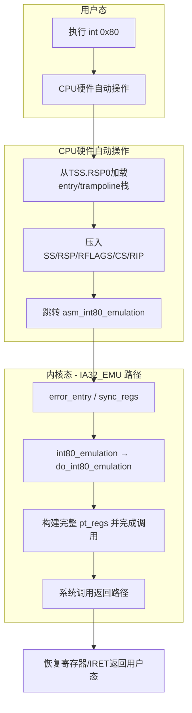



## 前言

在x86架构四十余年的发展历程中，中断和异常处理机制一直是操作系统与硬件交互的核心桥梁。从最初Intel 80286时代诞生的IDT（Interrupt Descriptor Table，中断描述符表）标准，到如今x86生态联盟力推的FRED（Flexible Return and Event Delivery，灵活返回与事件传递）技术，这条演进之路见证了计算机体系结构对性能与安全的不懈追求。

本文将从Linux内核的视角，深入剖析三种核心事件——软中断（`int $0x80`）、硬件中断和CPU异常——在传统IDT机制下的完整处理流程，包括硬件自动操作、内核栈切换、寄存器保存等关键环节。最后，我们还将对比`syscall`指令的快速路径，并展望FRED这一x86架构未来的统一事件分发框架。

---

## 一、IDT机制概述：事件分发的基石

中断描述符表（IDT）是x86架构处理事件的核心数据结构。它最多包含256个门描述符（gate descriptors），每个描述符定义了对应中断/异常的处理程序入口地址、段选择子、特权级等信息。

当CPU检测到事件发生时，它会根据事件向量号在IDT中查找对应的门描述符，经过特权级检查后，跳转到内核中预设的处理程序。

**三种事件类型的本质区别：**

| 事件类型 | 触发方式 | 典型例子 | 是否可屏蔽 |
|---------|---------|---------|-----------|
| **软中断** | 软件指令主动触发 | `int $0x80` | 否 |
| **硬件中断** | 外设通过中断控制器发送 | 时钟中断、键盘中断 | 是（IF标志位） |
| **CPU异常** | 指令执行过程中CPU检测 | #PF缺页异常、#DE除零异常 | 否 |

尽管触发源不同，但CPU在处理这些事件时遵循相似的核心流程。下面我们以最经典的`int $0x80`为例，详细解剖这一过程。

---

## 二、软中断（int $0x80）的完整流程

`int $0x80`是x86架构传统的系统调用入口。在x86_64 Linux内核中，它作为32位兼容层继续存在，用于执行32位系统调用。

### 2.1 硬件自动执行的操作

当用户态程序执行`int $0x80`指令时，CPU在切换到内核态之前会**自动完成**以下操作：

```mermaid
flowchart LR
    A[执行 int 0x80] --> B[检查特权级]
    B --> C[从TSS加载内核栈]
    C --> D[压入用户态上下文]
    D --> E[跳转到IDT[0x80]入口]
```

具体步骤如下：

**第一步：特权级检查**
- CPU检查当前CPL（Current Privilege Level，当前特权级，值为3）是否允许调用IDT[0x80]门
- 由于`int $0x80`门描述符的DPL（Descriptor Privilege Level，描述符特权级）被设置为3，用户态程序可以合法调用

**第二步：内核栈切换**
- CPU读取TR（Task Register，任务寄存器）获取当前任务的TSS（Task State Segment，任务状态段）地址
- 从TSS中取出`SS0`和`ESP0`字段——这两个字段预装了内核数据段选择子和内核栈顶指针
- 将`RSP`（或`ESP`）切换为TSS.ESP0的值，完成从用户栈到内核栈的切换

**第三步：保存用户态上下文**
- CPU将以下内容**依次压入新切换的内核栈**：
  - `SS`（用户态栈段选择子）
  - `RSP`（用户态栈指针）
  - `RFLAGS`（标志寄存器）
  - `CS`（用户态代码段选择子）
  - `RIP`（`int $0x80`的下一条指令地址）

### 2.2 TSS.ESP0的指向：trampoline机制

在x86_64 Linux中，TSS.ESP0**并不直接指向最终的任务内核栈**，而是指向一个称为**trampoline栈**的临时区域。这是为了应对Meltdown漏洞而引入的安全机制。

[`cpu_init()`](https://github.com/torvalds/linux/blob/master/arch/x86/kernel/cpu/common.c)将 **`sp0`** 设为该 CPU **entry trampoline stack** 顶端一侧（注释写明：`sp0` 始终指向 entry trampoline stack，与当前任务无关）：

```c
/* arch/x86/kernel/cpu/common.c — cpu_init() 内 */
load_sp0((unsigned long)(cpu_entry_stack(cpu) + 1));
```

trampoline栈是一个每CPU独立的小型栈（大小约4KB），它的作用是：
1. 提供一个安全的临时运行环境
2. 允许内核安全地切换CR3（页表基址寄存器）
3. 在切换到真正任务栈之前完成必要的安全检查

### 2.3 内核入口：entry_INT80_compat

硬件完成初始切换后，CPU跳转到IDT[0x80]指定的入口——文档与 [`entry_32.S`](https://github.com/torvalds/linux/blob/master/arch/x86/entry/entry_32.S) 注释里仍把 64 位内核上的这一路口语称作 **`entry_INT80_compat`**。**当前主干**在启用 **`CONFIG_IA32_EMULATION`** 时，IDT 桩名为 **`asm_int80_emulation`**（由 [`idtentry`](https://github.com/torvalds/linux/blob/master/arch/x86/include/asm/idtentry.h) 展开），先经 **`error_entry`** / **`sync_regs()`**，再到 [`entry_64_compat.S`](https://github.com/torvalds/linux/blob/master/arch/x86/entry/entry_64_compat.S) 的 **`int80_emulation`**，最终进入 **`do_int80_emulation()`**（[`syscall_32.c`](https://github.com/torvalds/linux/blob/master/arch/x86/entry/syscall_32.c)）；纯 32 位内核仍是 **`entry_INT80_32`** → **`do_int80_syscall_32()`**。草稿里那种逐条 `pushq` 从 trampoline 拷贝 `pt_regs` 的写法只是帮助理解意图，与现今统一的 **`idtentry`** + **`sync_regs`** 路径并不逐行对应。

### 2.4 从trampoline栈到任务栈的切换

这一过程背后的栈切换逻辑如下。`cpu_current_top_of_stack`是一个per-CPU变量，它存储着**当前运行进程的任务内核栈栈顶**。这个值由内核在每次任务切换时更新。

整个切换过程可以概括为：
1. **暂存旧栈指针**：将trampoline栈指针保存到`%rdi`
2. **切换到新栈**：从`cpu_current_top_of_stack`加载新栈顶到`%rsp`
3. **数据迁移**：通过`pushq`指令将trampoline栈上的硬件保存数据逐一拷贝到新栈
4. **构建pt_regs**：继续压入其他通用寄存器，形成完整的`struct pt_regs`

（与 **`idtentry`** 主干对齐时，应把 3～4 步理解为由 **`error_entry`** / **`sync_regs()`** 完成的等效结果，而不是再依赖上一节那种手写 **`pushq offset(%rdi)`** 的示意汇编。）

### 2.5 SAVE_ALL与system_call

在32位时代，`int $0x80`的入口是`system_call`，其中会调用`SAVE_ALL`宏来保存所有寄存器：

```assembly
#define SAVE_ALL \
    cld; \
    pushl %es; \
    pushl %ds; \
    pushl %eax; \
    pushl %ebp; \
    pushl %edi; \
    pushl %esi; \
    pushl %edx; \
    pushl %ecx; \
    pushl %ebx; \
    movl $(__KERNEL_DS),%edx; \
    movl %edx,%ds; \
    movl %edx,%es;
```

`SAVE_ALL`不仅保存了寄存器状态，还巧妙地完成了系统调用参数的传递——在`int $0x80`之前，用户将系统调用号放入`EAX`，参数放入`EBX`、`ECX`等寄存器，`SAVE_ALL`将这些值压入内核栈后，C处理函数就可以通过栈指针访问这些参数。

### 2.6 完整流程图



---

## 三、硬件中断的处理流程

硬件中断与`int $0x80`的流程高度相似，但在细节上存在关键差异。

### 3.1 中断控制器与中断向量

外部设备通过中断控制器（如APIC）向CPU发送中断请求。每个中断源被分配一个中断向量号（32-255），CPU根据这个向量号在IDT中查找对应的门描述符。

### 3.2 中断处理的核心差异

| 对比项 | int $0x80（软中断） | 硬件中断 |
|-------|-------------------|---------|
| **TSS.RSP0指向** | entry / trampoline 区域（与下方相同） | 同为 per-CPU entry stack（用户态入口时） |
| **是否再迁到线程栈** | 经 `error_entry`/`sync_regs` 等到线程栈 | 同样经 `error_entry`/`sync_regs` 等到线程栈 |
| **中断屏蔽** | 不可屏蔽 | 可通过CLI/STI控制IF位 |
| **EOI处理** | 不需要 | 需要发送EOI给中断控制器 |
| **入口函数** | `asm_int80_emulation` → `do_int80_emulation` | `asm_common_interrupt` → [`common_interrupt()`](https://github.com/torvalds/linux/blob/master/arch/x86/kernel/irq.c)（内部 `call_irq_handler()` 等） |

### 3.3 中断入口：common_interrupt

硬件中断的通用入口由 **IDT 桩**跳到 **`asm_common_interrupt`**（在 [`entry_64.S`](https://github.com/torvalds/linux/blob/master/arch/x86/entry/entry_64.S) 中与 `idtentry_irq` 宏展开衔接），C 侧对应 **[`DEFINE_IDTENTRY_IRQ(common_interrupt)`](https://github.com/torvalds/linux/blob/master/arch/x86/kernel/irq.c)**：在 **`common_interrupt()`** 里通过 **`call_irq_handler()`** 解析向量并调用已注册的 **`irq_desc`**；并非早期内核名 **`do_IRQ()`** 这一套命名。其核心流程仍可理解为：

```assembly
common_interrupt:
    /* 保存寄存器（idtentry_irq 展开的入口） */
    /* 调用 common_interrupt() → call_irq_handler() 进行中断分发 */
    /* 必要时 apic_eoi() */
    /* 恢复寄存器并返回 */
```

---

## 四、CPU异常的处理流程

CPU异常是处理器在执行指令过程中检测到异常情况时触发的事件，如缺页异常（#PF）、除零异常（#DE）等。

### 4.1 异常的分类与向量

x86定义了多种异常，每个异常有固定的向量号：
- `#DE`（除零异常）：向量0
- `#PF`（缺页异常）：向量14
- `#GP`（通用保护故障）：向量13
- `#DF`（双重故障）：向量8

### 4.2 异常的栈切换：IST机制

与软中断和普通硬件中断不同，某些**高危异常**（如#DF、#NMI、#MC）会触发**IST（Interrupt Stack Table，中断栈表）**机制。

IST允许为特定异常配置**独立的应急栈**，而不使用TSS.ESP0指向的栈。这是为了防止在栈已损坏的情况下发生异常时，系统完全无法响应。

**IST的工作流程：**

1. CPU查阅IDT中对应异常门描述符的IST字段（**3** 位，取值 **0～7**；**0** 表示不使用 IST，改用 **`RSP0`**）
2. 从TSS中的IST表读取对应的应急栈指针
3. 将RSP切换为该应急栈（而非TSS.RSP0）
4. 压入上下文并执行异常处理程序

```mermaid
flowchart TD
    A[CPU检测到异常] --> B{异常是否配置IST?}
    B -->|是| C[从TSS.IST[x]加载应急栈]
    B -->|否| D[从TSS.RSP0加载内核栈]
    C --> E[在IST栈上压入上下文]
    D --> F[在普通内核栈上压入上下文]
    E --> G[跳转异常处理入口]
    F --> G
```

### 4.3 异常入口：exc_* 函数

每个异常对应专门的处理函数，如 **[`exc_page_fault`](https://github.com/torvalds/linux/blob/master/arch/x86/mm/fault.c)**（实现于 **`arch/x86/mm/fault.c`**）处理缺页异常、**`exc_divide_error`** 处理除零异常。这些函数会：
1. 读取错误码（如果有）
2. 从`CR2`寄存器获取缺页地址（#PF）
3. 调用核心处理逻辑（如`handle_mm_fault`）
4. 根据处理结果恢复执行或发送信号

---

## 五、快速路径：syscall指令

在x86_64架构中，`syscall`指令是**更高效的系统调用方式**，它专为快速特权级切换而设计。

### 5.1 syscall vs int 0x80

| 对比维度 | int 0x80 | syscall |
|---------|----------|---------|
| **性能** | 较慢（需内存访问IDT/TSS） | 更快（专用指令） |
| **栈切换** | 硬件自动切换（通过TSS.RSP0） | 不自动切换，软件需手动设置 |
| **寄存器破坏** | 保存完整上下文 | 破坏RCX和R11 |
| **适用架构** | 32位/64位兼容 | x86_64原生 |
| **内核入口** | `asm_int80_emulation` → `do_int80_emulation`（IA32_EMU） | `entry_SYSCALL_64` |

### 5.2 syscall的独特之处

`syscall`指令的设计哲学是**硬件做最少的事，软件做最多的事**，以此换取极致性能：

- **不保存RSP**：硬件不自动切换栈，入口代码必须立即从`cpu_current_top_of_stack`加载内核栈
- **不保存RCX/R11**：硬件将RIP保存到RCX，RFLAGS保存到R11，这意味着这两个寄存器被破坏
- **无内存访问**：不查阅IDT，直接从MSR读取目标地址

[`entry_SYSCALL_64`](https://github.com/torvalds/linux/blob/master/arch/x86/entry/entry_64.S) 中用户栈指针暂存在 per-CPU **TSS 的 `sp2` 槽**（注释写明作 scratch），而不是名为 `rsp_scratch` 的变量：

```assembly
ENTRY(entry_SYSCALL_64)
    swapgs
    movq    %rsp, PER_CPU_VAR(cpu_tss_rw + TSS_sp2)
    SWITCH_TO_KERNEL_CR3 scratch_reg=%rsp
    movq    PER_CPU_VAR(cpu_current_top_of_stack), %rsp
    ...
```

由于RCX被`syscall`指令破坏，而x86-64 System V ABI规定第四个参数使用RCX传递，内核必须使用R10来接收第四个参数。这就是为什么64位系统调用包装器中会出现`mov %rcx, %r10`指令。

---

## 六、FRED：x86架构的未来

### 6.1 为什么需要FRED？

IDT机制诞生于20世纪80年代的Intel 80286时代，已有40余年历史。现代程序员普遍认为其设计“杂乱且别扭”：

- **上下文保存不完整**：硬件只保存最少状态，软件需手动补齐
- **边缘情况复杂**：需要处理NMI嵌套、#DF双重故障等各种极端场景
- **CR2/DR6瞬时状态**：缺页地址和调试状态易被覆盖
- **IST机制有限**：只有7个IST槽位，且不可动态扩展

### 6.2 FRED的核心改进

FRED（Flexible Return and Event Delivery，灵活返回与事件传递）由Intel提出，AMD已承诺在Zen 6架构中支持，标志着x86生态的重大统一。

**主要改进包括：**

1. **原子性上下文保存/恢复**
   - FRED事件传递时自动保存完整的管理程序/用户上下文
   - 避免%CR2/%DR6等瞬时状态问题
   - 不再需要处理“半生不熟”的入口状态

2. **显式NMI控制**
   - 用`ERETS`/`ERETU`指令替代`IRET`
   - 明确控制NMI的解锁时机，避免嵌套混乱

3. **栈级别替代IST**
   - 引入4个栈级别（0-3）代替不可重入的IST
   - 可为每个向量配置独立的栈级别
   - 支持栈级别的动态升降

4. **消除SWAPGS**
   - 引入`LKGS`指令管理GS段
   - FRED事件传递自动交换GS基址
   - `SWAPGS`在FRED下变为非法（#UD）

5. **统一栈结构**
   - 所有事件使用一致的栈帧格式
   - 开发者无需为边缘案例编写规避代码

### 6.3 两级事件分发

FRED要求软件根据**事件类型和向量**进行两级分发，而非IDT的直接向量索引：

```
事件类型 (fred_ss.type)
    ├── EVENT_TYPE_EXTINT（外部中断）→ 中断分发
    ├── EVENT_TYPE_NMI（NMI）→ NMI处理
    ├── EVENT_TYPE_HWEXC（硬件异常）→ 异常分发
    ├── EVENT_TYPE_SWINT（软件中断）→ 系统调用
    └── EVENT_TYPE_OTHER（其他）→ 特殊处理
```

这种设计让软件重新掌握了事件路由的控制权，同时保持了灵活性。

### 6.4 Linux内核支持状态

Linux内核从6.9版本开始已提供对FRED的临时支持，相关代码位于：
- [`arch/x86/entry/entry_fred.c`](https://github.com/torvalds/linux/blob/master/arch/x86/entry/entry_fred.c)：FRED事件分发框架
- [`arch/x86/kernel/fred.c`](https://github.com/torvalds/linux/blob/master/arch/x86/kernel/fred.c)：FRED初始化与MSR配置
- [`arch/x86/include/asm/fred.h`](https://github.com/torvalds/linux/blob/master/arch/x86/include/asm/fred.h)：FRED相关宏定义

---

## 七、总结

从`int $0x80`到`syscall`，再到即将到来的FRED，x86架构的事件处理机制走过了漫长的演进之路：

| 时代 | 机制 | 特点 | 缺陷 |
|-----|------|------|------|
| 1980s-2000s | IDT + int 0x80 | 统一框架，硬件自动栈切换 | 性能较低，边缘情况复杂 |
| 2000s-2020s | syscall/sysenter | 专用指令，性能优化 | 与IDT并存，增加复杂度 |
| 2026+ | FRED | 原子性操作，统一栈结构，简化软件 | 尚未大规模部署 |

传统的IDT机制虽然历史悠久且功能完备，但其设计已难以满足现代操作系统对性能和安全性的双重追求。FRED通过硬件层面的重新设计，有望在保证兼容性的同时，为x86架构带来更高效、更健壮的事件处理框架。

正如Linus Torvalds所言，FRED是“更完整的解决方案”。随着Intel和AMD在下一代处理器中共同拥抱这一技术，我们有理由期待FRED将成为x86架构下一个四十年的基石。

---

## 参考文献

1. Linux内核源码: [`arch/x86/entry/entry_64.S`](https://github.com/torvalds/linux/blob/master/arch/x86/entry/entry_64.S), [`arch/x86/entry/entry_64_compat.S`](https://github.com/torvalds/linux/blob/master/arch/x86/entry/entry_64_compat.S), [`arch/x86/entry/entry_fred.c`](https://github.com/torvalds/linux/blob/master/arch/x86/entry/entry_fred.c), [`arch/x86/kernel/cpu/common.c`](https://github.com/torvalds/linux/blob/master/arch/x86/kernel/cpu/common.c), [`arch/x86/kernel/irq.c`](https://github.com/torvalds/linux/blob/master/arch/x86/kernel/irq.c), [`arch/x86/entry/syscall_32.c`](https://github.com/torvalds/linux/blob/master/arch/x86/entry/syscall_32.c)
2. Linux内核文档: [`Documentation/arch/x86/x86_64/fred.rst`](https://github.com/torvalds/linux/blob/master/Documentation/arch/x86/x86_64/fred.rst)
3. “Linux系统调用中syscall与int 0x80的实现方式性能及适用场景对比”，阿里云开发者社区
4. “终结 40 年 IDT 旧标准，AMD Zen 6 架构将使用英特尔 FRED 技术”，IT之家
5. “软中断指令int $0x80的执行过程”，CSDN博客
6. “Linux内核之中断INT 0x80的作用”，ChinaUnix博客
7. Stack Overflow: “x86_64 Linux函数与syscalls之间的ABI差异”
