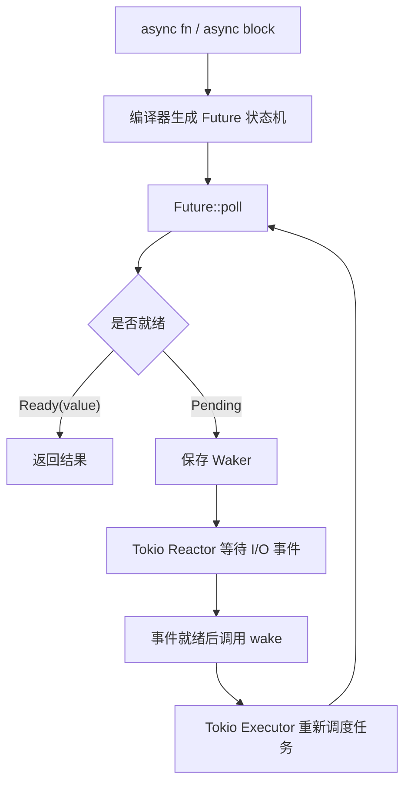
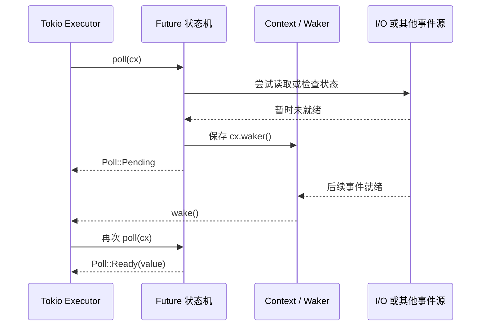
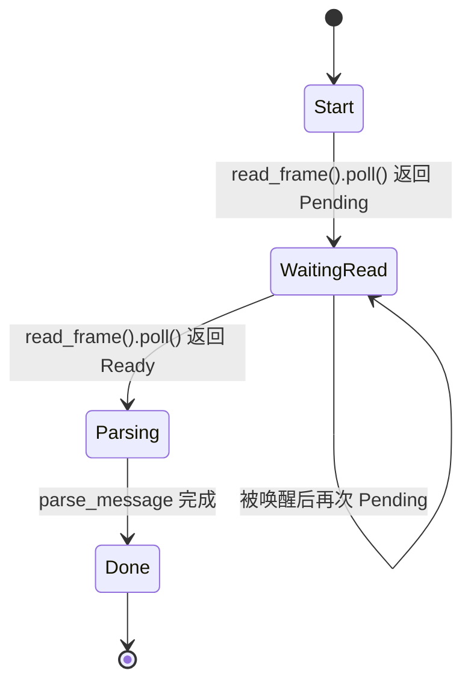
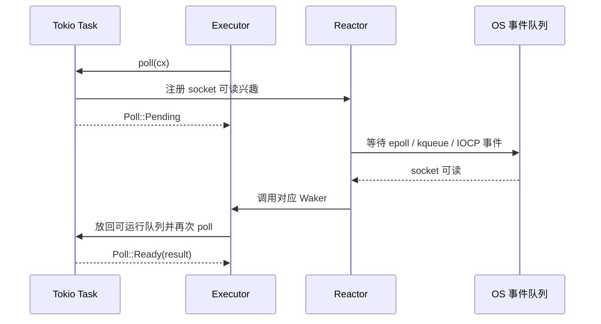



> `async fn` 看起来像同步函数，但它真正交给运行时的不是一段会自己运行的代码，而是一个需要被反复 `poll` 的状态机。

## 前言

Rust 的异步编程很容易给人一种错觉：既然 `.await` 写起来像普通函数调用，那么运行时似乎只是在背后替我们开了很多轻量线程。这个理解只对了一小部分。真正的关键不是线程，而是 **`Future::poll` 这条契约**。

在 Rust 标准库里，`Future` 被描述为一种尚未完成的异步计算；它不会自动推进，只有被主动 `poll` 时才会继续执行。`poll` 如果暂时无法产出结果，就返回 `Poll::Pending`，并通过 `Context` 里的 `Waker` 安排后续唤醒[^1]。

这篇文章从 Rust 源码出发，再回到 Tokio 的运行时模型，拆开三个问题：

1. `async fn` 最终为什么会变成状态机？
2. `Future::poll`、`Context`、`Waker` 分别承担什么职责？
3. 为什么在 async 任务里直接调用阻塞 I/O 会拖垮运行时？

---

## 一、先把边界划清楚：Rust 定义契约，Tokio 负责驱动

Rust 语言和标准库提供的是异步抽象的核心接口：`Future`、`Poll`、`Context`、`Waker`、`Pin`。Tokio 这样的运行时则负责把这些接口接到实际的调度器、I/O 事件源和线程池上。

下图可以作为整篇文章的地图：



这里有一个非常重要的分层：

- Rust 标准库规定：`poll` 不能阻塞；未就绪时必须安排唤醒。
- 编译器负责：把 `async` 代码降成可以挂起和恢复的 coroutine 状态机。
- Tokio 负责：创建任务、调度任务、监听 I/O、在事件就绪时调用 `Waker`。

也就是说，Tokio 不是在执行一段普通函数，而是在驱动一个个实现了 `Future` 的状态机。

---

## 二、Future::poll：异步系统的唯一入口

Rust 源码中 `Future` 的核心方法只有一个：

```rust
fn poll(self: Pin<&mut Self>, cx: &mut Context<'_>) -> Poll<Self::Output>;
```

这个签名里有三个关键词：

- `Pin<&mut Self>`：状态机被轮询时不能随意移动。
- `Context<'_>`：运行时传入当前任务的上下文。
- `Poll<Self::Output>`：本次轮询的结果，要么完成，要么等待。

`Poll` 本身也非常直接，只有两个状态：`Ready(T)` 和 `Pending`。源码注释明确写到：返回 `Pending` 时，函数还必须确保当前任务会在可以继续推进时被唤醒[^2]。

这意味着 `Pending` 不是一句“我还没好”的空话，而是一份责任：



如果一个 Future 返回 `Pending`，却没有保存或安排 `Waker`，这个任务就可能永远睡下去。反过来，如果运行时在没有唤醒信号时疯狂重复 `poll`，就会变成忙等，浪费 CPU。

Rust 标准库的文档也特别强调：Future 是惰性的，必须被主动 `poll` 才能推进；`poll` 不应该在紧密循环中反复调用，而应该在 Future 表示可以继续推进时再调用[^1]。

---

## 三、Context 与 Waker：状态机和运行时之间的回拨协议

`Context` 当前最核心的作用，就是提供一个 `&Waker`。源码里的 `Context` 结构体保存了 `waker` 字段，并通过 `Context::waker()` 返回它[^3]。

`Waker` 则是状态机反向通知运行时的句柄。Rust 源码对它的描述很清楚：`Waker` 用于通知 executor 某个任务已经可以重新运行；如果 Future 返回 `Poll::Pending`，它必须以某种方式保存 waker，并在 Future 应该再次被 `poll` 时调用 `wake()`[^4]。

这套设计的妙处在于解耦：

- Future 不需要知道自己运行在哪个 executor 上。
- Reactor 不需要知道等待事件的是哪个业务函数。
- Executor 不需要理解 socket、timer 或文件 I/O 的具体细节。

它们只共享一个最小协议：**未就绪时保存 waker，就绪后调用 wake，运行时随后重新 poll**。

`Waker::wake()` 的实现也印证了这一点。源码中真正的唤醒动作会通过 `RawWaker` 的 vtable 委托给 executor 提供的实现[^4]。换句话说，Rust 标准库定义了“按钮”的形状，但按钮背后接到哪个调度队列，由运行时决定。

---

## 四、async fn 如何变成状态机

`async fn` 不会在调用时立即执行完函数体。调用它会得到一个 Future。这个 Future 内部保存了必要的局部变量、当前执行到哪个挂起点，以及恢复执行所需的信息。

Rust 编译器的 coroutine transform pass 对这个过程有一段非常直白的说明：它会把 coroutine 转换成状态机，最终结构大致包含 upvars、状态字段，以及跨挂起点仍然存活的 MIR locals[^5]。

源码注释给出的示意结构可以简化理解为：

```rust
struct Coroutine {
    upvars: ...,
    state: u32,
    mir_locals: ...,
}
```

其中 `state` 至少有几个保留状态：

- `0`：还没有开始执行。
- `1`：已经返回或完成。
- `2`：已经 poisoned。
- 其他状态：对应具体的挂起点。

当 `async fn` 执行到 `.await`，如果被等待的 Future 还没完成，外层 Future 就必须挂起。编译器会让跨越这个挂起点仍然需要的局部变量进入状态机结构体，并把恢复点记录下来。

这就是为什么下面这段代码看起来像顺序执行：

```rust
async fn read_then_parse(socket: TcpStream) -> io::Result<Message> {
    let bytes = read_frame(socket).await?;
    parse_message(bytes)
}
```

但编译器看到的是类似这样的状态流转：



这也是 `Pin` 出现在 `Future::poll` 签名里的原因。异步状态机内部可能持有跨挂起点的引用；一旦状态机在内存中被移动，这些引用的安全性就会被破坏。`Pin` 给这类值提供了“位置不再随意移动”的约束。标准库文档在 `Pin` 模块里也专门用 `async fn` 返回的 Future 作为常见例子，展示了用 `Box::pin` 固定 Future 的方式[^6]。

---

## 五、编译器如何把 coroutine 接到 Future::poll

前面讲的是概念，Rust 编译器源码里还有一个关键连接点：对于 async coroutine，编译器会把它的主入口 ABI 映射成 `Future::poll(_, &mut Context<'_>) -> Poll<Output>`。

在 `rustc_ty_utils/src/abi.rs` 中，源码注释明确区分了普通 coroutine、async construct 和 gen construct：普通 coroutine 对应 `Coroutine::resume`，async construct 对应 `Future::poll`，gen construct 对应 `Iterator::next`[^7]。

同一处代码还做了两件具体的事：

- 把 async coroutine 的返回类型组装成 `Poll<Output>`。
- 把类型检查阶段使用的 `ResumeTy` 替换成 codegen 阶段使用的 `&mut Context<'_>`。

这就把语法层面的 `async fn`、中间表示里的 coroutine，以及标准库里的 `Future::poll` 签名连接成了一条线：


编译器的 coroutine transform pass 还会把 `return x` 和 `yield y` 改写成状态设置与返回值构造。对 async 来说，最终对应的是 `Poll::Ready(x)` 和 `Poll::Pending`[^5]。

所以，`.await` 的本质不是“阻塞等一下”，而是：

1. 轮询被等待的 Future。
2. 如果未就绪，把当前状态机的必要局部变量保存到自身结构里。
3. 返回 `Poll::Pending` 给运行时。
4. 等 waker 被触发后，从记录的状态继续执行。

---

## 六、Tokio 的位置：Executor、Reactor 和任务队列

Tokio 接手的是运行时部分。它需要把大量 Future 包装成任务，安排它们在线程上被 `poll`，并把网络 I/O、timer 等事件和对应的 `Waker` 关联起来。

可以把 Tokio 的异步 I/O 路径理解成下面这条闭环：



这里的 `Reactor` 不是 Rust 标准库的一部分，而是运行时实现的一部分。Rust 只要求 Future 和运行时之间遵守 `poll` / `wake` 协议；Tokio 则把这个协议接到具体操作系统的事件通知机制上。

这也解释了为什么一个 async 任务在等待网络 I/O 时不会占住线程。它返回 `Pending` 后，运行时线程可以继续 `poll` 其他任务。等 socket 真的可读，Reactor 再通过 waker 把任务放回调度队列。

---

## 七、阻塞 I/O 为什么会破坏这套模型

`Future::poll` 的文档对运行时特性有一个非常关键的要求：`poll` 的实现应该快速返回，不应该阻塞；如果提前知道某个调用可能耗时较长，应该把工作转移到线程池或类似机制中[^1]。

这不是风格建议，而是异步运行时的基本假设。

如果在 async 任务中直接调用阻塞 I/O，例如：

```rust
use std::fs::File;
use std::io::Read;

async fn read_config_bad() -> std::io::Result<String> {
    let mut file = File::open("config.toml")?;
    let mut contents = String::new();
    file.read_to_string(&mut contents)?;
    Ok(contents)
}
```

那么当前 executor 工作线程会被同步文件 I/O 占住。它无法继续轮询其他 Future，也无法及时处理已经被唤醒的任务。任务没有阻塞，线程却阻塞了；对运行时来说，结果仍然是吞吐下降和延迟放大。

Tokio 的 `spawn_blocking` 文档也明确指出：在 future 中执行阻塞调用或大量不让出执行权的计算是有问题的，因为这可能阻止 executor 推进其他 futures；`spawn_blocking` 会把闭包放到允许阻塞的线程上运行[^8]。

因此，上面的代码应该改成类似这样：

```rust
use std::fs::File;
use std::io::Read;
use tokio::task;

async fn read_config() -> std::io::Result<String> {
    task::spawn_blocking(|| {
        let mut file = File::open("config.toml")?;
        let mut contents = String::new();
        file.read_to_string(&mut contents)?;
        Ok(contents)
    })
    .await
    .expect("blocking task panicked")
}
```

如果使用 `tokio::fs`，也要知道它并不是在所有平台上都使用真正的内核异步文件 I/O。Tokio 文档说明，多数操作系统并不提供异步文件系统 API，因此 `tokio::fs` 会在后台使用普通阻塞文件操作，并通过 `spawn_blocking` 线程池运行它们[^9]。

所以，对于 async 代码里的文件 I/O，性能判断不能只看 API 名字里有没有 `async`。更重要的是理解它背后的调度成本：

- 网络 I/O 通常可以交给 Reactor 等待内核事件。
- 普通文件 I/O 在 Tokio 当前实现里通常会进入 blocking 线程池。
- CPU 密集型任务也不应该长时间占住 executor 工作线程。

---

## 八、一个更实用的心智模型

把所有源码线索合起来，可以得到一个更可靠的心智模型：

```text
async fn 调用
    -> 得到 Future 状态机
        -> executor 调用 Future::poll
            -> Ready：任务完成
            -> Pending：保存 Waker 并让出线程
                -> 外部事件完成后调用 wake
                    -> executor 再次 poll
```

这套模型里最容易混淆的是“等待”和“阻塞”的区别：

- `Poll::Pending` 是任务级别的等待，它把线程还给运行时。
- 阻塞 I/O 是线程级别的等待，它让运行时无法使用这条线程。
- `.await` 本身不保证非阻塞；它只是在语法层面等待一个 Future。
- 真正的非阻塞来自 Future 的 `poll` 实现是否遵守快速返回和正确唤醒的契约。

这也是 Rust async 的精髓：语言和标准库只定义最小协议，编译器把代码降成状态机，运行时负责把状态机接到调度器和 I/O 事件源上。Tokio 的高并发能力并不来自魔法，而是来自这条协议被严格执行。

## References

[^1]: Rust 源码，`Future` trait 文档与 `poll` 签名，commit [`f53b654a8882`](https://github.com/rust-lang/rust/tree/f53b654a8882)：[`library/core/src/future/future.rs`](https://github.com/rust-lang/rust/blob/f53b654a8882/library/core/src/future/future.rs#L7-L113)。其中说明 Future 是惰性的、`poll` 不应阻塞，并且未就绪时应保存 `Waker`。

[^2]: Rust 源码，`Poll<T>` 定义，commit [`f53b654a8882`](https://github.com/rust-lang/rust/tree/f53b654a8882)：[`library/core/src/task/poll.rs`](https://github.com/rust-lang/rust/blob/f53b654a8882/library/core/src/task/poll.rs#L6-L27)。`Pending` 的文档要求在可以继续推进时安排当前任务被唤醒。

[^3]: Rust 源码，`Context<'a>` 定义和 `waker()` 方法，commit [`f53b654a8882`](https://github.com/rust-lang/rust/tree/f53b654a8882)：[`library/core/src/task/wake.rs`](https://github.com/rust-lang/rust/blob/f53b654a8882/library/core/src/task/wake.rs#L212-L249)。

[^4]: Rust 源码，`Waker` 文档与 `wake()` 实现，commit [`f53b654a8882`](https://github.com/rust-lang/rust/tree/f53b654a8882)：[`library/core/src/task/wake.rs`](https://github.com/rust-lang/rust/blob/f53b654a8882/library/core/src/task/wake.rs#L378-L448)。源码说明实际唤醒动作通过 executor 提供的 vtable 实现委托出去。

[^5]: Rust 编译器源码，coroutine state transform pass，commit [`f53b654a8882`](https://github.com/rust-lang/rust/tree/f53b654a8882)：[`compiler/rustc_mir_transform/src/coroutine.rs`](https://github.com/rust-lang/rust/blob/f53b654a8882/compiler/rustc_mir_transform/src/coroutine.rs#L1-L51)。该 pass 会创建 `Coroutine::resume` / `Future::poll` 实现，并把 coroutine 转换成包含状态字段和跨挂起点 locals 的状态机。

[^6]: Rust 源码，`Pin` 文档与 `Pin<Ptr>` 定义，commit [`f53b654a8882`](https://github.com/rust-lang/rust/tree/f53b654a8882)：[`library/core/src/pin.rs`](https://github.com/rust-lang/rust/blob/f53b654a8882/library/core/src/pin.rs#L1010-L1093)。文档使用 `async fn` 返回的 Future 作为 pinning 的常见例子。

[^7]: Rust 编译器源码，async coroutine ABI 映射，commit [`f53b654a8882`](https://github.com/rust-lang/rust/tree/f53b654a8882)：[`compiler/rustc_ty_utils/src/abi.rs`](https://github.com/rust-lang/rust/blob/f53b654a8882/compiler/rustc_ty_utils/src/abi.rs#L118-L168)。源码注释说明 async construct 的主入口对应 `Future::poll(_, &mut Context<'_>) -> Poll<Output>`。

[^8]: Tokio 文档，`tokio::task::spawn_blocking`：<https://docs.rs/tokio/latest/tokio/task/fn.spawn_blocking.html>。文档说明在 future 中执行阻塞调用或大量计算会阻止 executor 推进其他 futures，`spawn_blocking` 用于在允许阻塞的线程上运行闭包。

[^9]: Tokio 文档，`tokio::fs` 模块：<https://docs.rs/tokio/latest/tokio/fs/index.html>。文档说明多数操作系统不提供异步文件系统 API，因此 Tokio 文件操作会在后台使用普通阻塞文件操作，并通过 `spawn_blocking` 线程池运行。
